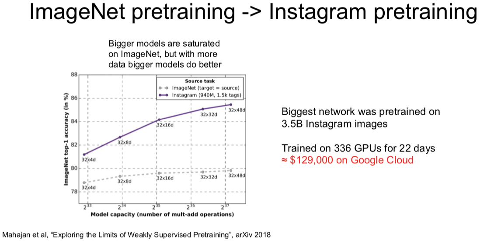
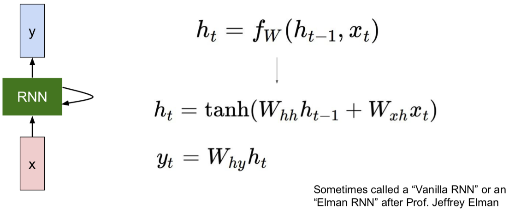
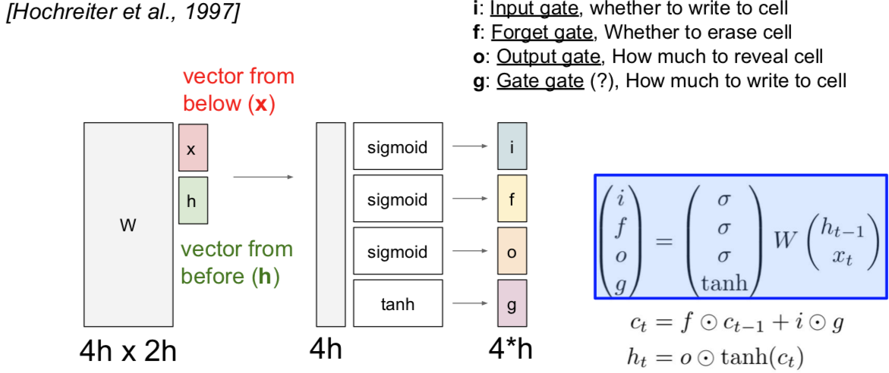
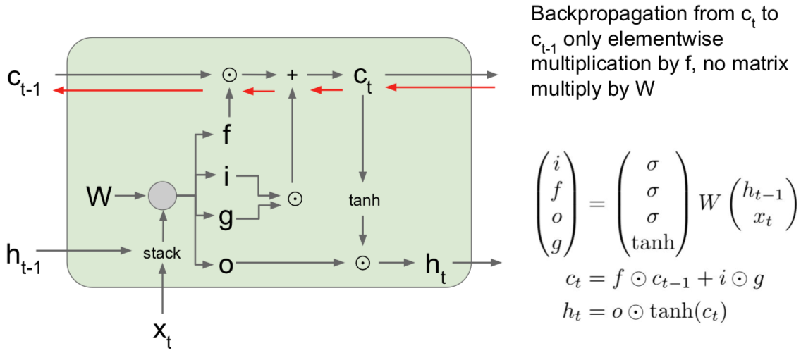

[返回到上一页](./index.html)

---

[TOC]

> CS231n 课程的官方地址：http://cs231n.stanford.edu/index.html
>
> 该笔记根据的视频课程版本是 [Spring 2017](https://www.bilibili.com/video/av17204303/?p=21)(BiliBili)，PPt 资源版本是 [Spring 2018](http://cs231n.stanford.edu/syllabus.html).
>
> 另有该 Lecture 10. 扩展讲义资料：
>
> - [DL book RNN chapter](http://www.deeplearningbook.org/contents/rnn.html) (optional) 
> - [min-char-rnn](https://gist.github.com/karpathy/d4dee566867f8291f086), [char-rnn](https://github.com/karpathy/char-rnn), [neuraltalk2](https://github.com/karpathy/neuraltalk2)
> - [The Unreasonable Effectiveness of Recurrent Neural Networks](./The Unreasonable Effectiveness of Recurrent Neural Networks .html)（中译版）

# Lecture 10. Recurrent Neural Networks

- Recall：

小哥回顾了上节课中的经典模型，谈到 2014年的时候，还没有批量归一化技术。所以当初的 VGG 用了一些技巧和手段才实现了最终训练的收敛，而 GoogLeNet 是有一些辅助分类器把它们添加到下层，额外的梯度直接注入到网络的下层。以后用了批量归一化后，就不再需要这些笨拙的技巧使得网络收敛了。

ResNet 是一种有趣的框架，实际上它有两个很好的属性。

一个是如果我们把残差块中所有的权值设为零，那么所有的残差块就是**恒等的**，所以在某种程度上，这个模型是相对容易去训练的，并不需要添加额外的层。另外，在神经网络中添加 L2 正则化的原因是，一旦你使用了 L2 正则化，网络中的权值将迫使所有的参数趋近于零。也许你的标准卷积架构正趋近于零也许这有些说不通，但是在残差网络中，如果所有的参数逐渐趋向于0，那就是促使模型不再使用它不需要的层，因为它只是驱使残差块趋向同一性（identity），也就不需要进行分类。

另一个非常有用的属性是残差网络与反向路径中的**梯度流**有关。如果你还记得在反向传播中加法门的工作原理，当上游梯度通过一个加法门时，他将沿着两个不同的路径。所有，当上游梯度到来时，它将通过这些卷积块。但它也会通过这些残差连接直接连接到梯度。所以你可以看到当这些残差块堆叠在一起时，我们的网络最终会有几百个或上千个层，然后这些残差连接提供给梯度一个超级“高速公路”使梯度在整个网络中进行反向传播，这使网络可以更容易且更快地训练。实际上，即使模型有几百层的深度也能很好的收敛。在机器学习领域中，管理模型的梯度流是非常重要的，在递归网络中也是很普遍的。所以，我们还会再讨论到“梯度流”这个概念。

最近看到一些更为新奇的 CNN 构架，包括 DenseNet 和 FractalNet。一旦你用梯度流来思考这些构架，它们就更有意义了。像 DenseNet 和 FractalNet 这类模型中都加入了一些额外的快捷或恒等连接。如果你考虑到模型在反向传播中发生了什么，这些额外的有趣的拓扑结构可以为梯度从网络末端损失层更容易地流向整个网络中的不同层，提供一个直接的路径。所以我认为在 CNN 构架中，合理地管理梯度流使我们在过去几年里看到的最多的东西。随着越来越多的新奇构架被发明出来，我们将会看到更多的进步。

## Recurrent Neural Networks: Process Sequences

## Recurrent Neural Networks: Non-Sequence Data

- Classify images by taking a series of “glimpses”

  

  > Ba, Mnih, and Kavukcuoglu, “Multiple Object Recognition with Visual Attention”, ICLR 2015. 
  >
  > Gregor et al, “DRAW: A Recurrent Neural Network For Image Generation”, ICML 2015 

- Generate images one piece at a time!

  

  

  > Gregor et al, “DRAW: A Recurrent Neural Network For Image Generation”, ICML 2015 

## Recurrent Neural Network

每个 RNN 网络都有这样一个小小的循环核心单元（绿色块），它把 x 作为输入，将其传入 RNN。RNN 有一个**内部隐藏态（internal hidden state）**，这一隐藏态会在 RNN 每次读取新的输入时更新，然后这一内部隐藏态会将结果反馈至模型，当模型下一次读取输入时。通常来说，我们想让 RNN 在每一步都能给出输出，因此就有了这样的模式：它读取输入，更新隐藏态，并且生成输出。

### Vanilla RNN

读取前一个隐藏态和当下的输入值 $x_t$，生成下一个隐藏态。然后和你想象得一样简单，我们再用权重矩阵 W x h 将其与输入 $x_t$ 相乘，另一个权重矩阵 $W_{hh}$ 与前一个隐藏态 $h_{t-1}$ 相乘。我们将这两部分分别做乘法再相加，然后用 tanh 函数将结果缩放至 -1 至 1 之间，这样系统中就引入了一些非线性元素。

为啥这里用 tanh 呢，而不是用其他非线性函数呢？回答：急什么？且听下文。。。。

在此架构中，如果我们想在每一步时都生成 $y_t$，可能需要另外一个权重矩阵 W 来接受这一隐藏态，然后将其转换为某个 y，每一步都生成，例如分类评分的预测。

### Computational Graph

值得注意的是：相同的 W。。。。

- Many to Many

  

- Many to One

  

- One to Many

  

- Sequence to Sequence: Many-to-one + one-to-many

  

  [Sutskever et al, “Sequence to Sequence Learning with Neural Networks”, NIPS 2014]

### Example: Character-level Language Model

Vocabulary: [h, e, l, o]; 

Example training sequence: "**hello**"

- Training:

- Testing

  - At test-time sample characters one at a time, feed back to model

  

  - Q：为什么我们不是输出一个得分最高的字母？
    - 因为我们基于的是字母的概率分布图，所有我们不可能得到正确的字母，因此我们通过采样来解决这个问题。但是在实际中，你有时两者都会看到。所以你会选取概率最大的字母，而这种方法有时会更稳定一些，但是一般来说，softmax 方法的一个优势在于它可以让你的模型输出结果多样化，比如你的模型可能有相同的输入（相同的前缀），或者在图像标注时使用相同的图像，但是如果你使用概率分布而不是选择得分最大的，那么你会发现这些训练模型实际上可以产生多组不同类型的合理的输出序列，这取决于他们在第一个时间步中的样本。这实际上是一个好处，因为我们的输出结果更加多样化了。
  - Q：在测试阶段，我们是否可以输入整个 softmax 向量，而不是一个 one-hot 向量？
    - 这存在两个问题。第一个问题是这与训练阶段所使用的数据不同。一般来说，如果你让训练好后的模型在测试阶段去做一些与训练阶段不同的任务，那么模型会产生一些偏差，它通常会输出一些无用的信息，你也会为此感到沮丧。另一个问题是在实际操作中，我们的词库可能非常大，而在我们刚刚讲的简单实例中词库里只有四个元素（字母），所以这个问题的规模不大，但是如果你想一次输出若干个单词，那么你的词库就是英语中所有的单词，而这可能会有数以万计的元素。所以在实际中，书里 one-hot 向量的首选通常使用稀疏向量，而不是用密集向量。如果你想加载 10,000 个元素的 softmax 向量，在计算时间上可能会比较长。所以这就是为什么我们通常使用 one-hot 向量，甚至在测试阶段。

- 沿时间的截断反向传播方法（truncated backpropagation through time） 

  - **Problem**: Forward through entire sequence to compute loss, then backward through entire sequence to compute gradient.
  - **Solution**: Run forward and backward through <u>chunks</u> of the sequence instead of whole sequence

  即使我们输入的序列很长很长，甚至趋近于无限，我们采用的方法是，在训练模型时前向计算若干步，比如大概100这样的数目，也就是说我们可能会前向计算100步子序列的损失值，然后沿着这个子序列反向传播误差，并计算梯度更新参数。现在当我们重复上述过程，仍然会得到网络中的一些隐藏状态，那么我们从第一批数据中计算得到的。现在当我们计算下一批数据时，我们使用这些隐藏状态，所以前向计算过程是相同的，但是现在当我们基于下一批数据计算梯度时，我们只能根据第二批数据反向传播误差。现在我们基于沿时间的截断反向传播法计算一次梯度。这个过程会持续到我们使用下一批数据的时候，我们会复制这些隐藏层的状态值，但是前向计算和反向传播都只是持续一定数量的时间步。

  - Q：这种方法是在做 Mark Hobb 假设么？
    - 不是的。因为我们在沿着时间使用这些隐藏层的状态值，这是在做 Marcovian 假设，从某种意义上来说，这是对隐藏状态的假设，但是这个隐藏状态是我们用来预测序列的未来值。但是这个假设从一开始是基于递归神经网络的计算公式，沿时间反向传播并不特殊。沿时间截断反向传播算法只是一种近似估计梯度的方法，这种方法不用反向传播遍历本来非常长的序列。

听上去很复杂是么？其实代码很简洁：(112行) https://gist.github.com/karpathy/d4dee566867f8291f086

还有个有趣的例子是学一本代数拓扑的数学书，来自：https://stacks.math.columbia.edu

接下来的有趣例子和 paper 都在阐释这样一个事实：

> 尽管我们在试着训练预测下一个字符的模型，但它最终会学到很多其他关于输入数据的结构的东西。
>
> Karpathy, Johnson, and Fei-Fei: Visualizing and Understanding Recurrent Networks, ICLR Workshop 2016

## Image Captioning

此处可引用一批 papers：

> Explain Images with Multimodal Recurrent Neural Networks, Mao et al. 
>
> Deep Visual-Semantic Alignments for Generating Image Descriptions, Karpathy and Fei-Fei 
>
> Show and Tell: A Neural Image Caption Generator, Vinyals et al. 
>
> Long-term Recurrent Convolutional Networks for Visual Recognition and Description, Donahue et al. 
>
> Learning a Recurrent Visual Representation for Image Caption Generation, Chen and Zitnick

 ## Image Captioning with Attention

此处的 paper：

> Xu et al, “Show, Attend, and Tell: Neural Image Caption Generation with Visual Attention”, ICML 2015 

## Visual Question Answering: RNNs with Attention

此处的 papers：

> Agrawal et al, “VQA: Visual Question Answering”, ICCV 2015 
>
> Zhu et al, “Visual 7W: Grounded Question Answering in Images”, CVPR 2016 

### Multilayer RNNs

### Vanilla RNN Gradient Flow

此处有两篇 papers：

> Bengio et al, “Learning long-term dependencies with gradient descent is difficult”, IEEE Transactions on Neural Networks, 1994 
>
> Pascanu et al, “On the difficulty of training recurrent neural networks”, ICML 2013

接下来要说清楚的是：在我们训练它们的时候，这些模型会发生什么？

这里我们将 $x_t$ 作为当前时间步的输入，并且输入前一个隐藏状态 $h_{t-1}$，然后将这两个向量堆叠起来，我们可以只把他们堆在一起，之后将它与权重矩阵做矩阵乘法来得到一个输出，再将输出送入 tanh 激活函数，这就得到下一个隐藏状态，这就是 Vanilla 递归神经网络的基本函数形式。

现在我们需要考虑的是当我们尝试计算梯度时，反向传播在这个结构中如何进行。所以在反向传播过程中，我们会得到 $h_t$ 的导数，以及关于 $h_t$ 的损失函数的导数，在反向传播通过这个单元时，我们需要计算关于 $h_{t-1}$ 的损失函数的导数。当我们计算反向传播时，我们可以看到梯度沿着这条红色的路线方向流动。因此，梯度会反向流过 tanh 门，然后会反向流过矩阵乘法门。 在作业中我们会看到在实现这些矩阵乘法的层时，当反向传播流过这个矩阵乘法门时，最后实际使用权重矩阵的转置来做矩阵乘法。这意味着每次反向传播经过其中一个 Vanilla 地推神经网络单元时，实际是和部分权重矩阵相乘。

现在你可以设想我们把许多递归神经网络单元连接成一个序列，因为这是一个递归神经网络，我们想要的是一个模型序列，你可以设想梯度流穿过一系列这样的层时会发生什么。之后会有一些不对劲的事情发生，因为当我们计算关于 $h_0$ 的损失函数的梯度时，反向传播需要经过递归神经网络中的每一个单元。每次反向传播经过一个单元时，都要使用其中某一个 W 的转置。这意味着最终的表达式对 $h_0$ 的梯度的表达式，将会包含很多很多权重矩阵因子，这将会很糟糕。或许你可以不考虑矩阵权重，但假如我们考虑标量，如果我们有一些标量我们不断地将同一个数值做乘法不断相乘，可能对四个时间步没问题，但对于有一百或几百个时间步的情况，这样不断对同一个值做乘法是非常糟糕的。在标量的情形中，它要么在这个值大于1时，发生（梯度）爆炸，要么当这个值绝对值小于1时（梯度）逐渐消失减小到零。唯一能够让这不发生的情况是当这个值恰好为1时，但这在实际中很少见。

这让我们可以同样延伸到矩阵的情况，但现在不再是标量的绝对值，你需要关注权重矩阵的最大的奇异值。如果最大奇异值大于1，那么在反向传播时，当我们用权重矩阵一个一个相乘时，$h_0$ 的梯度将会非常非常大（如果这个矩阵非常大），这就是我们称之为**梯度爆炸（Exploding gradients）**的问题。随着时间步数目的增加，梯度将会随着反向传播流向的深度增加而产生指数级爆炸。如果最大奇异值小于1，情况则相反，这是梯度会指数级的不断缩小，但我们反向传播不断乘上越来越多权重矩阵因子，这成为**梯度消失（Vanishing gradients）**问题。

有一个小技巧是大家经常用来解决梯度爆炸问题的方法，成为**梯度截断（Gradient clipping）**，也是一种启发式算法。在我们计算梯度之后，如果梯度的 L2 范式大于某个阈值，就将它剪断并做除法。就是这样把它剪短，这样的梯度就有最大阈值。这是比较粗暴的方法，但在实际中使用较多，在训练循环神经网络时，这是一种相对有用的方法来防止发生梯度爆炸问题。而对梯度消失的问题，常见的做法是换一个更加复杂的 RNN 结构。这就是**使用 LSTM （Long Short Term Memory），即长短期记忆网络，的原因**，是递归神经网络的一种更高级的递归结构。LSTM 被设计用来缓解梯度消失和梯度爆炸问题。我们不是直接在输出上想办法，而是设计一些更好的结构来获取更好的梯度流动，可以类比一下我们之前课程见到过的那些高级的 CNN 结构。

此处一篇 paper：

> Hochreiter and Schmidhuber, “Long Short Term Memory”, Neural Computation 1997

另一点是 LSTM cell 这个想法起源于 1997 年。所以 LSTM 这个想法已经非常久远了，人们差不多是在上世纪九十年代就着手研究如何实现这些非常超前的想法。直到 20 年后的今天，这些模型才开始变得流行起来。

这些 LSTM 的函数形式很有趣。我们之前讲过 vanilla 递归神经网络，它具备隐藏状态，在每个时间步中利用递归关系来更新隐藏状态。现在考虑 LSTM，我们在每个时间步中都维持两个隐藏状态，一个是 $h_t$，就简单叫做隐藏状态，可以类比 vanilla 递归神经网络中对应的隐藏状态。但是 LSTM 还有第二个向量 $c_t$，这个叫做单元状态的向量相当于保留在 LSTM 内部的隐藏状态，并且不会完全暴露到外部去。我们可以看到通过这个更新公式，也就是说，首先我们可以使用两个输入来计算四个门，即 $i,f,o,g$。我们使用这些门来更新单元状态 $c_t$，然后我们将这些单元状态（作为参数）来计算下一个时间步中的隐藏状态。

在 LSTM 中第一件事情要做的就是：给定前一时刻的隐藏状态 $h_t$ 和当前时刻的输入向量 $x_t$，就像 vanilla 神经网络一样。在 vanilla 神经网络中，拿着两个输入向量拼接到一起，然后进行矩阵相乘，由此计算得到了 RNN 中下一个时刻的隐藏状态。现在 LSTM 的做法有点不同。我们仍然拿上一时间步的隐藏状态和当前的输入堆叠在一起，然后乘上一个非常大的权重矩阵 W，计算得到四个不同的门向量，每个门向量的大小和隐状态都一样。有时候你可能会见到不同的写法，有时候作者们会为每个门都用一个相应的权重矩阵，有时候作者们又会把这些矩阵结合成一个大的权重矩阵，其实本质都是一样的，都是通过隐藏状态和当前输入来计算四个门。

这四个门通常写作 $i,f,o,g$，简称 **ifog**。要记住这四个门的名字也很容易：i 代表输入门（input gate），表示 LSTM 要接受多少新的输入信息；f 是遗忘门（forget gate），表示要遗忘多少之前的单元记忆，就是上一时间步的记忆信息；o 是输出门（output gate），表示我们要展现多少信息给外部；G 没有一个好名字，一般叫门之门（gate gate），表示我们有多少信息要写入到输入单元中。可以注意到这四个门都用了不同的非线性函数，$i,f,o$ 都用了 sigmoid，这意味着输出值都在 0 和 1 之间，但是门之门用了 tanh 函数，这意味着输出都在 -1 和 1 之间。这有点怪怪的，但是其实是说得通的，如果你想象这些都是二元的值，想象取到这两个极端的值是什么情景。如果你看看我们算的这些门，如果你看第二条公式，可以看到是上一时间步的单元状态经过了遗忘门的逐元素乘操作。这个遗忘门的话，可以看做都是 0 和 1 的向量，这些值告诉我们对于单元状态中的每个元素，如果遗忘门中的值是零，说明我们想要忘记这个单元状态中的元素值；如果遗忘门中的值是 1，说明我们想要记住单元状态中的值。一旦我们使用了遗忘门来断开部分单元状态的值，那么我们就需要输入门，即 i 和 g 做逐元素乘法。i 是由 0 和 1 构成的向量，因为 i 是经过了一个 sigmoid 函数得到的，输入门告诉我们，对于单元状态的每个元素值，如果 i 的值是 1，说明我们想要保留单元状态的那个元素，或者如果 i 的那个位置是 0 的话，说明我们不想保留单元状态对应的那个元素。现在考虑门之门，因为这个是 tanh 函数处理后的结果，所以值都在 -1 和 1 之间。这些值是当前时间步中我们可能会写入到单元状态中去的候选值。如果你看看单元状态的公式，可以看到每个时间步中，单元状态都有这些不同的独立的标量值，在每个时间步中可以被加一或者减去一，就是说，在单元状态的内部，我们可以保留或者遗忘之前的状态，在每个时间步中我们可以给单元状态的每个元素加上或者减去最多是 1 的值，所以你可以把单元状态的每个元素看作是小的标量计数器，每个时间步中只能自增或者自减。在计算了单元状态 $c_t$ 之后，我们将通过更新过的单元状态来计算隐状态 $h_t$，这个向量是要暴露到外部的。因为前面把单元状态解释成计数器，而且每个时间步都是加一或者减一，我们想要把这个计数用 tanh 压缩到 0 和 1 之间，现在用这个输出门逐元素乘上单元状态。因为这个输出门是经过 sigmoid 函数后的结果，所以它的组成元素大部分是 0 和 1，输出门告诉我们对于单元状态中的每个元素，我们在每个时刻计算外部的隐状态时，到底想不想暴露那个单元状态的元素。

对于上图左边所示的上一时间步中的单元状态 $h_{t-1}$ 和隐藏状态 $h_{t-1}$ 以及当前时间步中的输入 $x_t$。我们要把上一时间步的隐藏状态和当前时间步的输入堆积在一起，然后乘上权重矩阵 W，来得到四个门。这里我省略了非线性函数，因为之前的讲义提到过。遗忘门是和上一时间步的单元状态做逐元素乘法，输入门和门之门也是做逐元素乘法，然后加在一起，就得到了下一时间步的单元状态 $c_t$，下一时间步的单元经过一个 tanh 函数的压缩，又经过输出门的逐元素乘法，得到了下一时间步的隐藏状态 $h_t$。

若在反向传播路径中，计算了单元状态的梯度，结果是很漂亮的。我们通过传输进来的单元获得了上游梯度，然后我们通过加法运算，记住这个加法匀速三仅仅是将上游的梯度复制在两个分支里，这样上游的梯度直接被复制并且通过元素相乘的方式直接贯穿了反向传播过程，然后上游的梯度最终通过遗忘门得到相乘后的元素。当我们通过这个单元状态向后反向传播时，对于上游的单元状态梯度，唯一会发生的事情就是它最终会通过遗忘门得到相乘后的元素。这确实比原始循环神经网络好很多，原因有两个：

1. 第一个原因是这里的遗忘门是矩阵元素相乘，而不是矩阵相乘。而矩阵元素相乘会比矩阵相乘好一点；
2. 第二个原因是矩阵元素相乘可能会在不同的时间点乘以一个不同的遗忘门。因此要记住，在 vanilla 循环神经网络中，我们会不断地乘以相同的权重矩阵一遍又一遍，显而易见地这会导致梯度爆炸或者梯度消失。但是在这个 LSTM 例子中，遗忘门在每一个时间点会发生变化，因此对于这个模型来说避免出现梯度爆炸或者梯度消失问题。最后，因为遗忘门是一个 sigmoid 函数，所以矩阵元素相乘的结果会保证在 0 和 1 之间，这也会使数值性质更好。如果你想象一下这些矩阵元素一遍又一遍地相乘就会明白。

另一个要注意的是在原始循环神经网络环境中，我们看到在反向传播过程中，在每一个梯度传播的时间步长中都会经过一个 tanh 激活函数。但是现在在一个 LSTM 中，使用隐藏状态来计算输出 $y_t$，因此从最后的隐藏状态单元反向传播到第一个单元状态，在反向传播的路径上，我们只通过一个单一的非线性 tanh 向后传播，而不是在每一个时间步长中单独设置 tanh 函数。

梯度高速公路！梯度相对畅通无阻地

- Q：关于 W 的梯度咋整呢？
  - W 的梯度其传播方式是：在每一个时间步长中获得当前的单元状态以及当前的隐藏状态，这会给我们在这个时间点的 W 的局部梯度。所以由于我们的单元状态（这里仅指在 vanilla 循环神经网络例子中），我们会将这些第一个时间不长 W 的梯度相加，从而计算出 W 的最终梯度。但是现在有一个很长的序列，我们仅仅得到序列末尾的梯度，然后进行反向传播，我们会得到每一个时间步长 W 的局部梯度，而这个 W 上的局部梯度将会经过 c 和 h 的梯度。由于在 LSTM 的例子中，我们很好地保存了 c 的梯度，所以在每一个时间步长的 W 的局部梯度，也会随着时间的推移更加平稳地向前和向后传播。
- Q：由于也是非线性的，这是否也会影响梯度消失的问题？
  - 确实是这样。事实上，你们可能会想这些遗忘门也许总是小于 0，或者总是小于1，当持续的让梯度通过这些遗忘门的时候，也许会出现梯度消失现象。人们在训练中使用的一种方法是他们有时候会初始化遗忘门的偏置参数，使其成为达到某种程度的正数，以便在训练开始的时候，这些遗忘门总是非常接近于1，至少在训练开始的时候，我们并没有这样，由于梯度都被初始化为接近于1，所以经过这些遗忘门的梯度相对简洁。在整个训练的过程中，这个模型会学习这些偏置参数，还会稍微学习一下在哪个地方它需要忘记。在这里，确实仍然存在出现梯度消失的可能性，但是相比于 vanilla 循环神经网络，这个可能性要小得多。 这都是因为函数 f 在每个时间步长中都会变化，并且我们进行的是矩阵元素相乘，而不是矩阵相乘。

## Other RNN Variants

## Summary

- RNNs allow a lot of flexibility in architecture design

- Vanilla RNNs are simple but don't work very well

- Common to use LSRM or GRU: their additive interactives impove pradient flow

- Backward flow of gradients in RNN can explode or vanish

  Exploding is controlled with gradient clipping. 

  Vanishing is controlled with additive interactions (LSTM)

- Better/simpler architectures are a hot topic of current research

- Better understanding (both theoretical and empirical) is needed.

---

[返回到上一页](./index.html) | [返回到顶部](./cs231n_10.html)

---
 
 This work is licensed under a <a rel="license" href="http://creativecommons.org/licenses/by-nc-sa/4.0/">Creative Commons Attribution-NonCommercial-ShareAlike 4.0 International License</a>.
 

