[返回到上一页](./index.html)

---

[TOC]

> CS231n 课程的官方地址：http://cs231n.stanford.edu/index.html
>
> 该笔记根据的视频课程版本是 [Spring 2017](https://www.bilibili.com/video/av17204303/?p=24)(BiliBili)，PPt 资源版本是 [Spring 2018](http://cs231n.stanford.edu/syllabus.html).
>

# Lecture 11. Detection and Segmentation

上课前，有人问小哥：

- Q：如何在训练过程中添加网络层？
  - 请读 papers：Ian Goodfellow 的 Net2Net 和微软的 Network Morphism。

## Semantic Segmentation

> 语义分割：我们希望输入图像，并对图像中每个像素做分类。

### Sliding Window

Papers：

> Farabet et al, “Learning Hierarchical Features for Scene Labeling,” TPAMI 2013 
>
> Pinheiro and Collobert, “Recurrent Convolutional Neural Networks for Scene Labeling”, ICML 2014

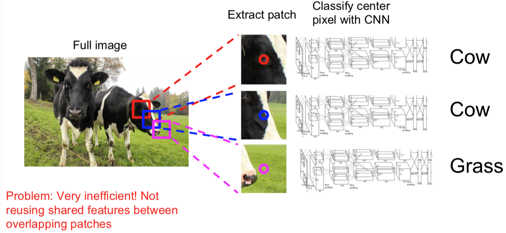

- 计算复杂度高，尤其对正向和反向传播来说。

### Fully Convolutional

Papers：

> Long, Shelhamer, and Darrell, “Fully Convolutional Networks for Semantic Segmentation”, CVPR 2015
>
> Noh et al, “Learning Deconvolution Network for Semantic Segmentation”, ICCV 2015

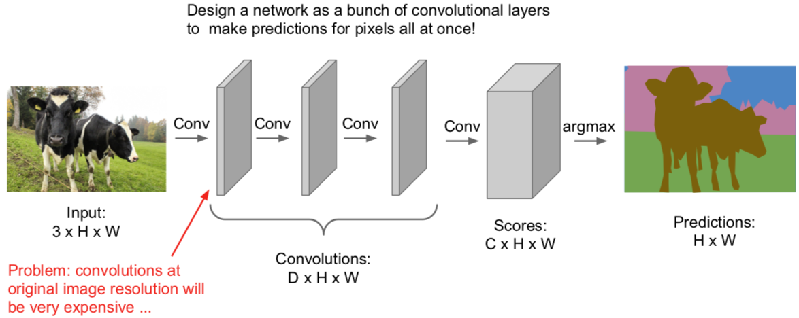

输出一个张量，尺寸是 C\*H\*W，其中 C 是类的数量。这个张量会为每个像素进行预测，给出评分。对每个像素这么做，我们可以用堆叠的卷积层一次性完成所有的计算。这样的话，训练这个网络就是对每个像素分配损失并且平均化损失用反向传播来进行训练。

- Q：如何得到这种训练集？
  - 是的，很贵啊！我们需要给每个像素标记。这样的工具可以在网上找到，你可以用它在图像上画轮廓线并且填充区域。不过获取这样的数据集还是挺贵的。

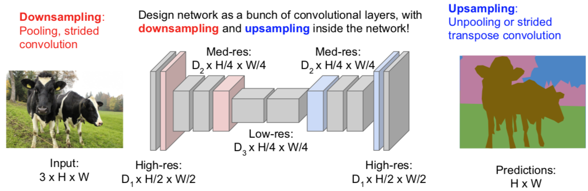

#### In-Network upsampling: “Unpooling”

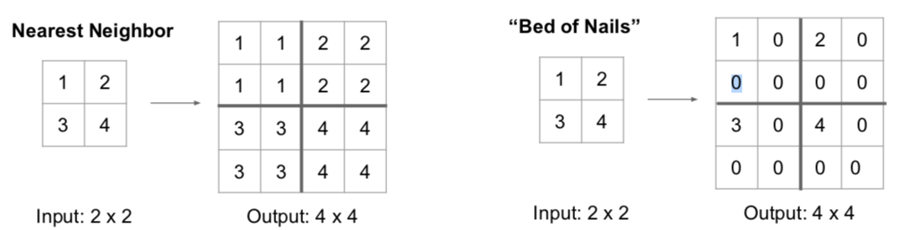

#### In-Network upsampling: “Max Unpooling”

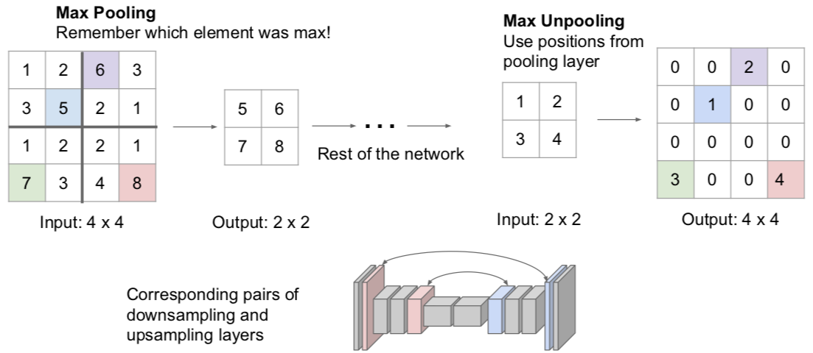

#### Learnable Upsampling: Transpose Convolution

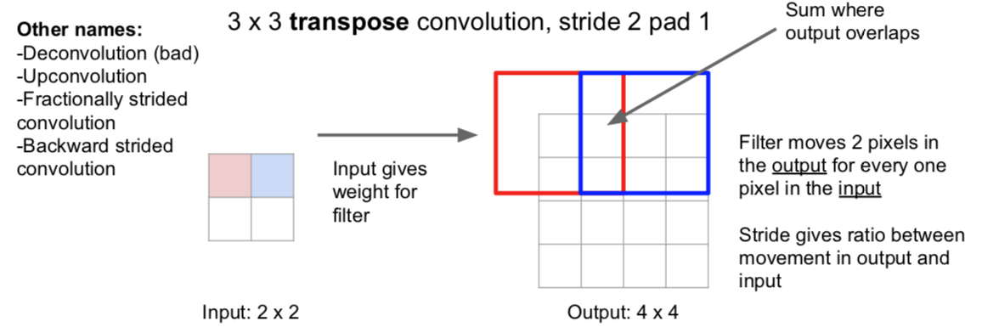

- 为啥叫做“转置”卷积

  - 例子1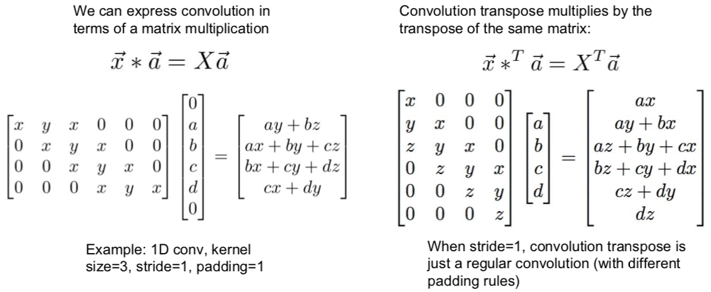

  - 例子2

    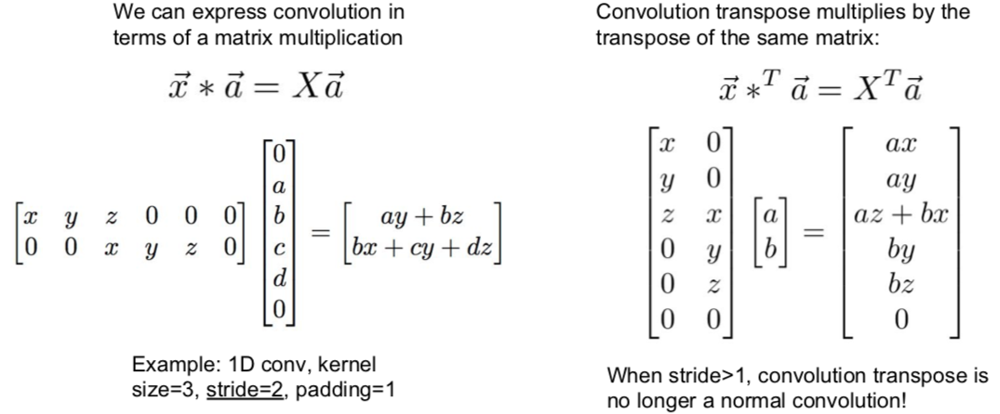

### Aside: Multi-view 3D Reconstruction (New topic in spring 2018)

Papers：

> Choy, C. B., Xu, D., Gwak, J., Chen, K., & Savarese, S. (2016, October). 3d-r2n2: A unified approach for single and multi-view
> 3d object reconstruction. In European Conference on Computer Vision (pp. 628-644). Springer, Cham.

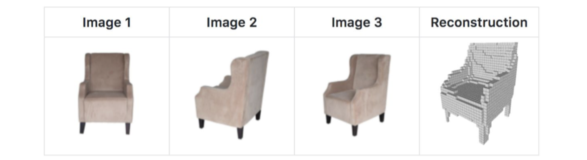

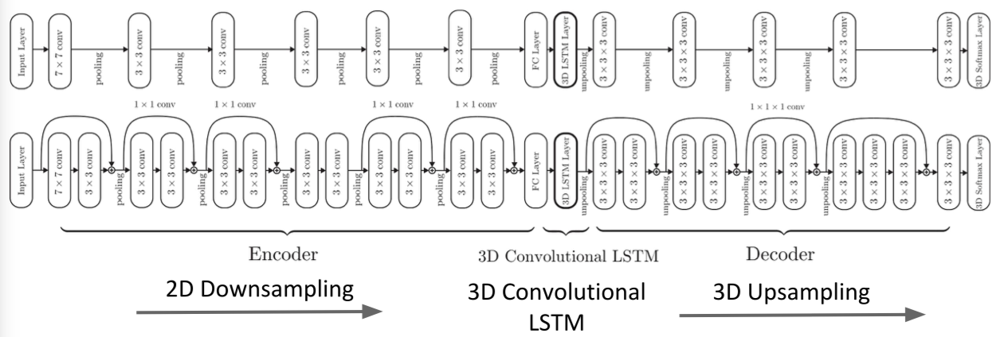

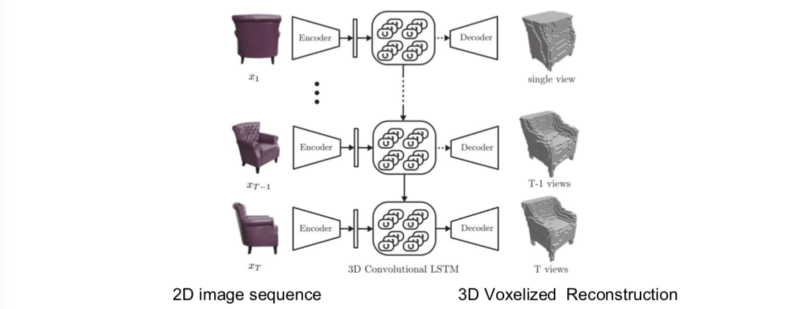

## Classification + Localization

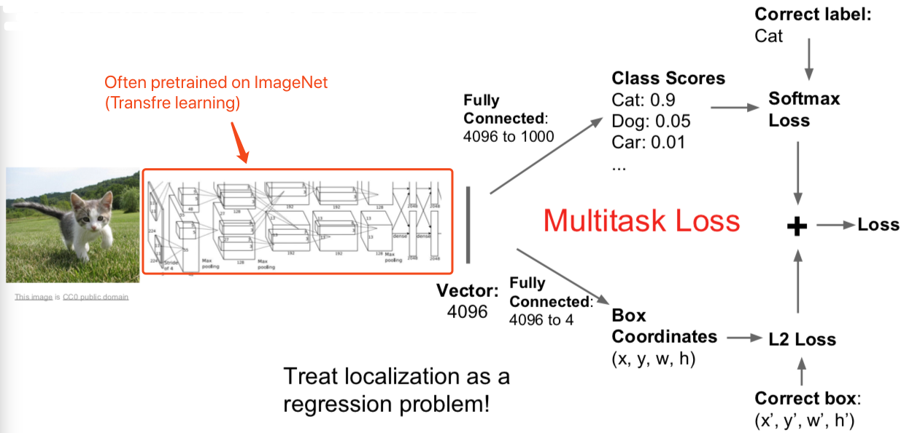

- Q：同时做这些是一个好主意么？举一个例子，如果你误分类了，你是否应该查看边界坐标去验证。
  - 一般来说，这种方法表现不错，不是个大问题，你可以训练一个神经网络同时做这些事情。不过有些时候会微妙些，从误分类角度来看，举个例子，有时候不仅要预测单个边界，你可能要分类预测，每一类的边界仅仅对某类边界评估损失针对实际值。人们有时候对这个会感兴趣，实际来看有一些帮助。但是这种基本的假设不是完美的，并不能最优化，但是有效，能做一些东西。
- Q：这些损失有不同的单位么？他们会控制梯度么？
  - 这就是我们说的多重任务损失。不论何时求导，我们对网络参数求梯度基于我们的参数，用这个求导结果做梯度。但是现在我们有两个标量，我们想同时最小化。你实际想做的是在这两个损失上加上一些给出权重的超参数。所以你可以做加权求和。对两个损失函数来确定最终损失。这样你可以针对加和求两损失加权总和的梯度。这不好处理，因为这个加权超参数需要你来设定，但它和我们见到过的其他超参数有所不同，因为这种加权化参数会改变损失函数的值。一般在设定超参数时，你会取不同的参数值对之后输出的损失值进行比较，看看它们发生了怎样的变化。但这里的超参数会影响损失值，做这种比较就要一些技巧了。所以合理选择参数也是一种挑战。实际应用中，为了解决问题，你需要根据不同情境进行这样的超参数取值。我一般会采取的策略是用你关心的性能指标组成的矩阵来取代原本的损失值。这样一来你实际上是在用最终性能矩阵做交叉验证，而不是仅盯着损失值来选择参数。
- Q：为什么不先固定网络中的所有参数再分别用两个任务中的全连接层数据进行学习？
  - 确实有人这么干。但其实一般在迁移学习中，对整个系统进行联合调试会得到更好的结果，因为有可能会出现特征的误匹配。若你将在 ImageNet 上训练过的神经网络用于自己的数据集，对整个网络进行更新会得到更优的表现。实际中有一些小技巧，你可以冻结你的网络，之后分开训练这两个网络直到收敛，之后你回到你的网络，最后回来联合调试整个系统。这是实际应用中经常用到的技巧。

### Object Detection as Regression? (New topic in Spring 2018)

### Aside: Human Pose Estimation

Papers：

> Johnson and Everingham, "Clustered Pose and Nonlinear Appearance Models for Human Pose Estimation", BMVC 2010
>
> Toshev and Szegedy, “DeepPose: Human Pose Estimation via Deep Neural Networks”, CVPR 2014

---

[返回到上一页](./index.html) | [返回到顶部](./cs231n_11.html)

---
 
 This work is licensed under a <a rel="license" href="http://creativecommons.org/licenses/by-nc-sa/4.0/">Creative Commons Attribution-NonCommercial-ShareAlike 4.0 International License</a>.
 

