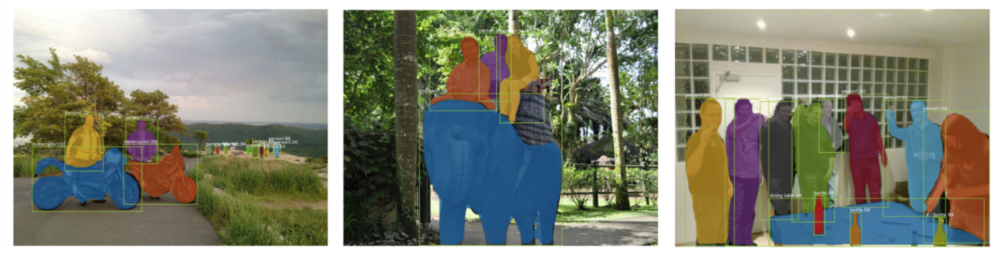
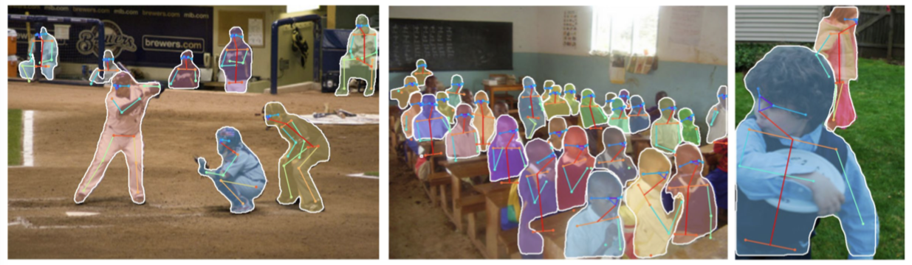

[返回到上一页](./index.html)

---

[TOC]

> CS231n 课程的官方地址：http://cs231n.stanford.edu/index.html
>
> 该笔记根据的视频课程版本是 [Spring 2017](https://www.bilibili.com/video/av17204303/?p=24)(BiliBili)，PPt 资源版本是 [Spring 2018](http://cs231n.stanford.edu/syllabus.html).
>

# Lecture 11. Detection and Segmentation

上课前，有人问小哥：

- Q：如何在训练过程中添加网络层？
  - 请读 papers：Ian Goodfellow 的 Net2Net 和微软的 Network Morphism。

## Semantic Segmentation

> 语义分割：我们希望输入图像，并对图像中每个像素做分类。

### Sliding Window

Papers：

> Farabet et al, “Learning Hierarchical Features for Scene Labeling,” TPAMI 2013 
>
> Pinheiro and Collobert, “Recurrent Convolutional Neural Networks for Scene Labeling”, ICML 2014

- 计算复杂度高，尤其对正向和反向传播来说。

### Fully Convolutional

Papers：

> Long, Shelhamer, and Darrell, “Fully Convolutional Networks for Semantic Segmentation”, CVPR 2015
>
> Noh et al, “Learning Deconvolution Network for Semantic Segmentation”, ICCV 2015

输出一个张量，尺寸是 C\*H\*W，其中 C 是类的数量。这个张量会为每个像素进行预测，给出评分。对每个像素这么做，我们可以用堆叠的卷积层一次性完成所有的计算。这样的话，训练这个网络就是对每个像素分配损失并且平均化损失用反向传播来进行训练。

- Q：如何得到这种训练集？
  - 是的，很贵啊！我们需要给每个像素标记。这样的工具可以在网上找到，你可以用它在图像上画轮廓线并且填充区域。不过获取这样的数据集还是挺贵的。

#### In-Network upsampling: “Unpooling”

#### In-Network upsampling: “Max Unpooling”

#### Learnable Upsampling: Transpose Convolution

- 为啥叫做“转置”卷积

  - 例子1

  - 例子2

    

### Aside: Multi-view 3D Reconstruction (New topic in spring 2018)

Papers：

> Choy, C. B., Xu, D., Gwak, J., Chen, K., & Savarese, S. (2016, October). 3d-r2n2: A unified approach for single and multi-view
> 3d object reconstruction. In European Conference on Computer Vision (pp. 628-644). Springer, Cham.

## Classification + Localization

- Q：同时做这些是一个好主意么？举一个例子，如果你误分类了，你是否应该查看边界坐标去验证。
  - 一般来说，这种方法表现不错，不是个大问题，你可以训练一个神经网络同时做这些事情。不过有些时候会微妙些，从误分类角度来看，举个例子，有时候不仅要预测单个边界，你可能要分类预测，每一类的边界仅仅对某类边界评估损失针对实际值。人们有时候对这个会感兴趣，实际来看有一些帮助。但是这种基本的假设不是完美的，并不能最优化，但是有效，能做一些东西。
- Q：这些损失有不同的单位么？他们会控制梯度么？
  - 这就是我们说的多重任务损失。不论何时求导，我们对网络参数求梯度基于我们的参数，用这个求导结果做梯度。但是现在我们有两个标量，我们想同时最小化。你实际想做的是在这两个损失上加上一些给出权重的超参数。所以你可以做加权求和。对两个损失函数来确定最终损失。这样你可以针对加和求两损失加权总和的梯度。这不好处理，因为这个加权超参数需要你来设定，但它和我们见到过的其他超参数有所不同，因为这种加权化参数会改变损失函数的值。一般在设定超参数时，你会取不同的参数值对之后输出的损失值进行比较，看看它们发生了怎样的变化。但这里的超参数会影响损失值，做这种比较就要一些技巧了。所以合理选择参数也是一种挑战。实际应用中，为了解决问题，你需要根据不同情境进行这样的超参数取值。我一般会采取的策略是用你关心的性能指标组成的矩阵来取代原本的损失值。这样一来你实际上是在用最终性能矩阵做交叉验证，而不是仅盯着损失值来选择参数。
- Q：为什么不先固定网络中的所有参数再分别用两个任务中的全连接层数据进行学习？
  - 确实有人这么干。但其实一般在迁移学习中，对整个系统进行联合调试会得到更好的结果，因为有可能会出现特征的误匹配。若你将在 ImageNet 上训练过的神经网络用于自己的数据集，对整个网络进行更新会得到更优的表现。实际中有一些小技巧，你可以冻结你的网络，之后分开训练这两个网络直到收敛，之后你回到你的网络，最后回来联合调试整个系统。这是实际应用中经常用到的技巧。

### Aside: Human Pose Estimation

Papers：

> Johnson and Everingham, "Clustered Pose and Nonlinear Appearance Models for Human Pose Estimation", BMVC 2010
>
> Toshev and Szegedy, “DeepPose: Human Pose Estimation via Deep Neural Networks”, CVPR 2014

## Object Detection

- Object Detection as Regression?

### Region Proposals (候选区域)

-  找到物体可能存在的备选区域，再应用卷积神经网络对这些备选区域进行分类，这样做比穷尽所有可能的位置和范围要来的更容易一些。

#### R-CNN

给定我们的输入，我们运行一些区域选择网络去找到备选区域，有时候也叫兴趣区域或 ROI，选择查找可以给你大概 2000 个兴趣区域。其中一个问题是这些输入中的区域可能有不同的尺寸，但是都要在卷积神经网络中运行做分类。这样的话，我们希望所有输入尺寸一致，因为全连接层的特性。所以，我们需要处理这些区域调整为固定尺寸，使之与下游网络输入相匹配。所以我们需要对输入做切分，根据备选区域的要求切分至固定尺寸，之后经过卷积神经网络运行这些算法，然后使用支持向量机算法基于样本做分类，预测对应的组别。另外提一下，基于区域选择的卷积神经网络可以做回归，可以用来矫正包围盒（bounding box），除了输入的问题。另外的问题是，你的输入图像中物体的位置你可能会感觉不错，实际不是完美的，所以算法会考虑这个不光对这些区域分类，也预测边界补偿和修正值，在确定备选区域时。再一次强调，这个是多任务损失，你需要对这些进行训练。

- Q：是否有必要让备选区域为长方形？
  -   是的。因为很难对不规则的物体进行划分，但是如果你谈及即时切割，你不一定用长方形，如果你想预测一些不是长方形的区域。
- Q：区域选择会不会学习这种算法是很传统的？
  - 嗯，它不是自学习的，这是种固定算法有人写下来。 
-  Q：校正是否在兴趣区域内？
  - 不是，不一定。举个例子，假设兴趣区域是围绕人的，但是没包括人的头部，你可以想象，网络会推断，怎么没有头，所以网络应该把边界提高一点。所以最终预测会比之前的区域要大。
- Q：如果你有很多兴趣区域不属于你要找的物体？
  - 除了你感兴趣的类，你可以添加其他背景类。所以你的类可以预测背景，说那里没有物体。
- Q：我们需要什么数据？
  - 这是一个监督学习问题。考虑到我们的训练集由图像组成，每个图像由包含并标记出所有目标的类别。绝对有尝试实现这个的论文。如果你没有数据，如果你只有一些图片的数据或者如果图片清晰度不够。在训练阶段，通常情况下，可以假设图像中所有目标都是监督学习。

#### R-CNN：Problems

- Ad hoc training objectives
  - Fine-tune network with softmax classifier (log loss)
  - Train post-hoc linear SVMs (hinge loss)
  - Train post-hoc bounding-box regressions (least squares) 
- Training is slow (84h), takes a lot of disk space 
- Inference (detection) is slow
  - 47s / image with VGG16 [Simonyan & Zisserman. ICLR15]
  - Fixed by SPP-net [He et al. ECCV14] 

#### Fast R-CNN

训练的时候：

#### Faster R-CNN

- Q：有时候多任务学习可以视为正则，这里怎么理解？
  - 我不确定是不是有更好的对照实验来说明这个。在原来的版本的 Faster R-CNN 论文他们做了一些实验，比如如果我们共享区域选择网络会怎么样，反之如何，如果我们通过分离卷积神经网络来学习区域选择网络效果会不会比分类网络好。这之间有些小小的不同，但是并不显著。实际中，只学一种更好，因为计算复杂度会低一些。
- Q：你如何训练区域选择网络，因为你不知道真值。
  - 这个有些复杂，不想说太多。解决方法是你设置区域选择网络与真值重叠的阈值，当大于这个阈值时判断为正，你可以拿这个做区域选择。如果与真值重叠小于这个阈值，责备预测为负。但是这里涉及很多玄妙的超参数，还是蛮复杂的。
- Q：什么是区域选择模型的分类损失？
  - 简单的二分类损失。对于你的潜在的区域，它进行二分类：这是一个目标吗？所以它像是一个二分类损失。

### Detection without Proposals: YOLO / SSD

 给定输入图像，你可以将输入图像分成网格。这个案例中是 7x7 个网络。在每个单元里，你可以想象一系列的基本边界框。上面画了三个基本边界框，高的，宽的，正方形的。在实际应用中你可能不止用3个。你想对每个网格和每个基本边界框预测几种目标物体。第一，你要预测边界框偏移，从而预测出边界框与目标物体的位置的偏差，你还要预测目标对应类别的分数，所以每个边界框都会对应一个类别分数，就是某类目标物体出现在边界框中的可能性有多大，然后我们就从输入图像中完成了预测，这个 7x7x(5xB+C) 的张量。我们有 B 个基本边界框，每个边界框对应5个值，分别对应边界框的插值和我们的置信度，C 对应 C 类目标类别的分数。我们可以把这种目标检测看作输入一张图像，输出一个3维张量，你可以使用一个巨大的卷积网络来训练这整个过程。这就是 **SSD** 算法的过程。这个过程将使用真实类标去匹配，这些潜在的基本框，虽然有点麻烦，但是就是这么做的。

另外，基于候选框的网络，正如在 Faster R-CNN 中所使用的，最终会寻找出一系列比较接近图像网络的边界框。另外一些基于候选框的网络除了预测类别之外，还会对预测框做回归。这些概念有些重叠。在 Faster R-CNN 中我们将目标区域的提出看做是一个端到端的回归问题，然后我们对提出的区域分别进行处理，但是在 SSD 方法中，我们只做第一步，通过一个前馈网络一次进行所有的目标检测。

### Object Detetion: Lots of variables ...

## Instance Segmentation

### Mask R-CNN

---

[返回到上一页](./index.html) | [返回到顶部](./cs231n_11.html)

---
 
 This work is licensed under a <a rel="license" href="http://creativecommons.org/licenses/by-nc-sa/4.0/">Creative Commons Attribution-NonCommercial-ShareAlike 4.0 International License</a>.
 

