[返回到上一页](./index.html)

---

[TOC]

> CS231n 课程的官方地址：http://cs231n.stanford.edu/index.html
>
> 该笔记根据的视频课程版本是 [Spring 2017](https://www.bilibili.com/video/av17204303/?p=27)(BiliBili)，PPt 资源版本是 [Spring 2018](http://cs231n.stanford.edu/syllabus.html).
>
> 另有该 Lecture 13. 扩展讲义资料：
>
> - [DeepDream](https://github.com/google/deepdream)
> - [neural-style](https://github.com/jcjohnson/neural-style)
> - [fast-neural-style](https://github.com/jcjohnson/fast-neural-style)

# Lecture 13. Visualizing and Understanding

ConvNets 的内部究竟是怎样的呢？

## First Layer: Visualize Filters

此处有三篇 papers：

> Krizhevsky, “One weird trick for parallelizing convolutional neural networks”, arXiv 2014
> He et al, “Deep Residual Learning for Image Recognition”, CVPR 2016
> Huang et al, “Densely Connected Convolutional Networks”, CVPR 2017

观察第一层的卷积核。你可以看到它们都在寻找有向边（oriented edges），比如明暗线条。从不同的角度和位置来观察输入图像，我们可以看到完全相反的颜色，比如绿色和粉色，或者橙色和蓝色灯相反的颜色。

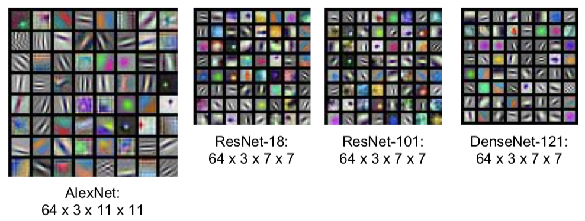

- Q：为什么要可视化卷积核的权重是为了让你知道卷积核在寻找什么？
  - 这个直觉来源于模板匹配和内积。想象一下，如果你有些模板向量，然后你通过模板向量和一些任意的数据之间的点积得到了标量输出。然后当这两个向量相互匹配输入将在范数约束的条件下被最大化。所以，不管你在什么时候进行内积，你正在进行内积的对象是内积的结果最大化的因素。所以这就是为什么我们要可视化权重以及它们能够提供给我们第一卷积层寻找的东西的原因。 

中间层权重可视化后的可解释性就差很多了。

- 所有的可视化图像，我们都把权值设定在 0 到 255 这个区间内。实际上，那些权值可以是无限的（任意的），它们可以在任意范围之内。但是为了得到比较好的可视化效果，并且（没有限定权值范围的）可视化也没有考虑到这些层的偏置，所以我们需要对它们进行缩放。所以你们应该记住模型可视化的恰当时机。

## Last Layer

- 可以考虑用 L2 Nearest neighbors in feature space 来可视化。

- t-sne 非线性降维方法（不同于主成分分析 PCA）

此处一篇 paper：

> Van der Maaten and Hinton, “Visualizing Data using t-SNE”, JMLR 2008

See high-resolution versions at http://cs.stanford.edu/people/karpathy/cnnembed/

## Visualizing Activations

虽然中间层的权重可视化可解释性很不好。但实际上，可视化中间层的激活映射图（activation maps），在某些情况下是具备可解释性的。

此处一篇 paper：

> Yosinski et al, “Understanding Neural Networks Through Deep Visualization”, ICML DL Workshop 2014
>
> http://yosinski.com/deepvis

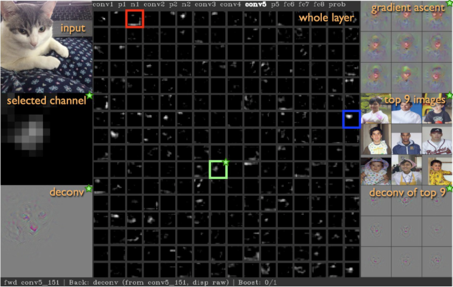

## Maximally Activation Patches

- 可视化输入图像中什么类型的图像块可以最大限度地激活？

此处一篇 paper：

> Springenberg et al, “Striving for Simplicity: The All Convolutional Net”, ICLR Workshop 2015

选取卷积层中的某个通道。通过卷积神经网络运行很多的图像，对于每一个图像，记录它们的卷积特征，然后可以观察到那个特征映射图的部分，已经被我们图像的数据集最大地激活。因为这是卷积层，卷积层中的每个神经元在输入部分都有一些小的感受野，每个神经元的（管辖部分）并不是整个图像，它们只针对于这个图像的子集合，然后我们要做的是，从这个庞大的图像数据集中，可视化来自该特顶层特定特征的最大激活的图像块。然后我们可以根据这些激活块，在特定层的激活程度来解决这个问题。

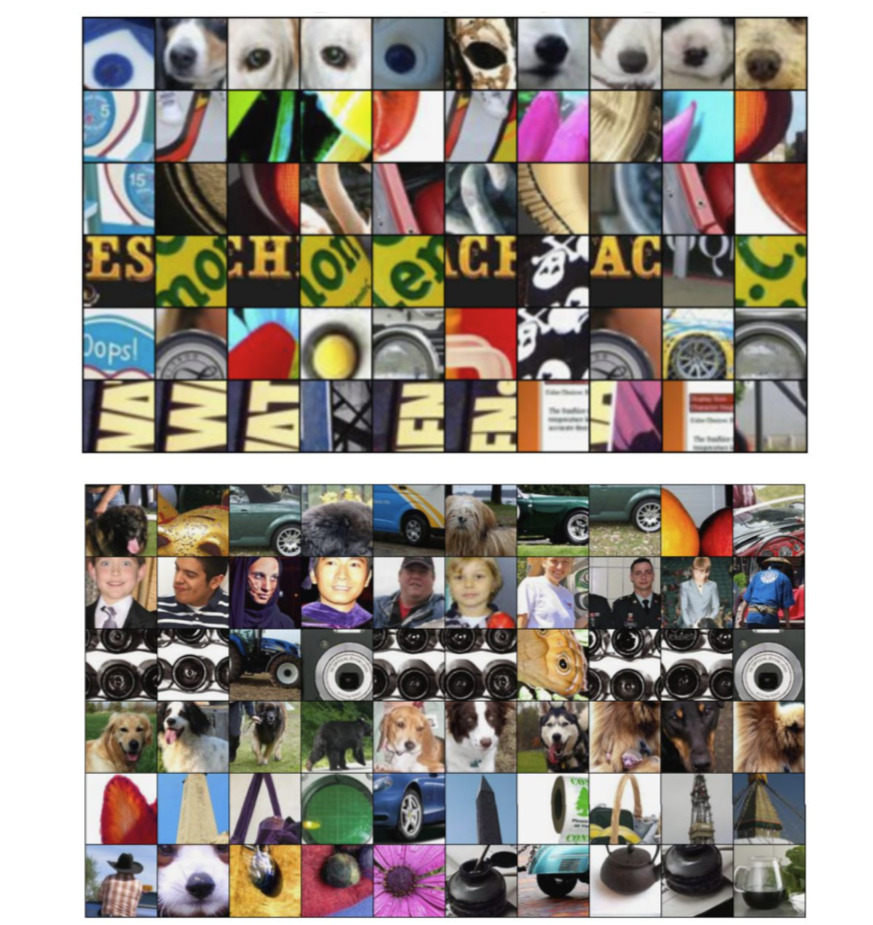

##  Which pixels matter: Saliency vs Occlusion

- 弄清楚究竟是输入图像的哪个部分，导致神经网络做出分类的决定。
  1. 排除实验！（Occlusion）

  此处一篇 paper：

	> Zeiler and Fergus, “Visualizing and Understanding Convolutional Networks”, ECCV 2014

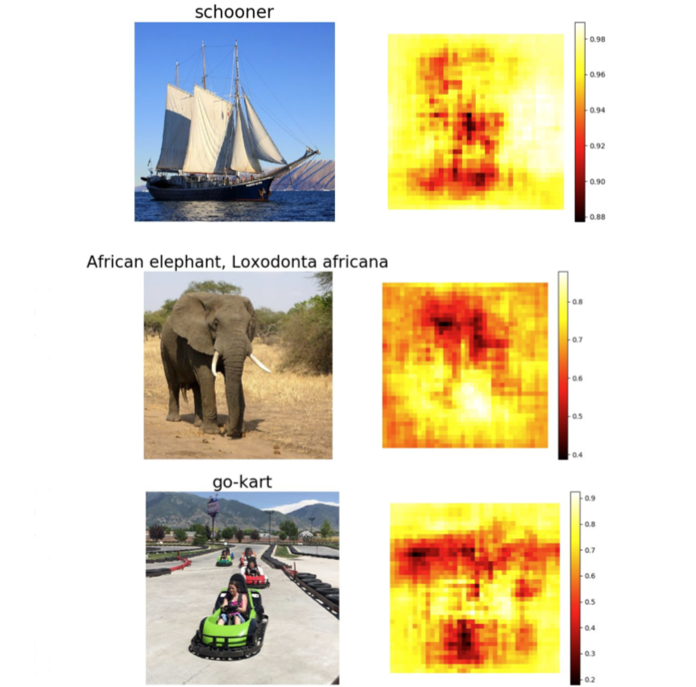

2. 显著图（Saliency）

   > Simonyan, Vedaldi, and Zisserman, “Deep Inside Convolutional Networks: Visualising Image Classification Models and Saliency Maps”, ICLR Workshop 2014.

   计算相对于输入图像中各像素对应的类预测值的梯度。在一阶近似意义上，对于每个输入图像的每个像素，如果我们进行小小的扰动，那么相应类的分类分值会有多大的变化。这是另一种用来解决输入图像的哪个部分的像素用于分类。

   

   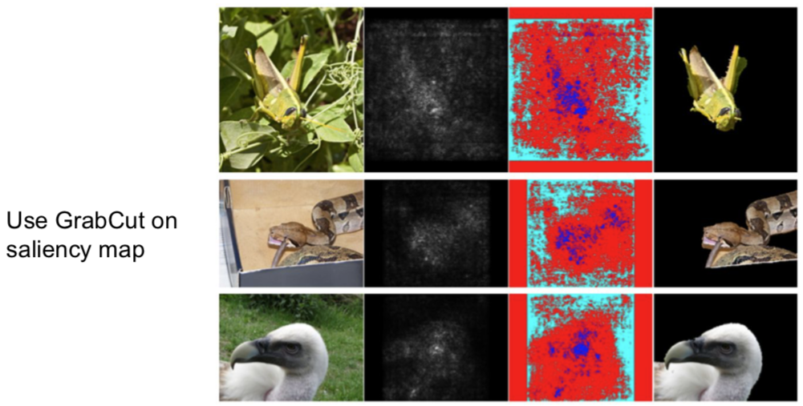

## Intermediate Features via (guided) backprop

引导式反向传播

这里有两篇 papers：

> Zeiler and Fergus, “Visualizing and Understanding Convolutional Networks”, ECCV 2014
> Springenberg et al, “Striving for Simplicity: The All Convolutional Net”, ICLR Workshop 2015

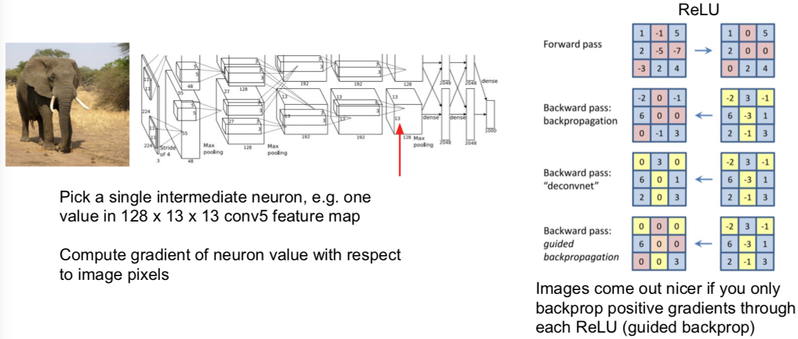

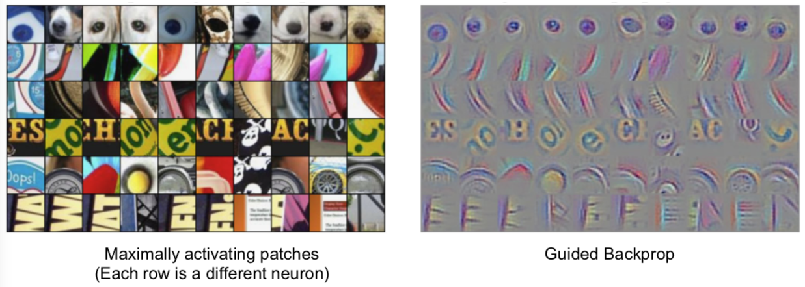

- 关于引导式反向传播或计算显著图的意见非常有趣的事情是：总有一个固定输入图像的函数，这个函数告诉我们对于一个固定输入的图像，输入图像的哪个像素或哪个部分影响了神经元的分值。

## Visualizing CNN features: Gradient Ascent

另一个你可能会问的问题是：如果我们在一些输入图像上移除这种依赖性，那什么类型的输入会激活这个神经元。

我们可以通过**梯度上升（Gradient Ascent）**算法来解决这个问题。记住我们总是在训练卷积神经网络时，使用梯度下降来使（函数）损失最小化。而现在，我们想要固定训练的卷积神经网络的权重，并且在图像的像素上执行梯度上升来合成图像，以尝试和最大化某些中间神经元和类的分值。

在执行梯度上升的过程中，我们不再优化神经网路中保持不变的权重。相反，我们试图改变一些图像的像素，使这个神经元的值或这个类的分值最大化。除此之外，我们需要一些正则项。在看到正则项尝试阻止神经网络权重过拟合训练数据之前，我们需要类似的东西来防止我们生成的图像过拟合特定网络的特性。所以，这里我们经常会加入一些正则项，我们需要具备两个特定属性的生成图像：

1. 我们想要最大程度地激活一些分值或神经元的值；
2. 我们希望这个生成图像看起来是自然的，即我们想要生成图像具备在自然图像中的统计数据。这些主管的正则项是强制生成图像看起来像是自然图像的东西。

步骤通常来说很简单：

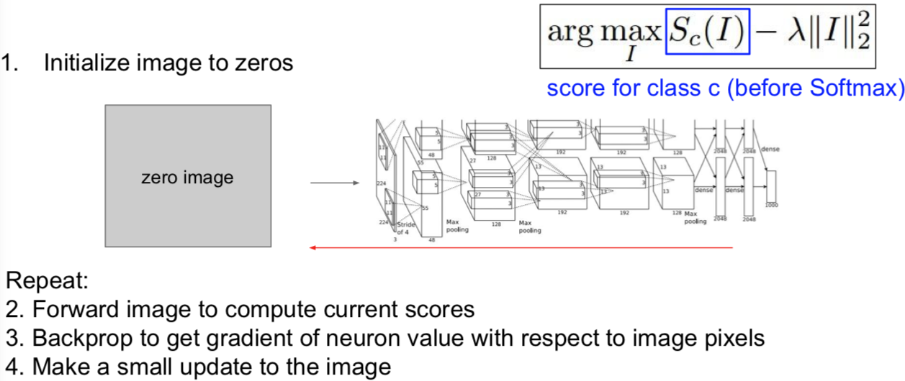

- Q：如果不使用任何的正则化会怎样？
  - 那么你将很有可能得到分值最大化并且已经分好的类，但是通常它看起来不像任何事物，就像随机噪声。

有人增加了一些令人印象深刻的正则化，在下面的 paper 中：

> Yosinski et al, “Understanding Neural Networks Through Deep Visualization”, ICML DL Workshop 2014.

除了 L2 范数约束之外。另外我们还定义在优化过程中，对图像进行高速模糊处理，我们同时也将一些低梯度的小的像素值修改为 0。可以看到这是一个投射梯度上升算法，我们定期投射具备良好属性的生成图像到更好的图像集中。举个例子，进行高斯模糊处理后，图像获得特殊平滑性。所以，对图像进行高斯模糊处理后，更容易获得清晰的图像。

除了对最后分值，我们也可以最大化某个中间层的其中一个神经元的分值：

下面是一个针对性解决多模态问题的 paper：

> Nguyen et al, “Multifaceted Feature Visualization: Uncovering the Different Types of Features Learned By Each Neuron in Deep Neural Networks”, ICML Visualization for Deep Learning Workshop 2016.

在这篇论文中，他们尝试在优化的过程中考虑多模态问题，即对每一个类运行聚类算法以使这些类分成不同的模型，然后用接近这些模型其中之一的类进行初始化。那么当你这么做的事情，你就可能考虑多模态形式。

你还可以添加更加强大的先验图像，然后生成非常漂亮的图像。这些生成图像都是通过最大化一些图像类的分值得到的。一般的想法是，尝试优化图像在 FC6 潜在空间中的表示，而不是直接优化输入图像的像素。他们需要使用特征反演网络。

多说无益，给你 paper：

> Nguyen et al, “Synthesizing the preferred inputs for neurons in neural networks via deep generator networks,” NIPS 2016

重点是：当你开始在自然图像建模时，添加先验图像，你最终可以得到一些非常真实的图像，它们让你了解到神经网络究竟在寻找什么（特征）。

## Fooling Images / Adversarial Examples

1. Start from an arbitrary image 
2. Pick an arbitrary class 
3. Modify the image to maximize the class 
4. Repeat until network is fooled 

多说无益，自己看 Goodfellow 的讲座：

> Check out [Ian Goodfellow’s lecture](https://www.youtube.com/watch?v=CIfsB_EYsVI) from last year （[Bilibili](https://www.bilibili.com/video/av17204303/?p=35&spm_id_from=333.788.multi_page.5)）

- Q：了解中间神经元，对我们了解最终的分类有什么帮助？
  - 实际上，试图对中间神经元进行可视化是深度学习里备受批评的领域。比如，你有一个大的黑盒子神经网络，你通过梯度上升来训练它并且得到了一个很好的值，那很好，但是我们并不信任这个神经网络，因为我们作为人类并不理解，它是如何作出决策的。很多这种类型的可视化技术被开发来试图从人类的角度来理解并解决，比如为什么这些网络分类的类别在逐渐地增多的问题，因为如果将深层神经网络与其他机器运行技术进行对比，（你会发现）线性模型更容易被解释，因为你可以观察权值并且理解每个特征对决策的影响程度，比如随机森林或决策树，一些其他的机器学习模型可以通过它们本身的特性，变得比这个黑盒子卷积神经网络更具有可解释性。很多回应这种质疑的声音认为，虽然它们是大型复杂的模型，但是它们仍然在做一些有趣的具备可解释性的事情，它们不是完全随意地分类事物，相反，它们在做有意义的事情。

## DeepDream: Amplify existing features

另一种基于梯度的图像优化是 DeepDream。只是 for fun。。。。。

我们做的是提取我们的输入图像，通过神经网络运行到某一层，接着进行反向传播，并且设置该层的梯度等于激活值，然后反向传播到图像，并不断地更新图像。

关于（上述步骤的）解释是试图放大神经网络在这张图像中检测到的特征，因为无论那层上存在什么样的特征，现在我们设置梯度等于特征值，以使神经网络放大它在图像中所检测到的特征。这种办法同样适用于最大化图像在该层的 L2 范数。

直接来看代码：

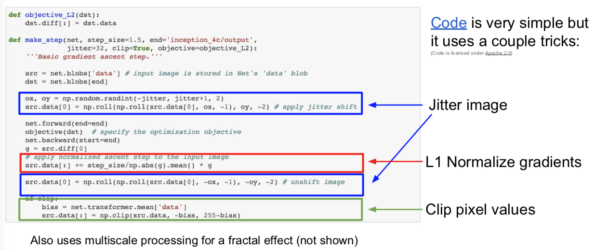

其中一个技巧是在计算梯度之前抖动图像，即不是通过神经网络运行完全和原图像相同的图像，而是将图像移动两个像素，并将其他两个像素包裹在这里。这是一种使用正则化以使图像更加得平滑。同样地，他们使用梯度的 L1 归一化，这在对待图像生成问题上，有时候也是一个有用的技巧。你也可以看到他们有时候修改像素值。再强调一遍，像素值应该被限定在 0 到 255 之间，这是一种投影梯度下降，即投影到实际有效图像的空间上。

## Feature Inversion

特征反演。

此处 paper 两篇：

> Mahendran and Vedaldi, “Understanding Deep Image Representations by Inverting Them”, CVPR 2015
>
> Johnson, Alahi, and Fei-Fei, “Perceptual Losses for Real-Time Style Transfer and Super-Resolution”, ECCV 2016. Copyright Springer, 2016.

我们将要做的是，选取一张图像，通过神经网络运行该图像，记录其中一个图像的特征值，然后根据它的特征表示重构那个图像。基于重建图像的样子，这将给我们一些关于在该特征向量中捕获的图像类型的信息。我们可以通过梯度上升和正则化来做到这一点，与其最大化某些分值，不如最小化捕获到的特征向量之间的距离，并且在生成图像的特征之间尝试合成一个新的与之前计算过的图像特征相匹配的图像。

另一个经常见到的是正则化是全变差正则化（Total Variationregularizer）。全变差正则化是将左右相邻像素之间的差异拼凑成上下相邻，以尝试增加生成图像中特殊的平滑度。

## Texture Synthesis

纹理合成 —— 计算机图形学中的老问题

给定一些纹理的输入图像块，像下面左边的小尺度，现在我们想要构建某个模型以使其生成更大快的相同的纹理图像。举个例子，我们想要在这里生成包含许多与输入图像相同尺度的更大的图像。

此处一篇 paper：

> Gatys, Ecker, and Bethge, “Texture Synthesis Using Convolutional Neural Networks”, NIPS 2015

为了在神经网络上进行纹理合成，他们使用了格拉姆矩阵（gram matrix）。我们将要做的是，在这个实例中，选取我们输入的石头纹理，把它传递给卷积神经网络，抽取它们在卷积神经网络某层的卷积特征。假设我们正在讨论的卷积特征体积是 C x H x W，你可以把它看做 H x W 的空间网格，在网络上的每一点都有 C 维的特征向量来描述图像在这点的外观。我们将会使用激活映射图（activation map）来计算输入纹理图像的映射符，然后选取输入特征的两个不同列，每个特征列都是 C 维的向量，然后通过这两个向量得到 C x C 的矩阵。这个告诉我们图像中两个点代表的不同特征的同现关系（co-occurrence）。如果 C x C 矩阵中，位置索引为 i j 的元素值非常大，这意味着这两个输入向量的位置索引为 i 和 j 的元素值非常大。这以某种方式捕获了一些二阶统计量，即特特征映射图中的哪些特征，倾向于在空间的不同位置一起激活。

我们将通过使用 H x W 网格中不同点所对应的特征向量，取它们的平均值，那么我们会得到 C x C 的格拉姆矩阵，然后使用描述符（descriptor）来描述输入图像的纹理结构。

关于格拉姆矩阵的有趣的一点是，它丢弃了特征体积中的所有空间信息，因为我们对图像中的每一点所对应的特征向量对取平均值，它只是捕获特征间的二阶同现统计量。这最终是一个很好的纹理描述符。

顺便提及一点，这里的计算你效率非常高。你可能会思考：为什么不使用协方差矩阵或类似的方法，而是使用有趣的格拉姆矩阵。这个问题的答案是使用协方差矩阵同样有效，但是计算成本要高一些。在实际中，人们只是使用格拉姆矩阵描述符。

## Neural Style Transfer: Feature + Gram Reconstruction

小哥贴出了他的 github 哈：https://github.com/jcjohnson/neural-style

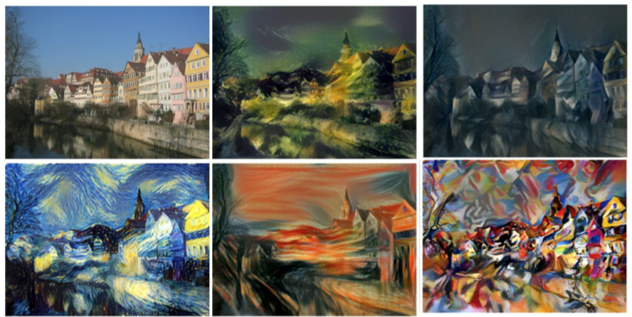

-  如果平衡内容和风格图像之间的权重以及损失，然后就可以控制内容和风格之间在生成图像的比重：

  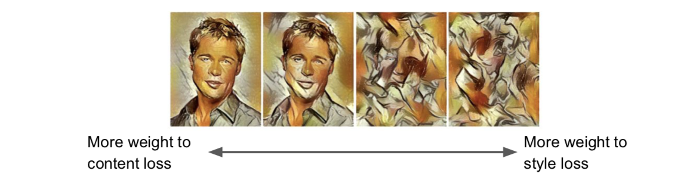

- 在计算格拉姆矩阵之前，重新调整风格图像的尺寸大小，就可以让你控制从特征图像中重构的特征的尺度。可以看到我们已经完成了相同的重构，唯一的区别是在我们计算格拉姆矩阵之前，风格图像的比重大小：

  

- 对多重风格图像进行风格迁移，并且同时匹配多重格拉姆矩阵，效果会非常棒。

  

- 对图像可以执行类似Deepdream相同的多尺度处理，生成高分辨率的风格图像。

  

## Neural Style Transfer: Problem & Solution

- Problem：Style transfer requires many forword / backward passes through VGG; very slow!
- Solution：Train *another* neural network to perform style transfer for us!

 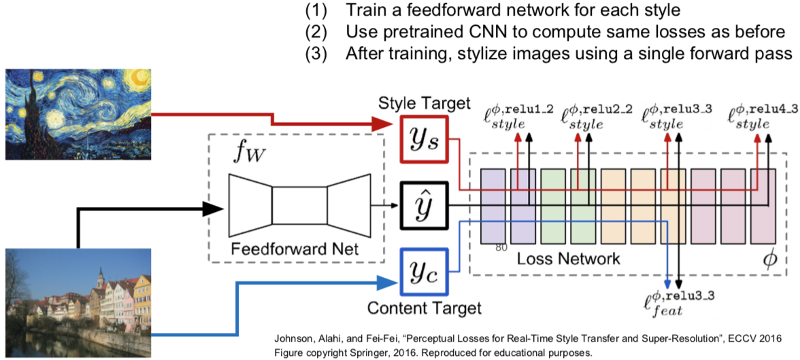

效果惊艳！速度快了1000倍，小哥提供了代码：https://github.com/jcjohnson/fast-neural-style

俄罗斯的组也有做加速风格转换的：

> Ulyanov et al, “Texture Networks: Feed-forward Synthesis of Textures and Stylized Images”, ICML 2016
> Ulyanov et al, “Instance Normalization: The Missing Ingredient for Fast Stylization”, arXiv 2016

Google 搞出了一个 one network, many styles:

最后总结下：

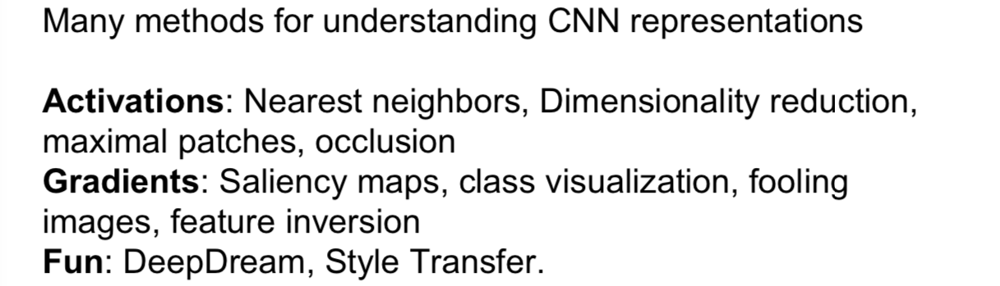

---

[返回到上一页](./index.html) | [返回到顶部](./cs231n_13.html)

---
 
 This work is licensed under a <a rel="license" href="http://creativecommons.org/licenses/by-nc-sa/4.0/">Creative Commons Attribution-NonCommercial-ShareAlike 4.0 International License</a>.
 

