[返回到上一页](./index.html)

---

[TOC]

> CS231n 课程的官方地址：http://cs231n.stanford.edu/index.html
>
> 该笔记根据的视频课程版本是 [Spring 2017](https://www.bilibili.com/video/av17204303/?p=16)(BiliBili)，PPt 资源版本是 [Spring 2018](http://cs231n.stanford.edu/syllabus.html).
>
> 另有该 Lecture 7. 扩展讲义资料：
>
> - **Tips and tricks for tuning NNs** [slides](https://docs.google.com/presentation/d/183aCHcSq-YsaokZrqI3khuy_zPbehG-XgkyA6L5W4t4/edit?usp=sharing) (Discussion Section)
> - [Neural Nets notes 3](http://cs231n.github.io/neural-networks-3/) ([中译版](./CS231n_Neural_Nets_notes_3.html))
> - [proposal description](http://cs231n.stanford.edu/project.html) (Project Proposal) 有很多很不错的顶会/领域/papers/datasets等


# Lecture 7. Training Neural Networks, part 2


## More normalization (new topic in Spring 2018)

### Batch Normalization

### Batch Normalization for ConvNets

### Layer Normalization

### Instance Normalization

### Group Normalization

### Decorrelated Batch Normalization


## Fancier optimization

之前学的 SGD 优化算法似乎很容易理解，但是它有很多问题：


### Problems with SGD

1. 损失函数对于不同参数梯度的敏感程度差异很大的话，损失值的变化在这种情况下会表现很坏：

   > Loss function has high **condition number**: ratio of largest to smallest singular value of the **Hessian** matrix is large. (海森矩阵中最大奇异值和最小奇异值之比)

   直观来看，损失函数像是个玉米🌽。梯度的方向并不是与局部最小值的直线，而是走 nasty zigzagging，所谓**之字形**运动。事实上，在高维参数空间中，这种情况很普遍。

   

2. 存在**局部极小值**或**鞍点**（非凸优化问题）。

   - 梯度下降会 stuck 在局部极小值。

     

   - 在高维参数空间上，鞍点远比局部极小值麻烦的多。这意味着在鞍点处，某些方向上损失会增加，某些方向上会减小。这种情况在高维参数空间中会发生得更加频繁，基本上几乎在任何点上都会发生。然而在局部极小值点上，任何一个方向前进损失都会变大。事实上在考虑这种很高维的问题时，看起来似乎这种情况非常稀少。

   - 有时候问题并非恰好在鞍点上，也可能在鞍点附近。因为梯度实在太小，学习的前进会非常缓慢。

     

   此处可引一篇 paper：Dauphin et al, “Identifying and attacking the saddle point problem in high-dimensional non-convex optimization”, NIPS 2014

3. **Stochastic**（随机性）是 SGD 的另一个问题。

   通常我们并不会在实践中真的一个一个实例的扔到网络中跑损失值和梯度估计，毕竟太慢了~ 而是通常用 mini-batch 方法来对梯度进行有噪声估计。可以实验，带有均匀噪声的 SGD 会对当前的附近损失空间造成一定扭曲，从而可能实际上需要花费很长时间才能得到极小值。

- Q：使用 GD （也就是 full batch gradient descent）的话，可以解决上述三大问题么？
  - 不会。有时候网络本身就存在明确的随机性，所以仍是一个问题；鞍点问题也仍会存在。


### SGD + Momentum

作为对比，先贴出 SGD：


然后，作为对比，贴出 SGD+Momentum 的两种等价表示：


在 SGD+Momentum 算法中，$v, \rho$ 分别作为“速度”和“摩擦系数”一般的存在，其中 $\rho$ 是一个新的超参数。

之前提到过，SGD方法的一个缺点是其更新方向完全依赖于当前batch计算出的梯度，因而十分不稳定。Momentum算法借用了物理中的动量概念，它模拟的是物体运动时的惯性，即更新的时候在一定程度上保留之前更新的方向，同时利用当前batch的梯度微调最终的更新方向。这样一来，可以在一定程度上增加稳定性，从而学习地更快，并且还有一定摆脱局部最优的能力。

- Build up "velocity" as a running mean of gradients，是一个最近梯度加权平均的平滑移动，会随着最近的梯度权重越来越大。
- $\rho$ gives "friction" ; typically $\rho=0.9 \text{ or } 0.99$
- 可以较好的解决局部最小和鞍点的问题；效果表现明显比 SGD 更要好。

此处有 paper 一篇：Sutskever et al, “On the importance of initialization and momentum in deep learning”, ICML 2013

- Q：“速度”的初始值一般怎么取？
  - 基本上都是初始化到 0，它不算是超参数。


### Nesterov Momentum

这是在 SGD+Momentum 的基础上一个轻微变化，叫做 Nesterov accelerated gradient 或者 Nesterov momentum。

此处有 paper 2 篇：Nesterov, “A method of solving a convex programming problem with convergence rate O(1/k^2)”, 1983 和 Nesterov, “Introductory lectures on convex optimization: a basic course”, 2004 。


梯度动量更新都是在红色点处，把历史梯度信息综合而成的“速度”在当前点与梯度结合，然后做出实际的更新运动。而 Nesterov 加速梯度下降是先在当前的 step 处用历史梯度信息综合而成的“速度”进行一次模拟更新运动，用运动后的梯度再与之前的“速度”结合做出实际当前 step 处的梯度更新运动。

公式就是这样的：


从后一个经过换元的新公式来看，我们可以说 Nesterov 动量包含了当前速度向量和先前速度向量的误差修正。

而且，你可以看到带动量的 SGD 和 Nesternov 动量的一个不同就是：由于 Nesternov 有校正因子的存在，与常规方法相比它不会那么剧烈的越过局部极小值点。

小哥开始了自问自答：

- Q：实际情况是如果你的局部极小点在一个非常窄的盆地里呢？上述的两种优化方法带来的“速度”能否让你越过这个局部极小点呢？

  - 最近这方面的理论研究有一些。但事实上这些非常极端的局部极值（所谓的坏点）我们的算法甚至不会经过这些点。因为实际上如果你遇到了一个非常极端的极值点，那么事实上你的训练很有可能已经过拟合了。如果我们能够扩大我们的训练数据集到两倍，那么整个优化函数的形状都会改变，以至于这个非常极端的极值点会消失，前提是如果我们收集更多的训练数据的话，我们可以得到的一个直觉判断就是我们愿意去靠近一个相对平缓的极值点，因为这样的极值点往往随着训练数据的变化有更好的鲁棒性。这样的平缓极值点往往针对测试数据有更好的泛化能力。

    某种意义上来说，跳过这些非常尖锐的极值点，这实际上是带动量的 SGD 的一个特性，而不是一个 bug。


### AdaGrad

AdaGrad 的核心思想是：在优化的过程中，需要保持一个在训练过程中的每一部梯度的平方和的持续估计。

与速度项不同的是，现在我们有了一个梯度平方项。在训练时，我们会一直累加当前梯度的平方到这个梯度平方项（历史上所有参数维度的梯度平方和）。当我们在更新我们的参数向量时，我们会除以这个梯度平方项。


- Q：对于 high condition number 时（如上图），AdaGrad 是如何缓解问题的呢？
  - 这个思想就是如果我们有两个坐标轴，沿其中一个轴我们有很高的梯度，而另一个轴方向却有很小的梯度，那么我们随着我们累加小梯度的平方，我们会在最后更新参数向量时除以一个很小的数字，从而加速了在小梯度对应的一个维度上的学习速度。然后在另一个维度方向上，由于梯度变得特别大，我们会除以一个非常大的数，所以我们会降低这个维度方向（Zigzaging 方向）上的训练速度。
- Q：当 t（时间）越来越大的时候，在训练过程中使用 AdaGrad 会发生什么问题？
  - 步长会变得越来越小。在学习目标是一个凸函数的情况下，有理论证明这个AdaGrad优化策略效果很好。因为当你接近极值点时，你会逐渐的慢下来最后达到收敛。这点是AdaGrad在凸函数情况下的一个很好的特性。但是在非凸函数的情况下，事情会变得复杂，因为当你到达一个局部的极值点时，使用 AdaGrad 会让你在这里被困住，从而使得训练过程无法再进行下去。
  - 所以，对 AdaGrad 有一个变体叫做 RMSProp。


### RMSProp

在这个算法中，我们依然计算梯度的平方，但是我们并不是仅仅简单的在训练中累加梯度平方，而是我们会让平方梯度按照一定比率下降。


此处引用的是Tieleman and Hinton, 2012。

它看起来就和动量优化法很像，除了我们是给梯度的平方加上动量，而不是给梯度本身。 

所以说。。总之啦。。。我们不倾向于使用 AdaGrad。。。


### Adam

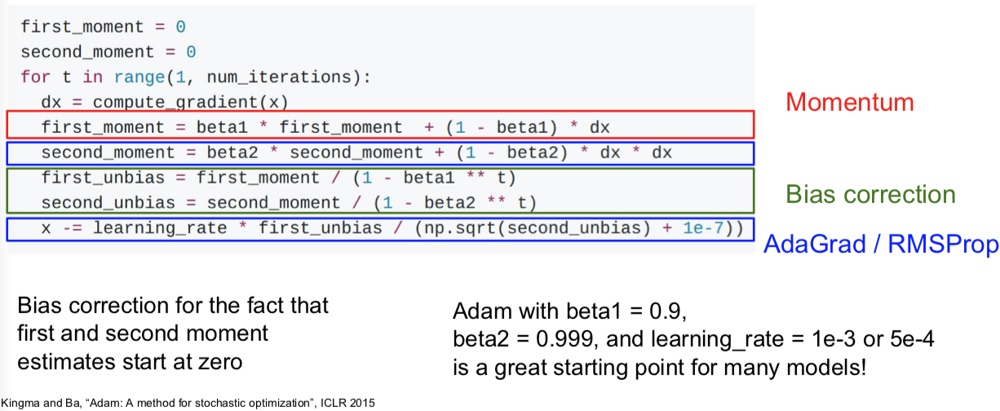

用 Adam 企图将上面优化算法的有点综合起来，我们让第一动量的估计值等于我们梯度的加权和，让第二动量的动态估计值，像 AdaGrad 和 RMSProp 一样，就是一个梯度平方的动态近似值。

假如不用 Bias correction（偏置校正项），经过第一次迭代的第一二的动量在最后的参数更新式子中，很可能会分母接近0，而使得更新步长太大。因为我们回去初始动量都为0，但是 `beta1` 和 `beta2` 为0.9或0.99。所以我们构造了第一和第二动量的无偏估计，通过使用当前时间步 `t` 。现在我们实际上在使用无偏估计来做每一部更新，而不是初始的第一和第二动量的估计值。（虽然是有可能第一动量和第二动量都比较小，使得第一步参数更新的步长可以抵消掉很多）

（式子中的 `1e-7` 实际上在 AdaGrad 或 RMSProp 中会出现，之所有有这一项是因为我们除以一个不会为0的数。理论上讲，这也是一个超参数）


- 现在我们综合一下前面的优化算法，看在一个鞍点附近的行为：
- 
- 


### Learning rate

- Q：上面这么多优化算法中，都有学习率这个超参数。那么该如何调它呢？

  - 

  - 要学习率衰减！

  - 在 **ResNet** 那篇 paper 中，你会经常看到像下面这样的曲线：

    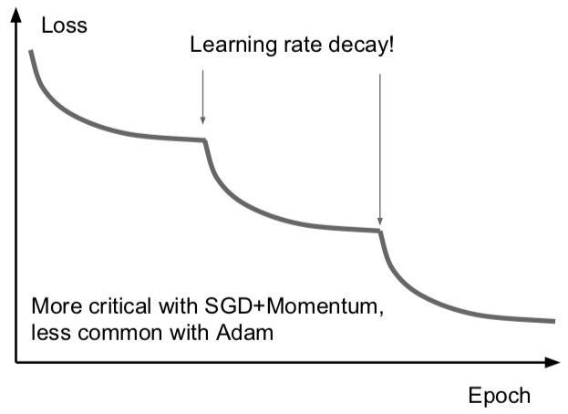

    可以看到损失先一直下降，然后骤降，再然后平坦，接着又骤降。这些曲线背后其实是他们在用步长衰减的学习率。这些曲线出现骤降的地方是在迭代时把学习率乘上了一个因子。**降低学习率的想法**是说：<u>假设模型已经接近一个比较不错的取值区域，但是此时的梯度已经很小了，保持原有学习速率只能在最优点附近来回徘徊，如果我们降低了学习率，目标函数仍然能够进一步降低，即在损失函数上进一步取得进步</u>。有时候这很有用。

  - 带动量 SGD 的学习率衰减很常见，但是像 <u>Adam 的优化算法就很少用学习率的衰减</u>。

  - 学习率衰减是一种二阶的超参数，通常不应该一开始就用上。学习率衰减这样的事情，一般只有通常你想要让神经网络开始工作，你想要挑选一个不带学习率衰减的不错的学习率来作为开始，尝试在交叉验证中同时调学习率衰减和初始学习率等等其他的事情，你会一头雾水的。所以，**设置学习率衰减的方法**是：<u>先尝试不用衰减，看看会发生什么，然后仔细观察损失函数，看看你希望在哪个地方开始衰减。</u>


### First-Order/Second-Order Optimization

我们之前谈过的优化算法都是一阶优化算法，如下图：

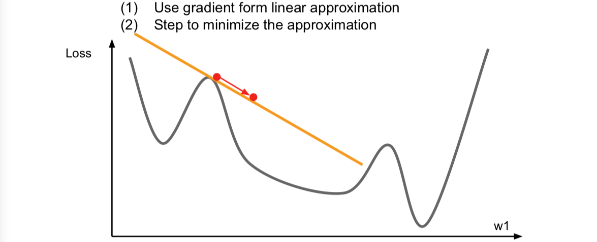

我们在上面的一个点上求一个梯度，我们用梯度信息来计算这个函数逇线性逼近，这个相当于是对我们的函数进行的一阶泰勒逼近。于是，现在我们假设我们的一阶逼近就是实际的函数，然后我们想要迈出一步来找到逼近的最小值。但是这个逼近在稍大的区间内并不成立，所以我们不能朝哪个方向一下走太多。事实上，这里的梯度的想法用上了函数的一阶偏导，完全可以有二阶逼近：

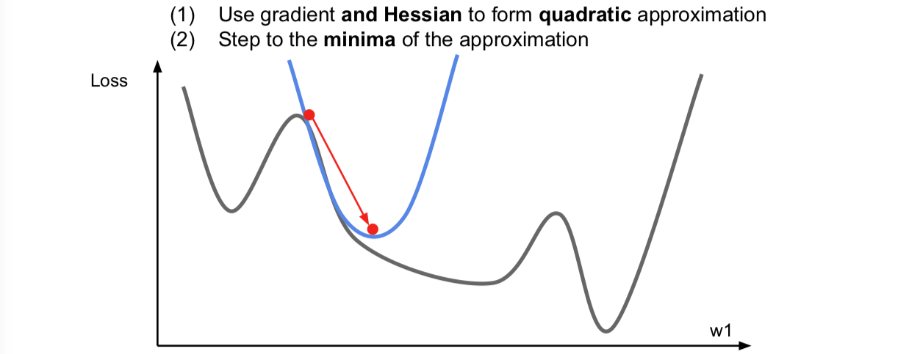

这里同时考虑了一阶和二阶偏导信息，现在我们对函数做一个二阶泰勒逼近，就是用一个二次函数来局部逼近我们的函数。因为是二次函数，可以直接跳到最小值点，这就很开心了。这个就是二阶优化的思想了。

进一步推广这个想法，于是就会得到一个叫做 Newton step（牛顿步长）的东西。计算下面这个 Hessian matrix（海森矩阵），即二阶偏导矩阵，接着求这个海森矩阵的逆，以便直接走到对你的函数用二次逼近后的最小值的地方。

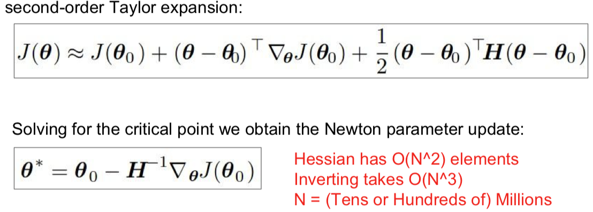

这个原始版本的牛顿法带来的好处，首先就是没有学习率这个超参数。不过很不好的地方是，Hessian 矩阵有用 O(N^2) 的元素，对它求逆的话，内存会疯掉。所以就有了下面的 quasi-Newton methods（拟牛顿法）来代替牛顿法，而不是直接地去求完整的 Hessian 矩阵的逆，而是去逼近这个矩阵的逆。常见的是低阶逼近。

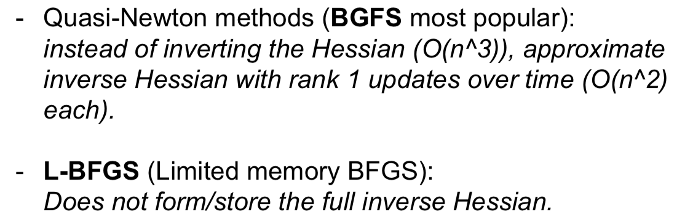

- L-BFGS 就是一个二阶优化器，它是二阶逼近，用 Hessian 来逼近。实际中你可能会看到很多深度学习的问题并不适应这个算法，因为这些二阶逼近的方法对随机的情况处理的并不是很多很好，而且在非凸问题上表现不是很好。

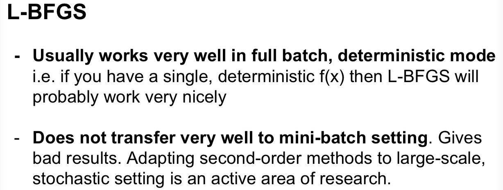


- > 所以说。。。总之呢。。。
  >
  > - **Adam** is a good default choice in most cases
  > - If you can afford to do full batch updates then try out **L-BFGS** (and don't forget to disable all sources of noise)


## Beyond Training Error

上述的内容，都是目标要减小训练的错误率。不过事实上，我们并不真的很在乎训练误差是怎样的，而是在没有见过的数据上的表现。

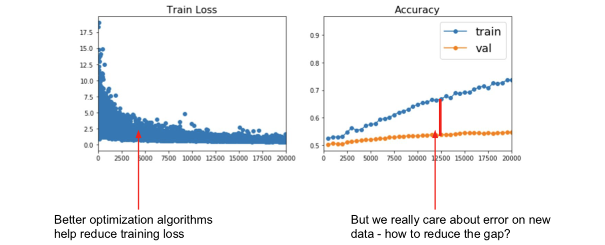

### Early Stopping (new topic in Spring 2018)


### Model Ensembles

- Way 1

模型集成在机器学习的很多领域应用广泛。点子其实很简单，比起使用一个模型，我们选择从不同的随机初始值上训练10个不同的模型，到了测试时，我们就会在10个模型上运行测试数据，然后平均10个模型的预测结果。把这些多个模型加到一起，能够缓解一点过拟合，从而提高一些性能，通常会提高几个百分点，这不是很巨大的提升，但是确实很固定的提升。


- Way 2

有时候可以不用独立地训练不同的模型，你可以在训练的过程中保留多个模型的快照，然后用这些模型来做集成学习。然后再测试阶段，你仍然需要把这些多个快照的预测结果做平均，但是你可以在训练的过程中收集这些快照。可以用一个“疯狂”的学习率计划，其开始时很慢，然后非常快，接着又很慢，再然后又特别快。这样的学习率会使得训练过程中模型会收敛到目标函数不同的区域，但是结果仍然还不错。如果你对这些不同的快照做集成以后，就能够大幅提高最后的性能，虽然你只进行了一次训练。 

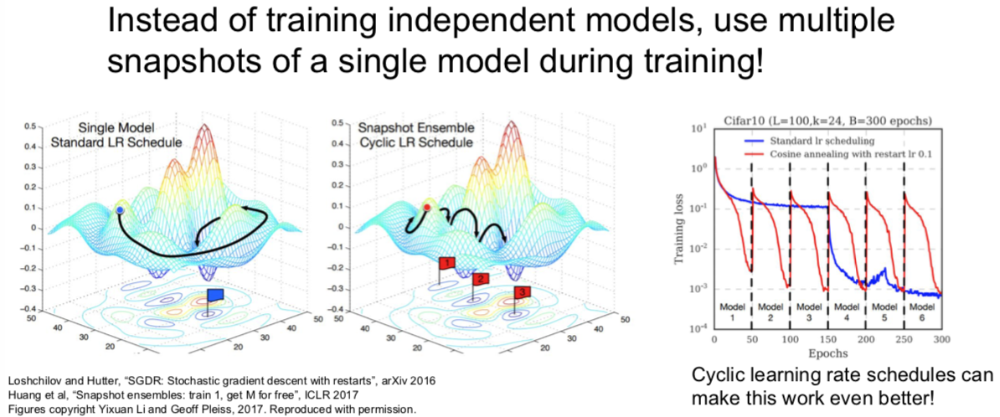


> 小哥在此回答了一个问题谈到：我们真正在意的并不是训练集有多么好的表现，也不是训练集与测试集之间的 gap 要小，而是**验证集上得到最优的结果。**至于，之前讲了这么多，就是在告诉我们如何通过模型的表现，给我们能够进一步得到最优模型的暗示。

顺道一提的是：集成模型中的各种模型中，他们的超参数一般都不太一样。


- Way 3

另外一个可能会用到的的小技巧是：在训练模型的时候，对不同时刻的每个模型参数，求指数衰减平均值。从而得到网络训练中一个比较平滑的集成模型，之后使用这些平滑衰减的平均后的模型参数，而不是截至在某一时刻的模型参数，这个方法叫做 **Polyak 平均**。有时候能有一点效果，但并不常见。

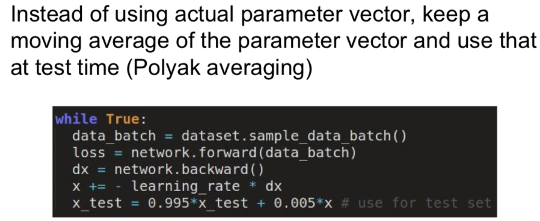


## Regularization

刚刚的模型集成是通过在测试阶段中考虑多个模型的手段，从而提高模型表现，降低过拟合。

那么如果只有单一模型，如何提高模型表现，降低过拟合呢？那就是 **Regularization**!


### Add term to loss

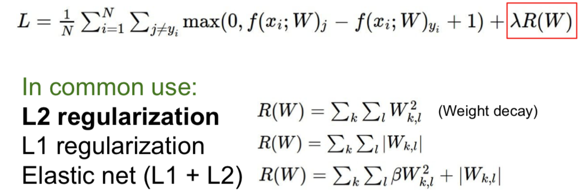


### Dropout


- Q：在哪些层使用 dropout？
  - 一般是在全连接层。但有时候你在卷积层也能看到。当你使用卷积层时，有时候你可能并不是随机把某个神经元上激活函数的结果置为0，而是随机把正而过特征映射置为0。在卷积神经网络里，有一个维度表示通道，你可能要把某几条通道整个置零，而不是某几个元素。

- 代码的实现并不复杂：（还不完整，下文会进一步说明）

  ```python
  p = 0.5 # probability of keeping a unit active. higher = less dropout
  
  def train_step(X):
      """X contain the data"""
      
      # forward pass for example 3-layer neural network
      H1 = np.maximum(0, np.dot(W1, X) + b1)
      U1 = np.random.rand(*H1.shape) < p # first dropout mask
      H1 *= U1 # drop!
      H2 = np.maximum(0, np.dot(W2, H1) + b2)
      U2 = np.random.rand(*H2.shape) < p # second dropout mask
      H2 *= U2 # drop!
      out = np.dot(W3, H2) + b3
      
      # backward pass: compute gradients... (not shown)
      # perform parameter update... (not shown)
  ```

- 解释一（勉强）

  - dropout 避免了特征间的相互适应。假设我们要分类判断是不是猫，可能在网络里一个神经元学到了“有一只耳朵”，一个学到了“尾巴”，一个学到了“输入图像有毛”，然后这些特征被组合到一起来判断是否有猫。但现在加入 dropout 后判断是不是猫时，网络就不能依赖这些特征组合在一起给出的结果，而是要通过不同的零散的特征来判断，这也许某种程度上抑制了过拟合。
  - Forces the network to have a redundant representation; Prevents co-adaptation of features.

- 解释二

  - 这是在单一模型中进行的集成学习。如果你们观察左图，在 dropout 之后，我们是在一个子网络中用所有神经元的子集进行运算，每一种可能的 dropout 方式都可以产生一个不同的子网络。所以，dropout 像是同时对一群共享参数的网络进行集成学习。顺便说一下，因为 dropout 的可能性随神经元个数呈指数倍增长，你不可能穷举每种情况，这可以看做是一个超级无比巨大的网络集合在同时被训练。
  - Dropout is training a large ensemble of models (that share parameters). Each binary mask is one model.
  - An FC layer with 4096 units has $2^{4096}$ ~ $10^{1233}$ possible masks! Only ~ $10^{82}$ atoms in the universe...

- 测试的时候，如何处理？如何消除 dropout 带来的随机性？

  - 我们可以平均这个随机性，也就是需要通过一些积分来边缘化随机性。
    $$
    y = f(x) = E_z[f(x,z)]=\int p(z)f(x,z)dz
    $$

  - 但在实践中，这个积分是完全难以处理的，我们不知道怎样对这进行求解，你会一脸懵逼。

  - 有种通过采样来逼近这个积分的办法。你可以对 z 的多次取样，然后在测试的时候把它们平均化。但是这仍然会引入一些随机性，这不好。

  - 还好，我们可以做一个简易地局部逼近这个积分：

    

    可见，测试的时候只要输出层的输出乘以 dropout 的概率值就可以了。

  - 更常见的手段是 inverted dropout。测试的时候，你可能更关心效率。所以测试的时候，不用动，让训练的时候除以概率值 p 就好，下面就是真正完整版的 dropout：

  ```python
  p = 0.5 # probability of keeping a unit active. higher = less dropout
  
  def train_step(X):
      # forward pass for example 3-layer neural network
      H1 = np.maximum(0, np.dot(W1, X) + b1)
      U1 = (np.random.rand(*H1.shape) < p) / p # first dropout mask. Notice /p !
      H1 *= U1 # drop!
      H2 = np.maximum(0, np.dot(W2, H1) + b2)
      U2 = (np.random.rand(*H2.shape) < p) / p # second dropout mask. Notice /p !
      H2 *= U2 # drop!
      out = np.dot(W3, H2) + b3
      
      # backward pass: compute gradients... (not shown)
      # perform parameter update... (not shown)
  ```

- Q：dropout 会对训练时的参数梯度更新有什么影响？
  - 通常训练需要更长的时间，因为在每一步，你只是更新网络的一些子部分。但是收敛后，模型的鲁棒性更好。


### Regularization：A common pattern

> **Training**：Add some kind of randomness
> $$
> y = f_W(x,z)
> $$
> **Testing**：Average out randomness (sometimes approximate)
> $$
> y = f(x) = E_z[f(x,z)] = \inf p(z)f(x,z)dz
> $$
>

**在训练的时候，都随机引入某种随机性或者噪声，但是又在测试的时候抵消掉它们。**

实际上，当你使用 batch normalization 来训练神经网络的时候，有时你一点儿都不会使用 dropout，仅仅是 batch normalization 给你的网络增加了足够的正则化效果。但 dropout 某种程度上更好，是因为你实际上可以通过改变参数 p 调整正则化的力度，但是在 batch normalization 中并没有这种控制机制。

另一种符合这种范式的策略就是**数据增强**的想法。比如说：

1. Random crops and scales

   

2. Color Jitter

   

3. Random mix/combinations of :

   - translation
   - rotation
   - stretching
   - shearing
   - lens distortions, ... (go crazy)

总的来说，数据增强就是让这些随机转换应用于你的输入数据，这种方式对网络有正则化效果。因为在训练的时候，你又增加了某种随机性，然后再测试的时候将它们淡化。


- 总结一下

  > **Trainning**：add random noise
  >
  > **Testing**：Marginalize over the noise
  >
  >  
  >
  > **Examples:**
  >
  > - Dropout
  > - Batch Normalization
  > - Data Augmentation
  > - DropConnect（随机将权重矩阵的一些值置为0）
  >   - Wan et al, “Regularization of Neural Networks using DropConnect”, ICML 2013
  > - Fractional Max Pooling
  >   - Graham, “Fractional Max Pooling”, arXiv 2014
  > - Stochastic Depth（随机丢弃一些层）
  >   - Huang et al, “Deep Networks with Stochastic Depth”, ECCV 2016

- Q：经常会用超过1个的正则化方法么？
  - 通常使用 batch normalization。它是一个现在大多数网络使用的方法，因为它的确帮助收敛，特别是非常深的网络，大多数情况下，单独使用 batch normalization 就够了。有时当你发现网络过拟合，如果 batch normalization 单独使用不太够，你可以增加 dropout 或一些其他的东西。你一般不要盲目地交叉验证这些方法，而是有的放矢，在网络过拟合时，把它们加进去。


## Transfer Learning

我们已经看到正则化可以减小训练误差和测试误差的间隙，所谓过拟合问题。

不过有时候过拟合的原因，是由于数据不够。你希望得到一个功能很大的网络模型。但大而强的网络在小数据集合时很容易过拟合。正则化是一种处理的方式，另一种方式就是使用迁移学习。

二图几乎说明一切：


迁移学习的运用是相当普遍的，大家的 paper 甚至都不怎么细致的提及这件事情。

（It's the norm, not an exception）


- 最后的FYI：

  - **Takeaway for your projects and beyond:** 

    Have some dataset of interest but it has < ~1M images? 

    1. Find a very large dataset that has similar data, train a big ConvNet there 
    2. Transfer learn to your dataset 

    Deep learning frameworks provide a “Model Zoo” of pretrained models so you don’t need to train your own 

    - Caffe: https://github.com/BVLC/caffe/wiki/Model-Zoo 
    - TensorFlow: https://github.com/tensorflow/models 
    - PyTorch: https://github.com/pytorch/vision 
    - MXNet: https://mxnet.incubator.apache.org/model_zoo/


---

[返回到上一页](./index.html) | [返回到顶部](./cs231n_7.html)

---
<br>
<a rel="license" href="http://creativecommons.org/licenses/by-nc-sa/4.0/"></a><br />This work is licensed under a <a rel="license" href="http://creativecommons.org/licenses/by-nc-sa/4.0/">Creative Commons Attribution-NonCommercial-ShareAlike 4.0 International License</a>.
<br>

<script type="application/json" class="js-hypothesis-config">
  {
    "openSidebar": false,
    "showHighlights": true,
    "theme": classic,
    "enableExperimentalNewNoteButton": true
  }
</script>
<script async src="https://hypothes.is/embed.js"></script>

