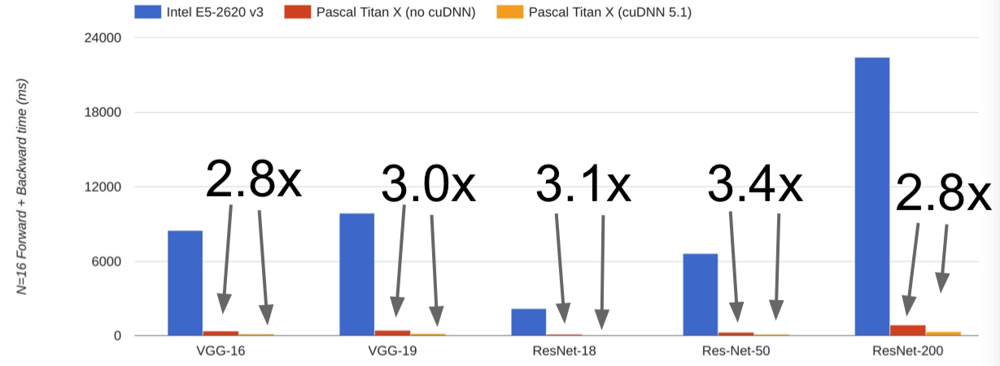

[返回到上一页](./index.html)

---

[TOC]

> CS231n 课程的官方地址：http://cs231n.stanford.edu/index.html
>
> 该笔记根据的视频课程版本是 [Spring 2017](https://www.bilibili.com/video/av17204303/?p=19)(BiliBili)，PPt 资源版本是 [Spring 2018](http://cs231n.stanford.edu/syllabus.html).
>

# Lecture 8. Deep Learning Hardware and Software

## CPU vs GPU

- GPU 占据很大的空间和能量

- GPU 就选 NVIDIA 的，没的说。

- GPU 和 CPU 之间有很多差异：

  

  **Note：**TITAN V isn't technically a "TPU" since that's a Google term, but both have hardware specialized for deep learning

- GPU 和 CPU 在价格上的差异变化：

  

- 在实际情况下，GPU 和 CPU 表现的差异：

  

  

  - cuDNN much faster that "unoptimized" CUDA

- Programming GPUs

  - CUDA（NVIDIA only）
    - Write C-like code that runs directly on the GPU
    - Optimized APIs：cuBLAS, cuFFT, cuDNN, etc
  - OpenCL
    - Similar to CUDA, but runs on anything
    - Usually slower on NVIDIA hardware
  - HIP https://github.com/ROCm-Developer-Tools/HIP
    - New project that automatically converts CUDA code to something that can run on AMD GPUs
  - Udacity：Intro to Parallel Programming https://www.udacity.com/course/cs344
    - For deep learning just use existing libraries

- CPU / GPU Communication
  - If you aren't careful, training can bottleneck on reading data and transferring to GPU！
  - **Solutions：**
    - Read all data into RAM
    - Use SSD instead of HDD
    - Use multiple CPU threads to prefetch data.

- 小哥谈到，从软件上来说，可能你能做到的最有效的事情就是：设定好 CPU 的预读内容（pre-fetching），比如避免这种比较笨的序列化操作，你先把数据从硬盘里读出来，等待小批量的数据一批一批地读完，然后依次送到 GPU 上做正向和反向传播，再读下一个小批量的数据，按顺序这样做。如果你有多个CPU，比如说多个 CPU 线程在后台从硬盘中搬运出数据，这样的话，你可以把这些过程交错着运行起来。GPU 在运行的同时，CPU 的后台线程从硬盘中取数据，主线程等待这些工作完成，在它们之间做一些同步化，让整个流程并行起来。好在如果你使用了下面要讲到的这些深度学习框架，它们已经替你完成了这部分操作，因为实现起来有点麻烦。

## Deep Learning Frameworks

- 第一代深度学习框架都是有学术界建立和维护起来的。 
- 下一代深度学习框架全部由工业界产生。

- 使用深度学习框架的理由：
  1. Quick to develop and test new ideas 
  2. Automatically compute gradients 
  3. Run it all efficiently on GPU (wrap cuDNN, cuBLAS, etc) 

> I love MXNet!

### Caffe / Caffe2

### Theano / TensorFlow

### Torch / PyTorch

---

[返回到上一页](./index.html) | [返回到顶部](./cs231n_8.html)

---
 
 This work is licensed under a <a rel="license" href="http://creativecommons.org/licenses/by-nc-sa/4.0/">Creative Commons Attribution-NonCommercial-ShareAlike 4.0 International License</a>.
 

