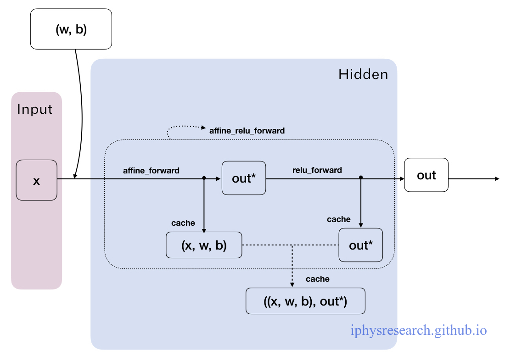
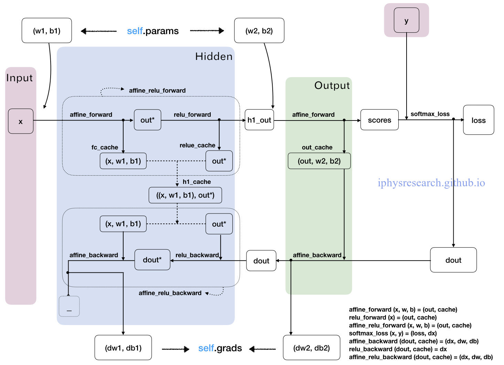
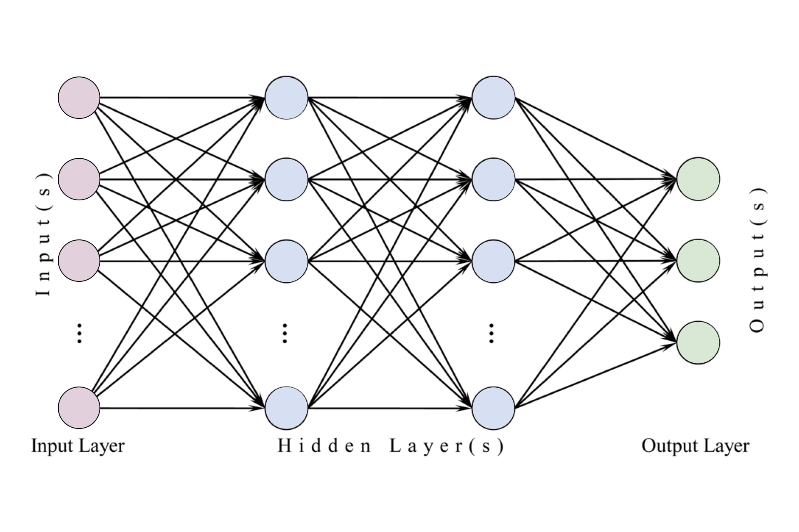
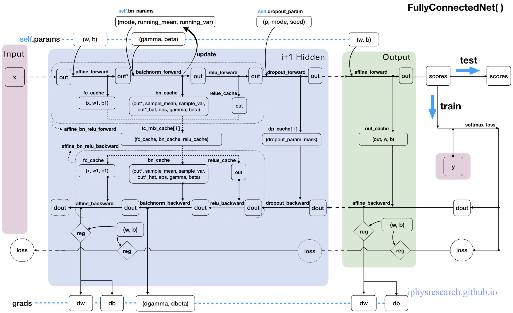

[返回到首页](./index.html)

---

[TOC]

# 一段关于神经网络的故事


（我是盗图大仙，所有图片资源全部来源于网络，若侵权望告知～）


- 本文是什么？
  - 本文以CS231n的Assignment2中的Q1-Q3部分代码作为例子，目标是由非常浅入深得搞清楚神经网络，同时也是以图片分类识别任务作为我们一步一步构建神经网路的目标。
  - 本文既适合仅看得懂一点Python代码、懂得矩阵的基本运算、听说过神经网络算法这个词的朋友，也适合准备学习和正在完成CS231n课程作业的的朋友。
  - 本文内容涉及：很细节的Python代码解析 + 神经网络中矩阵运算的图像化解释 + 模块化Python代码的流程图解析。
  - 本文是从Python编程代码的实现角度理解，一层一层拨开神经网络的面纱，以搞清楚数据在其中究竟是怎么运动和处理的为最终目标。希望可以为小白，尤其是为正在学习CS231n课程的朋友，提供一个既浅显又快捷的观点，用最直接的方式弄清楚并构建一个神经网络出来。所以，此文不适合章节跳跃式阅读。

- 本文不是什么？

  不涉及艰深的算法原理，忽略绝大多数数学细节，也尽量不扯任何生涩的专业术语，也不会对算法和优化处理技术做任何横向对比。


CS231n课程讲师Andrej Karpathy在他的博客上写过一篇文章[Hacker's guide to Neural Networks](http://karpathy.github.io/neuralnets/)，其中的精神是我最欣赏的一种教程写作方式：“<u>My exposition will center around code and physical intuitions instead of mathematical derivations. Basically, I will strive to present the algorithms in a way that I wish I had come across when I was starting out.</u>”

> **“…everything became much clearer when I started writing code.”**
>

废话不多说，找个板凳坐好，慢慢听故事～


---

## 待折腾的数据集

俗话说得好：皮裤套棉裤，里边有缘故；不是棉裤薄，就是皮裤没有毛！

我们的神经网络是要用来解决某特定问题的，不是家里闲置的花瓶摆设，模型的构建都有着它的动机。所以，首先让我们简单了解下要摆弄的数据集（CIFAR-10），最终的目标是要完成一个图片样本数据源的分类问题。


**图像分类数据集：CIFAR-10。**这是一个非常流行的图像分类数据集是[CIFAR-10](http://link.zhihu.com/?target=http%3A//www.cs.toronto.edu/%7Ekriz/cifar.html)。这个数据集包含了60000张$32\times 32$的小图像，单个像素的数值范围都在0-255之间。每张图像都对应于是10种分类标签(label)中的一种。此外，这60000张图像被分为包含带有标签的50000张图像的训练集和包含不带有标签的10000张图像的测试集。

---


上图是图片样本数据源[CIFAR-10](http://link.zhihu.com/?target=http%3A//www.cs.toronto.edu/%7Ekriz/cifar.html)中训练集的一部分样本图像，从中你可以预览10个标签类别下的10张随机图片。

---

**小结：**

在我们的故事中，只需要记得这个训练集是一堆$32\times32$的RGB彩色图像作为训练目标，一个样本图像共有$32\times32\times3$个数据，每个数据的取值范围0~255，一般用`x`来标记。每个图还配有一个标签值，总共10个标签，以后我们都用`y`来标记。（悄悄告诉你的是：每个像素点的3个数据维度是有序的，分别对应红绿蓝(RGB)）


---

## 关于神经网络，你起码应该知道的！

下图是将神经网络算法以神经元的形式绘制的两个图例，想必同志们早已见怪不怪了。

但是，你起码应该知道的是其中各种约定和定义：

---


**左边**是一个2层神经网络，一个隐藏层(蓝色层)有4个神经元(也可称为单元(unit))组成，输出层(绿色)由2个神经元组成，输入层(红色)是3个"神经元"。**右边**是一个3层神经网络，两个隐藏层，每层分别含4个神经元。<u>注意：层与层之间的神经元是全连接的，但是层内的神经元不连接（如此就是所谓**全连接层神经网络**）。</u>

这里有个**小坑**：输入层的每个圈圈代表的可不是每一张图片，其实也不是神经元。应该说整个纵向排列的输入层包含了一张样本图片的所有信息，也就是说，每个圈圈代表的是某样本图片对应位置的像素数值。可见对于[CIFAR-10](http://link.zhihu.com/?target=http%3A//www.cs.toronto.edu/%7Ekriz/cifar.html)数据集来说，输入层的维数就是$32\times32\times3$，共3072个圈圈呢！至于输出层的神经元数也是依赖数据集的，就[CIFAR-10](http://link.zhihu.com/?target=http%3A//www.cs.toronto.edu/%7Ekriz/cifar.html)数据集来说，输出层维数必然是10，即对应数据集的10个标签。至于中间的隐藏层可以有多少层，以及每层的神经元个数就都可以任意啦！你说牛不牛？！

---

在接下来我们的故事中，要从代码实现的角度慢慢剖析，先从一个神经元的角度出发，再搞清楚一层神经元们是如何干活的，然后逐渐的弄清楚一个含有任意神经元个数隐藏层的神经网络究竟是怎么玩的，在故事的最后将会以CIFAR-10数据集的分类问题为目标一试身手，看看我们构造的神经网络究竟是如何工作运转的。


---

## 所谓的前向传播


### 一个神经元的本事

我们先仅**前向传播**而言，来谈谈**一个神经元**究竟是做了什么事情。


**前向传播**，这名字起的也是神乎其神的，说白了就是将样本图片的数据信息，沿着箭头正向传给一个带参数的神经网络层中咀嚼一番，然后再吐出来一堆数据再喂给后面的一层吃(如此而已，居然就叫做了前向/正向传播了，让人忍不住吐槽一番)。那么，对于一个**全连接层(fully-connected layer)** [^释义1]

[^释义1]: 全连接层中的神经元与其前后两层的神经元是完全成对连接的，但是在同一个全连接层内的神经元之间没有连接。

的前向传播来说，所谓的“带参数的神经网络层”一般就是指对输入数据源(此后用"数据源"这个词来表示输入层所有输入样本图片数据总体)先进行一个矩阵乘法，然后加上偏置，得到数字再运用激活函数"修饰"，最后再反复迭代罢了（后文都默认使用此线性模型）。

是不是晕了？别着急，我们进一步嚼碎了来看看一个神经元(处于第一隐藏层)究竟是如何处理输入层传来的一张样本图片(带有猫咪标签)的？


上面提到过，输入数据源是一张尺寸为$32\times 32$的RGB彩色图像，我们假定输入数据$x_i$的个数是$D$的话（即$i$是有$D$个），那这个$D=32\times 32\times 3=3072$。为了普遍意义，下文继续用大写字母$D$来表示一张图片作为数据源的维数个数（如果该神经元位于隐藏层，则大写字母$D$表示本隐藏层神经元的神经元个数，下一节还会提到）。

显然，一张图片中的$D$个数据$x_i$包含了判断该图片是一支猫的所有特征信息，那么我们就需要"充分利用"这些信息来给这张样本图片"打个分"，来评价一下这张图像究竟有多像猫。

不能空口套白狼，一张美图说明问题：

---


**左图**不用看，这个一般是用来装X用的，并不是真的要严格类比。虽然最初的神经网络算法确实是受生物神经系统的启发，但是现在早已与之分道扬镳，成为一个工程问题。关键我们是要看**右图**的数学模型(严格地说，这就是传说中的**感知器perceptron**)。

---

如右图中的数学模型所示，我们为每一个喂进来的数据$x_i$都对应的"许配"一个"权重"参数$w_i$，再加上一个偏置$b$，然后一股脑的把他们都加起来得到一个数(scalar)：
$$
\sum_iw_ix_i+b = w_0x_0+w_1x_1+\cdots+w_{D-1}x_{D-1}+b\\
$$
上面的代数表达式看上去很繁杂，不容易推广，所以我们把它改写成一个后文更常用到的，也是很容易用代码实现的矩阵表达式：
$$
\underbrace{\begin{bmatrix}
 \sum_iw_ix_i+b  
\end{bmatrix}}_{1\times 1}
=
\underbrace{\begin{bmatrix}
\cdots & x_i & \cdots
\end{bmatrix}}_{1\times D}
\cdot
\underbrace{\begin{bmatrix}
\vdots  \\ 
  w_i   \\ 
\vdots   
\end{bmatrix}}_{D\times 1}
+
\underbrace{\begin{bmatrix}
 b 
\end{bmatrix}}_{1\times 1}
$$
上面等式左侧这样算出的一个数字，表示为对于输入进来的$D$个数据$x_i$，在当前选定的参数$(w_i,b)$下，这个神经元能够正确评价其所对应的"猫咪"标签的程度。所以，这个得分越高，越能说明其对应的在某种$(w_i,b)$这$D+1$个参数的评价下，该神经元正确判断的能力越好，准确率越高。

换句话说，相当于是有一个神经元坐在某选秀的评委席里，戴着一款度数为$(w_i,b)$雷朋眼镜，给某一位台上模仿猫咪的样本图片$x_i$打了一个分(评价分数)。显然，得分的高低是不仅依赖于台上的主角$x_i$的表现，还严重依赖于神经元评委戴着的有色眼镜(参数$w_i,b$)。当然，我们已经假定评委的智商(线性模型)是合乎统一要求的。

现如今，参加选秀的人可谓趋之若鹜，一个神经元评委该如何同时的批量化打分，提高效率嗯？

也就是说，一个神经元面对$N$张图片该如何给每一张图片打分的问题。这就是矩阵表达式的优势了，我们只需要很自然地把上述矩阵表达式纵向延展下即可，如下所示：
$$
\underbrace{\begin{bmatrix}
 \sum_iw_ix_i+b  \\
 \vdots
\end{bmatrix}}_{N\times1 }
=
\underbrace{\begin{bmatrix}
\cdots & x_i & \cdots \\
& \vdots &
\end{bmatrix}}_{N\times D}
\cdot
\underbrace{\begin{bmatrix}
\vdots  \\ 
  w_i   \\ 
\vdots   
\end{bmatrix}}_{D\times 1}
+
\underbrace{\begin{bmatrix}
 b \\
 \vdots\\
 \vdots
\end{bmatrix}}_{N\times 1}
$$
上面矩阵表达式中，等号左侧的得分矩阵中每一行运算都是独立并行的，并且其每一行分别代表$N$张样本图片的数据经过一个神经元后的得分数值。到此，我们就明白了一个神经元是如何面对一个shape为(N, D)的输入样本图片数据矩阵，并给出得分的。

然而，关于一个神经元的故事还没完。

你可能注意到了，上面例子中的美图中有个函数f，我们把图放大仔细看清楚：


在神经元对每张图片算得的“得分”送给下一个神经元之前都要经过一个函数f的考验。这就暗示我们，选秀节目的导演对神经元评委给出的得分还并不满意，为了(未来模型训练的)快捷方便，导演要求对每一个得分需要做进一步的“激活”处理（即上图中的函数$f$），于是这个叫**激活函数(activation)**的家伙临门抽一脚，要求把得分小于零的都阉割掉，一律给0分（都得负分的了还选什么秀啊？给0分滚蛋）：
$$
f(x)=\max(0,x)
$$
（这就是近些年很流行的非线性激活函数，叫做**ReLU**）

所以，总结下来，一个神经元干的活就是如下所示的公式：
$$
\text{out}=f(\sum_iw_ix_i+b)=\max(0,\sum_iw_ix_i+b)
$$
如果这个数学看得让人心烦意乱，不要怕，一层神经元的故事之后就是万众期待的Python代码实现了，相信看后会让你不禁感慨：“小样！不过如此嘛～”

**小备注：**

这里最后再多一句嘴：一个神经元在正向传播中输出的只是一个数字，另外，神经网络的训练过程，训练的是上述提到的模型参数$(w_i,b)$。

再多一句嘴，通常我们在整个神经网络结构中只使用一种激活函数。并且值得你注意的是，全连接层的最后一层就是**输出层**，除了这个最后一层，其它的全连接层神经元都要包含激活函数。

最最后说再一句，神经网络的激活函数是<u>非线性的</u>，所以神经网络是一个非线性分类器。


---

### 强大的层状神经元


在正式开始谈一层神经元之前，我们继续来探讨下神经元面对一张图片还可以做什么？

对于一张标签是猫咪的样本图片，我们光能评价有多么的像猫咪还不能满足，我们还需要神经元评价一下其他9个标签才行，然后才好比较评判得出最终结论。于是，光用$(w_i,b)$ 这$D+1$个参数就不够用了，应该要有$10\times(D+1)$个参数才行。还是用那个恶搞的例子说明的话，就是说一个神经元评委可不够用哦，要10个戴着不同有色眼镜的神经元评委分头去考察10个不同标签，这样就可以对每个样本图片给出10个对应不同类别的得分。

所以，我们可以在最初的矩阵表达式 $\sum_iw_ix_i+b$ 的基础上横向延展成如下矩阵表达式：
$$
\underbrace{\begin{bmatrix}
 \sum_iw_ix_i+b &  \cdots & 
\end{bmatrix}}_{1\times 10}
=
\underbrace{\begin{bmatrix}
\cdots & x_i & \cdots
\end{bmatrix}}_{1\times D}
\cdot
\underbrace{\begin{bmatrix}
\vdots & &  \\ 
  w_i & \cdots & \cdots \\ 
\vdots &  & 
\end{bmatrix}}_{D\times 10}
+
\underbrace{\begin{bmatrix}
 b &\cdots & 
\end{bmatrix}}_{\underset{\text{Broadcasting}}{1\times 10}}
$$
忘了说，在上面表达式里，大括号下面的数字表示的是当前矩阵的【行数$\times$列数】。同样地，这里运用了矩阵乘法和向量化表示会大大的提高运算效率。在如此简单的矩阵运算之后，等号左边所得到一行数组(行向量)就表达了在参数矩阵w和向量b的描述下，该一张样本图片分别对应10个不同类标标签的得分。而我们最终的目标就是学习如何训练这里的参数w和b，并且我们希望训练好后的某样本图片在正确目标标签下所对应的得分是最高的。

为了便于直观理解，给你一个数值栗子尝尝鲜（和上面的矩阵公式有点区别，但并不影响理解）：

---


可以看到我们拿了样本猫咪图片中的四个像素作为一个神经元的输入数据源，不过上图只查看了3个标签(猫／狗／船)，且把输入数据$x_i$改成用列向量表达罢了，这并不影响我们理解，无非是我们的矩阵公式改为$w^T x + b^T$表达 。接下来看图说话，可以看到在如图初始化矩阵$W$和$b$的情况下，算出的得分对应于猫咪的分数居然是最低的[^计算细节]

[^计算细节]: 0.2\*56 -0.5\*231 +0.1\*24 +2.0\*2 +1.1 = -96.8

，这说明$W$和$b$的值没有训练好啊。那么究竟该如何训练出合适的参数呢？难道每次都要肉眼观察每个标签算出的得分再同时对比参数选的究竟好不好？再难道每次都要自己手调参数矩阵的每个值来观察得分效果么？当然不会这么傻啦，到时候一个叫**损失函数**的概念就登场了，且继续听故事先～

---

回到上面经过横向延展后的矩阵表达式：
$$
\underbrace{\begin{bmatrix}
 \sum_iw_ix_i+b &  \cdots & 
\end{bmatrix}}_{1\times 10}
=
\underbrace{\begin{bmatrix}
\cdots & x_i & \cdots
\end{bmatrix}}_{1\times D}
\cdot
\underbrace{\begin{bmatrix}
\vdots & &  \\ 
  w_i & \cdots & \cdots \\ 
\vdots &  & 
\end{bmatrix}}_{D\times 10}
+
\underbrace{\begin{bmatrix}
 b &\cdots & 
\end{bmatrix}}_{\underset{\text{Broadcasting}}{1\times 10}}
$$
可以看到对于一个$D$维图片$x_i$，都和w矩阵的每一列(10个神经元评委)有过亲密接触，独立并行的进行过矩阵乘法，回想一下，这不和一个神经元面对一张样本图片的公式异曲同工了么？只不过换成了10个神经元并行面对一张样本图片。所以，上述矩阵表达式就相当于一张图片的数据从输入层流到含有10个神经元的层状结构（无激活函数）。（严格地说，这其实是**无隐层神经网络**，或者叫**单层感知器**，因为输入层的下一层就是输出层，直接输出了10个标签的打分结果了，如下面的示意图）


接下来，推广到一般的隐藏层神经元们是如何干活的就易如反掌了！只要充分利用矩阵乘法，就可以很清楚了。小结如下：

---


$$
\underbrace{ \begin{bmatrix}
 &  & \\ 
 & \max(0,\hat{x}_i) & \\ 
 &  & 
\end{bmatrix}}_{N\times M}
\overleftarrow{=}
\underbrace{\begin{bmatrix}
 &  & \\ 
 & \hat{x}_i & \\ 
 &  & 
\end{bmatrix}}_{N\times M}
\overleftarrow{=}
\underbrace{\begin{bmatrix}
 &  & \\ 
 & x_i & \\ 
 &  & 
\end{bmatrix}}_{N\times H}
\cdot
\underbrace{\begin{bmatrix}
 &  & \\ 
 & w_{ij} & \\ 
 &  & 
\end{bmatrix}}_{H\times M}
+
\underbrace{\begin{bmatrix}
 &  & \\ 
 &  b_i & \\ 
 &  & 
\end{bmatrix}}_{\underset{\text{Broadcasting}}{N\times M}}
$$
从右往左看公式(等号类似赋值操作)。上述矩阵表达式表示的是某一隐藏层的H个神经元们在面对上一层输入数据$x_i$是如何传给下一层的M个神经元的。N表示数据样本的个数(亦输入层的圈圈数)，H表示本隐藏层神经元的个数，M表示下一隐藏层神经元的个数(或位于下一输出层的样本图片标签种类数)。（最后矩阵b里的Broadcasting含义见后文哈～不要急）

每一个隐藏层得出得分$\hat{x}_i$后，都还需要经过激活函数$f(\hat{x}_i)=\max(0,\hat{x}_i)$的处理，要留意的是最后的输出层并不需要激活函数，给出得分后即可交给损失函数(后文会提到)。

---

**小备注：**

值得注意的是：流入每一层神经元们的输入数据矩阵x和流出每一层神经元们的输出数据矩阵的行数没有变化，都是N，即样本图片个数。每一层神经元们的参数矩阵w和b都是不同的，那么你就能想象到对于一个"很大很深"神经网络而言，需要训练学习的参数个数可是相当多的哦～而且参数矩阵w的维数也很有特点，其行数H和列数M，分别对应于当前隐藏层神经元个数和下一层神经元的个数。如此一来，就把每一层神经元一层套一层连接起来了。


---

### 不废话了，看代码！

正如本文开头那句话，

> “…everything became much clearer when I started writing code.”

再强大的算法，无论矫情的怎么解释，也都不如直接飞代码来得更清晰，更直接。

那么任意某一层神经元们在前向传播中，究竟做了什么呢？前面总算把数据如何运动的故事说清楚了，现在开始直接用代码说明一切，第一步，我们定义面对输入数据某一层神经元们给出“得分”的函数 `affine_forward(x, w, b) = (out, cache)` ：

```python
def affine_forward(x, w, b):
    """
    Inputs:
    - x: A numpy array containing input data, of shape (N, d_1, ..., d_k)
    - w: A numpy array of weights, of shape (D, M) 权重
    - b: A numpy array of biases, of shape (M,) 偏置
    Returns a tuple of:
    - out: output, of shape (N, M)
    - cache: (x, w, b)
    """
	out = None 		# 初始化
	reshaped_x = np.reshape(x, (x.shape[0],-1))		# 确保x是一个规整的矩阵
	out = reshape_x.dot(w) +b						# out = w x +b
	cache = (x, w, b)								# 将该函数的输入值缓冲储存起来，以备他用
	return out, cache
```

**代码详解：**

- 首先，需要对输入数据$x$进行**矩阵化**，这是因为如果这代表的是第一层神经元正向传播，那么对于我们的图片数据集CIFAR-10，其每张图片输入进来的数据$x$的shape是$(N,32,32,3)$，是一个4维的array，所以需要将其reshape成$(N,3072)$的2维矩阵，其中每行是由一串3072个数字所代表的一个图片样本。`np.reshape(x, (x.shape[0],-1))` 中的 `-1` 是指剩余可填充的维度，所以这段代码意思就是保证reshape后的矩阵行数是$N$，剩余的维度信息都规则的排场一行即可。
- 输出的 `cache` 变量就是把该函数的输入值$(x,w,b)$存为元组(tuple)再输出出去以备用，它当然不会流到下一层神经元，但其在后面会讲到的反向传播算法中利用到，由此可见其我们是有多么的老谋深算啊！
- 接下来是重点： `out = reshape_x.dot(w) +b` 这句代码就表达了某一层神经元中，每个神经元可以并行的独立完成上两节提到的线性感知器模型，对每个图像给出自己的评价分数，与代码对应一致的内涵可见如下矩阵表达式：

$$
\underbrace{\begin{bmatrix}
 &  & \\ 
 & \text{out} & \\ 
 &  & 
\end{bmatrix}}_{N\times M}
=
\underbrace{\begin{bmatrix}
 &  & \\ 
 & \text{reshape_x} & \\ 
 &  & 
\end{bmatrix}}_{N\times D}
\cdot
\underbrace{\begin{bmatrix}
 &  & \\ 
 & \text{w} & \\ 
 &  & 
\end{bmatrix}}_{D\times M}
+
\underbrace{\begin{bmatrix}
 &  & \\ 
 & \text{b} & \\ 
 &  & 
\end{bmatrix}}_{\underset{\text{Broadcasting}}{N\times M}}
$$

这里你要清楚的是 `reshape_x` 中每一行和 `w` 中的每一列的运算对应于一个神经元面对一张图片的运算过程。矩阵乘法没啥可说的，只要把输入矩阵和要输出的矩阵的维数掰扯清楚了，就会很简单。这里参数w和b都作为函数的输入参数参与运算的，可见你想让神经网络运作起来，你是需要先初始化所有的神经网络参数的，那么究竟如何初始化呢？这还是门小学问，我们暂且假定是随机填了些的参数进来。虽然输入进来的参数 b 的shape是 `(M,)`，但在numpy中，两个array的"+"相加，是完全等价于`np.add()`函数(详情可help该函数)，这里体现了numpy的**Broadcasting机制**：(详情可查看[Python库numpy中的Broadcasting机制解析](http://blog.csdn.net/hongxingabc/article/details/53149655))

> 简单的说，对两个阵进行操作时，NumPy逐元素地比较他们的形状。只有两种情况下Numpy会认为两个矩阵内的两个对应维度是兼容的：1. 它们相等； 2. 其中一个是1维。举个牛逼的例子：
>
> ```shell
> A      (4d array):  8 x 1 x 6 x 1
> B      (3d array):      7 x 1 x 5
> Result (4d array):  8 x 7 x 6 x 5
> ```
>
> 当任何一个维度是1，那么另一个不为1的维度将被用作最终结果的维度。也就是说，尺寸为1的维度将延展或“逐个复制”到与另一个维度匹配。
>
> 所以**代码中的偏置b，其shape为(M,)，其实它表明是一个$1\times M$的行向量，面对另一个$N\times M$的矩阵，b 便遇强则强的在弱势维度上(纵向)被延展成了一个$N\times M$的矩阵**：
> $$
> \Big\downarrow\left.\begin{bmatrix}
> \cdots &b & \cdots \\ 
> \cdots  &  b& \cdots \\ 
> \cdots  &  b&  \cdots
> \end{bmatrix}\right\} N行
> $$
>

虽然，我们说清楚了 `affine_forward(x,w,b)` 函数的故事，但要注意的是，在正向传播中一层神经元要干的活还没完哦～ 在隐藏层中得到的得分结果还需要ReLU激活函数“刺激”一下才算结束。

于是我们再定义 `relu_forward(x) = (out, cache)` 函数来完成这一步，其Python代码就更简单了：

```python
def relu_forward(x):
    """
    Computes the forward pass for a layer of rectified linear units (ReLUs).
    Input:
    - x: Inputs, of any shape
    Returns a tuple of:
    - out: Output, of the same shape as x
    - cache: x
    """
    out = np.maximum(0, x)   # 取x中每个元素和0做比较
    cache = x				 # 缓冲输入进来的x矩阵
    return out, cache
```

**代码详解：**

我们可以注意到，`np.maximum()` 函数中的接受的两个参数一样用到了刚刚详解过的Broadcasting机制：前一个参数是只有一个维度的数值0，被延展成了一个和矩阵x同样shape的矩阵，然后在对应元素上比大小(相当于矩阵x的所有元素中把比0小的元素都替换成0)，取较大元素填在新的同shape形的矩阵out中。

那么，终于到最后了。一个隐藏层层神经元们在正向传播中究竟做了什么呢？那就是下面定义的 `affine_relu_forward(x, w, b) = (out, cache)` 函数：

```python
def affine_relu_forward(x, w, b):
    """
    Convenience layer that perorms an affine transform followed by a ReLU

    Inputs:
    - x: Input to the affine layer
    - w, b: Weights for the affine layer

    Returns a tuple of:
    - out: Output from the ReLU
    - cache: Object to give to the backward pass
    """
    a, fc_cache = affine_forward(x, w, b) # 线性模型
    out, relu_cache = relu_forward(a)	# 激活函数
    cache = (fc_cache, relu_cache)  # 缓冲的是元组：(x, w, b, (a))
    return out, cache
```

这里还是要留个心眼，对于输出层的神经元们来说，他们只需要用 `affine_forward(x, w, b)` 函数给出得分即可，无需再被"激活"。

**小结一下：**

我们手绘一张图来说清楚，一隐藏层神经元们在正向传播的 `affine_relu_forward()` 函数中，数据变量在模块代码中究竟是如何流动的：




---

## 传说中的反向传播

关于传说中的反向传播，首先我们最重要的是要明白：我们为什么需要这个反向传播？

然而，要想弄清楚这点，我们就需要回头考察下我们正向传播下最后输出层得到10个标签的评分究竟有什么用。这个问题的答案，将会直接引出故事中的审判官——损失函数。

前情提要：

---


在正向传播(从左向右)中，输入的图像数据$x_i$(以及所对应的正确标签$y_i$)是给定的，当然不可修改，唯一可以调整的参数是权重矩阵W(大写字母W表示神经网络中每层权重矩阵w的集合)和参数B(大写字母表示神经网络中每层偏置向量b的集合)，即上图中每一条黑色的线和黑色的圈。所以，我们希望通过调节参数(W, B)，使得最后评分的结果与训练数据集中图像的真实类别一致，即输出层输出的评分在正确的分类上应当得到最高的评分。

---


### 审判官！损失函数登场！

回到之前那张用来尝鲜的猫的图像分类栗子，它有针对“猫”，“狗”，“船”三个类别的分数。我们看到例子中权重值非常差，因为猫分类的得分非常低（-96.8），而狗（437.9）和船（61.95）比较高。正如上文提到的，究竟该如何让计算机自动地判别得分的结果与正确标签之间的差异，并且对神经网络所有参数给出改进意见呢？

我们自己仅凭肉眼和肉脑当然是做不了审判官的，但是一个叫做**损失函数（Loss Function）**（有时也叫**代价函数Cost Function**或**目标函数Objective**）的可以做到！直观地讲，当输出层的评分给出结果与真实结果之间差异越大，我们的审判官——损失函数就会给出更加严厉的判决！举起一个写有很大的判决分数，以表示对其有多么的不满！反之差异若越小，损失函数就会给出越小的结果。

我们这里请的是**Softmax分类器**（**交叉熵损失（cross-entropy loss）**）来作为最终得分的审判官！废话少说，直接看代码！

```python
def softmax_loss(x, y):
    """
    Computes the loss and gradient for softmax classification.
    Inputs:
    - x: Input data, of shape (N, C) where x[i, j] is the score for the jth class
      for the ith input.
    - y: Vector of labels, of shape (N,) where y[i] is the label for x[i] and
      0 <= y[i] < C
    Returns a tuple of:
    - loss: Scalar giving the loss
    - dx: Gradient of the loss with respect to x
    """
    probs = np.exp(x - np.max(x, axis=1, keepdims=True)) 	# 1
    probs /= np.sum(probs, axis=1, keepdims=True)			# 2
    N = x.shape[0]											# 3
    loss = -np.sum(np.log(probs[np.arange(N), y])) / N		# 4
    dx = probs.copy()
    dx[np.arange(N), y] -= 1
    dx /= N
    return loss, dx
```

**代码详解：**

- `softmax_loss(x, y)` 函数的输入数据是shape为(N, C)的矩阵x和shape为(N, )的一维array行向量y。由于损失函数的输入数据来自神经网络的输出层，所以这里的矩阵x中的N代表是数据集样本图片的个数，C代表的是数据集的标签个数，对应于[CIFAR-10](http://link.zhihu.com/?target=http%3A//www.cs.toronto.edu/%7Ekriz/cifar.html)的训练集来说，x矩阵的shape应该为(50000, 10)，其中矩阵元素数值就是CIFAR-10的训练集数据经过整个神经网络层到达输出层，对每一张样本图片(每行)打分，给出对应各个标签(每列)的得分分数。一维array行向量y内的元素数值储存的是训练样本图片数据源的正确标签，数值范围是 $0\leqslant y_i<C=10$，亦即 $y_i=0,1,…,9$。
- 前2行代码定义了`probs`变量。首先，`np.max(x, axis=1, keepdims=True)` 是对输入矩阵x在横向方向挑出一个最大值，并要求保持横向的维度输出一个矩阵，即输出为一个shape为(N, 1)的矩阵，其每行的数值表示每张样本图片得分最高的标签对应得分；然后，再 `np.exp(x - ..)` 的操作表示的是对输入矩阵x的每张样本图片的所有标签得分都被减去该样本图片的最高得分，换句话说，将每行中的数值进行平移，使得最大值为0；再接下来对所有得分取exp函数，然后在每个样本图片中除以该样本图片中各标签的总和(`np.sum`)，最终得到一个与矩阵x同shape的(N, C)矩阵probs。上述得到矩阵probs中元素数值的过程对应的就是**softmax函数**：

$$
S_{ij}\equiv\frac{e^{x_{ij}}}{\sum_je^{x_{ij}}}=\frac{Ce^{x_{ij}}}{C\sum_je^{x_{ij}}}=\frac{e^{x_{ij}+\log C}}{\sum_je^{x_{ij}+\log C}}\equiv\text{probs}
$$

其中，我们已经取定了$C$的值：$\log C=-\max_jx_{ij}$，且$x_{ij}(x;W,B)$对应于代码中的输出数据矩阵x的第 $i$ 行、第 $j$ 列的得分`x[i, j]`，其取值仅依赖于从输出层输入来的数据矩阵x和参数$(W,B)$，同理，$S_{ij}$ 表示矩阵probs的第 $i$ 行、第 $j$ 列的新得分。我们举一个简单3个图像样本，4个标签的输入数据矩阵x的栗子来说明得分有着怎样的变化：
$$
x_{ij}
\equiv 
\underbrace{\begin{bmatrix}
1 & 1 & 1 & 2 \\ 
2 & 2 & 2 & 3 \\ 
3 & 3 & 3 & 5 \end{bmatrix}}_{3\times 4}

\overset{-\max}{\Longrightarrow }

\underbrace{\begin{bmatrix}
-1 & -1 & -1 & 0 \\ 
-1 & -1 & -1 & 0 \\ 
-2 & -2 & -2 & 0 \end{bmatrix}}_{3\times 4}
\overset{\exp}{\Longrightarrow }

\underbrace{\begin{bmatrix}
0.368 & 0.368 & 0.368 & 1 \\ 
0.368 & 0.368 & 0.368 & 1 \\ 
0.135 & 0.135 & 0.135 & 1 \end{bmatrix}}_{3\times 4}
\\
\overset{1/\text{sum}}{\Longrightarrow }

\underbrace{\begin{bmatrix}
0.175 & 0.175 & 0.175 & 1/2.104 \\ 
0.175 & 0.175 & 0.175 & 1/2.104 \\ 
0.096 & 0.096 & 0.096 & 1/1.405 \end{bmatrix}}_{3\times 4}
\equiv 
\text{probs}_{ij}
$$
可以看到"新得分矩阵"probs的取值范围为$(0,1)$之间，并且矩阵每行的数值之和为1，由此可看出来每张样本图片分布在各个标签的得分有**概率**的含义。

---


这个图是另一个小例子来说明Softmax函数可以镶嵌在输出层中，相当于其他隐藏层神经元们中的激活函数一样，用Softmax函数对输出层算得的得分进行了一步“激活”操作。

---


- 定义损失函数： `loss = -np.sum(np.log(probs[np.arange(N), y])) / N`，输出是一个scalar数 `loss`。其数学含义是这样的

$$
L\equiv\sum_{i;j=y_i} L_{ij}= -\frac{1}{N}\sum_{i;j=y_{i}}\log(S_{ij})= -\frac{1}{N}\sum_{i;j=y_{i}}\log(\frac{e^{x_{ij}}}{\sum_je^{x_{ij}}})
$$

其中的$\sum_{i;j=y_i} $表示的是对每个图片正确标签下的得分全部求和。听上去很晕是不是？还是痛快的给个栗子就清楚了：

$$
\begin{align*}
\left.\begin{matrix}

S_{ij}=\text{probs}_{ij}
\equiv 
\underbrace{\begin{bmatrix}
0.175 & 0.175 & {\color{Red}{0.175}} & 1/2.104 \\ 
{\color{Red}{0.175}} & 0.175 & 0.175 & 1/2.104 \\ 
0.096 & {\color{Red}{0.096}} & 0.096 & 1/1.405 \end{bmatrix}}_{3\times 4}

\\ 
y_{i}\equiv \underbrace{\begin{bmatrix}
2 & 0 & 1 
\end{bmatrix}}_{1\times 3}

\end{matrix}\right\}          \overset{\text{probs[np.arange(N), y]}}{\Longrightarrow } &

\underbrace{\begin{bmatrix}
{\color{Red} {0.175}} & {\color{Red} {0.096}} & {\color{Red} {0.175}} 
\end{bmatrix}}_{1\times 3}  
\\
     \overset{\log}{\Longrightarrow }   & \underbrace{\begin{bmatrix}
-1.743 & -2.343 & -1.743
\end{bmatrix}}_{1\times 3}  
\\
     
        \overset{\frac{-1}{N}\text{sum}}{\Longrightarrow }   &  -\frac{1}{3}(-1.743  -2.343  -1.743) \Rightarrow L
        
\end{align*}
$$
上图的例子依旧是3个图像样本，4个标签从输出层输出数据矩阵x，同时利用到了该三个图像样本的正确标签y。我们通过对probs矩阵的切片操作，即`probs[np.arange(N), y]`，取出了每个图片样本在正确标签下的得分(红色数字)。这里值得留意的是向量y的标签取值范围(0~9)刚好是可以对应于probs矩阵每列的index。

> - 详解一下：`probs[np.arange(N), y]`
>
> 在例子中，对probs矩阵确切的切片含义是 `probs[np.array([0, 1 ,2]), np.array([2, 0, 1])]` 
>
> 这就像是定义了经纬度一样，指定了确切的行列数，要求切片出相应的数值。对于上面的例子而已，就是说取出第0行、第2列的值；取出第1行、第0列的值；取出第2行、第1列的值。于是，就得到了例子中的红色得分数值。切行数时，`np.arange(N)` 相当于是说“我每行都要切一下哦～”，而切列数时，`y` 向量(array)所存的数值型分类标签(0~9)，刚好可以对应于probs矩阵每列的index(0~9)，如果 `y = np.array(['cat', 'dog', 'ship'])` ，显然代码还这么写就会出问题了。

<u>再简单解释一下上面获得loss损失函数的过程</u>：我们首先对输出层输出的矩阵x做了一个"概率化"的rescale操作，改写为同shape的矩阵probs，使得每张样本图片的正确得分数值是足够充分考虑到了其他标签得分的(概率化)，可见，**Softmax分类器为每种分类都提供了“可能性”**；然后针对这个矩阵probs，取出每个样本图片的正确标签所对应得分，再被单调递增函数log和sum取平均值操作后，取其负值即为损失函数的结果了。最后要说一下，公式中负号的存在，并不仅仅保证了一个正定的损失函数，还使得若损失函数的结果越小，那么就意味着我们最初追求的是正确标签下得分越高，整个神经网络模型的参数就训练得越好，其中的关联性正是损失函数的数学定义中单调递增函数exp和log的保证下所实现的。

由此很显然，在一整套层状神经网络框架里，我们希望能够得到让我们满意的模型参数(W, B)，只需要使得损失函数最小，就说明我们的模型参数(W, B)取得好哈！

所以说，找输出层给出的得分和正确标签得分差距小的参数(W, B)的问题，就被转移为究竟什么样的参数(W, B)使得损失函数最小！


### 跟着梯度走！

别忘了代码中的 `softmax_loss(x, y)` 函数最后还有三行哈！它非常重要，是除了**评分函数**和**损失函数**之外，体现的是神经网络算法的第三个关键组成部分：**最优化Optimization**！最优化是寻找能使得损失函数值最小化的参数(W, B)的过程。由于每当我们取定的模型参数(W, B)稍微变化一点点的时候，最后算得的损失函数应该也会变化一点点。自然地，我们就非常希望模型参数每变化一点点的时候，损失函数都刚好能变小一点点，也就是说损失函数总是很乖地向着变小的方向变化，最终达到损失函数的最小值，然后我们就收获到理想的模型参数(W, B)。若真如此，不就省下了“踏破铁鞋无觅处”，反而“得来全不费工夫“！那么究竟怎么走才能才能如此省心省事呢？

这时候，就有必要引出**梯度**这个概念了。因为，我们希望能够看到损失函数是如何随着模型参数的变化而变化的，也就是说损失函数与模型参数之间的变化关系，然后才好进一步顺着我们想走的可持续发展的道路上，"衣食无忧，顺理成章，奔向小康～"

那么究竟什么是梯度呢？

梯度的本意是一个向量（矢量），表示某一函数在该点处的方向导数沿着该方向取得**最大值**，即函数在该点处沿着该方向（此梯度的方向）**变化最快**，**变化率最大**（为该梯度的模）。一张小图来解释梯度怎么用：


上图中的曲面是二元函数$f(x,y)$在自变量$(x,y)$的图像。图上箭头就表示该点处函数f关于坐标参数x,y的梯度啦！从我们的神经网络角度去看，二元函数$f(x,y)$可以对应于模型最终算得的损失函数loss，其自变量就是模型的参数(W, B)。如果我们让训练样本图片经过一次神经网络，最后就可以得到一个损失值loss，再根据我们初始选定的模型参数(W, B)，就也可以在上面的(高维)曲面上找到一点对应。假若我们同时也知道了该点处loss的梯度，记号为grad，那么也就意味着参数(W, B)如果加上这个grad数值，在新参数(W+grad, b+grad)下让样本图片经过神经网络新计算出来的loss损失值一定会更大一些，这正是梯度的定义所保证的，如下图：(注：梯度grad是可为正也可为负的)


但是不要忘了，我们的目标是希望得到损失函数loss最小时的参数(W, B)，所以我们要让神经网络的参数(W, B)在每次有样本图片经过神经网络之后，都要让所有参数减去梯度(加负梯度)的方式来更新所有的参数，这就是所谓的**梯度下降（gradient descent）**。最终，使得损失函数关于模型参数的梯度达到足够小，即接近损失函数的最小值，就可以真正完成我们神经网络最优化的目的（更详细实现梯度下降的故事，我们留到最后的来说明）。

那么，如何在每一次有样本图片经过神经网络之后，得到损失函数关于模型参数的梯度呢？

寒暄到此为止，我们再贴一遍 `softmax_loss(x, y) = (loss, dx)` 函数代码，来观察下后三行代码里损失函数关于输出层输出数据矩阵x的梯度是如何计算出的：

```python
def softmax_loss(x, y):
    """
    Computes the loss and gradient for softmax classification.
    Inputs:
    - x: Input data, of shape (N, C) where x[i, j] is the score for the jth class
      for the ith input.
    - y: Vector of labels, of shape (N,) where y[i] is the label for x[i] and
      0 <= y[i] < C
    Returns a tuple of:
    - loss: Scalar giving the loss
    - dx: Gradient of the loss with respect to x, of shape (N, C)
    """
    probs = np.exp(x - np.max(x, axis=1, keepdims=True))
    probs /= np.sum(probs, axis=1, keepdims=True)
    N = x.shape[0]
    loss = -np.sum(np.log(probs[np.arange(N), y])) / N
    dx = probs.copy()   		# 1 probs.copy() 表示获得变量probs的副本
    dx[np.arange(N), y] -= 1	# 2 
    dx /= N						# 3
    return loss, dx
```

**代码解析：**

- 这里的后三行计算出的 `dx` 变量是损失函数关于从输出层输入来的数据矩阵x的梯度，其shape与数据矩阵x相同，即(N, C)。其严格的数学解析定义([证明过程](#1))是：

$$
\left.\begin{matrix}
\begin{align*}
 &\frac{\partial L_{ij}}{\partial x_{ij}} = \frac{1}{N}(S_{ij}-1)\,\,,\\
 &\frac{\partial L_{ij}}{\partial x_{il}} = \frac{1}{N}S_{il}\,,\,\,\,\,\,(l\neq j)
\end{align*}
\end{matrix}\right\}

\Rightarrow 
dL\equiv
\sum_{i;j=y_i}dL_{ij}
=
\sum_i\Big[\frac{1}{N}(S_{iy_j}-1)dx_{iy_i} +\frac{1}{N}S_{il}dx_{il} \Big]\,,\,\,\,(l\neq y_i)
$$

不明白数学没有关系，只需要清楚我们算得的是梯度是损失函数关于从输出层输入来的数据矩阵x上的梯度 $\partial L/\partial x$ 就足够了，直接看代码来弄清楚数据是如何运动的：
$$
\begin{align*}
\left.\begin{matrix}

S_{ij}
\equiv 
\underbrace{\begin{bmatrix}
0.175 & 0.175 & {\color{Red}{0.175}} & 1/2.104 \\ 
{\color{Red}{0.175}} & 0.175 & 0.175 & 1/2.104 \\ 
0.096 & {\color{Red}{0.096}} & 0.096 & 1/1.405 \end{bmatrix}}_{3\times 4}

\\ 
y_{i}\equiv \underbrace{\begin{bmatrix}
2 & 0 & 1 
\end{bmatrix}}_{1\times 3}

\end{matrix}\right\}    &      \overset{dx[\text{np.arange(N), y}] -= 1}{\Longrightarrow }

\underbrace{\begin{bmatrix}
0.175 & 0.175 & {\color{Red}{-0.825}} & 1/2.104 \\ 
{\color{Red}{-0.825}} & 0.175 & 0.175 & 1/2.104 \\ 
0.096 & {\color{Red}{-0.904}} & 0.096 & 1/1.405 \end{bmatrix}}_{3\times 4}
\\
     &  \overset{\frac{1}{N}}{\Longrightarrow } 
    \frac{1}{3}    \underbrace{\begin{bmatrix}
0.175 & 0.175 & {\color{Red}{-0.825}} & 1/2.104 \\ 
{\color{Red}{-0.825}} & 0.175 & 0.175 & 1/2.104 \\ 
0.096 & {\color{Red}{-0.904}} & 0.096 & 1/1.405 \end{bmatrix}}_{3\times 4}
        =\text{dx}\equiv\Big[\frac{\partial L_{ij}}{\partial x_{il}}\Big]
\end{align*}
$$
在上述的过程中，我们得到经过Softmax函数处理过的"新得分矩阵"$S_{ij}​$，并且令其中每张样本图片(每行)对应于正确标签的得分都减一，再配以系数1/N之后，就得到了损失函数关于输入矩阵x的“梯度矩阵” `dx`。严格的说，我们在 `softmax_loss(x, y)` 函数中输出的shape为(N, C)的 `dx` 矩阵变量对应的是$dL_{ij}/dx_{il}​$。

**小结一下：**

在我们定义的 `softmax_loss(x, y)` 函数中，不仅对神经网络的输出层给出的得分矩阵x给出了一个最终打分 `loss`——即损失函数，同时还输出了一个和得分矩阵x相同shape的散度矩阵 `dx`，代表的是损失函数关于输入得分矩阵x的梯度：根据$\frac{\partial L_{ij}}{\partial x_{ij}} = \frac{1}{N}(S_{ij}-1); \frac{\partial L_{ij}}{\partial x_{il}} = \frac{1}{N}S_{il}\,;(l\neq y_i)$，有：
$$
\Big[\frac{\partial L_{ij}}{\partial x_{il}}\Big]
\Leftrightarrow   
\underbrace{\begin{bmatrix}
\frac{\partial L_{0 0}}{\partial x_{00}} & \cdots & {\color{Red}{\frac{\partial L_{0 y_i}}{\partial x_{0y_i}}}} &\cdots & \cdots\\ 
{\color{Red}{\frac{\partial L_{1y_0}}{\partial x_{1y_0}}}} & \cdots &\frac{\partial L_{1 j}}{\partial x_{1j}} & \cdots & \cdots \\ 
\cdots & {\color{Red}{\frac{\partial L_{iy_i}}{\partial x_{y_i}}}} & \cdots & \frac{\partial L_{ij}}{\partial x_{ij}} &\cdots\\
\cdots &\cdots &\cdots & \cdots &\cdots
\end{bmatrix}}_{N\times C}
 
\Leftrightarrow   \frac{1}{N}
\underbrace{\begin{bmatrix}
S_{00} & \cdots & {\color{Red}{S_{0y_i}-1}} &\cdots & \cdots\\ 
{\color{Red}{S_{1y_0}-1}} & \cdots &S_{1j} & \cdots & \cdots \\ 
\cdots & {\color{Red}{S_{iy_j}-1}}  & \cdots & S_{ij} &\cdots\\
\cdots &\cdots &\cdots & \cdots &\cdots
\end{bmatrix}}_{N\times C}
\Rightarrow
\text{dx}
$$

可以看到这个损失函数的梯度矩阵 `dx` 会得出每张样本图片(每行)的每个标签(每列)下输出层输出数据的得分梯度，亦即我们得到的是<u>损失函数关于输出层得分的变化率</u> $\partial L/\partial z$（后文用 $\partial L/\partial z$ 表示损失函数关于输出层神经元得分数据的梯度，用 $\partial L/\partial x, \partial L/\partial y$ 表示损失函数关于隐藏层神经元输出数据的梯度）。然而，我们的故事还远没有说完，回忆一下！我们需要的可是<u>损失函数关于神经网络中所有参数(W, B)的变化率啊</u>！(即 $\partial L/\partial W,\partial L/\partial B$ ) 然后我们才能不断通过损失函数$L$的反馈来调整神经网络中的参数(W, B)。

那么究竟该如何把<u>损失函数关于输出层得分的变化率</u> $\partial L/\partial z$ 与<u>损失函数关于神经网络中参数(W, B)的变化率</u> $\partial L/\partial W,\partial L/\partial B$ 建立起联系呢？这时候，传说中的**反向传播**终于要登场了！


### 链式的反向传播！

目前，我们已经将损失函数$L$与输出层输出数据矩阵的每一个得分建立起了联系。只要最后我们能算得出损失函数的值，就说明我们已经获得输出层的输出数据，进而就能得到损失函数关于输出层输出数据的梯度 $\partial L/\partial z$。

那么该如何进一步得到损失函数关于其他隐藏神经元层的输出数据的梯度 $\partial L/\partial x$ 呢？还有其关于每一隐藏层的参数数据的梯度 $\partial L/\partial W,\partial L/\partial B$ 呢？这时候就要感谢一下伟大的莱布尼兹，感谢他发明复合函数的微积分求导“**链式法则**”就是传说中的反向传播算法的核心基础。

废话少说，看图说话，故事还是要先从一个神经元说起：

---


图中正中的函数f相当于输出层的某一个神经元。绿色箭头代表的是得分数据的正向传播 $f(x,y)=z$（可以看到输出层正向来的数据$x,y$被"激活"过，流出输出层的数据$z$并没有考虑”激活“），红色箭头即代表的是梯度的反向传播。图中右侧的$\partial L/\partial z$ 表示损失函数$L$关于输出层中来自当前神经元的数据得分$z$的梯度(scalar)。以上都是我们已知的，而我们未知且想知道的是损失函数$L$关于最后一隐藏层中流入当前神经元的数据得分$x$和$y$的梯度，即$\partial L/\partial x,\partial L/\partial y$。

链式法则给我们提供了解决方案，那就是通过“**局部梯度**”将损失函数的梯度传递回去：
$$
\frac{\partial L}{\partial x} = \frac{\partial L}{\partial z} {\color{blue} {\frac{\partial z}{\partial x}}}\,;
\,\,\,\,\,
\frac{\partial L}{\partial y} = \frac{\partial L}{\partial z}  {\color{blue} {\frac{\partial z}{\partial y}}}
$$

在反向传播的过程中，我们只需要给出上面蓝色公式所代表的局部梯度 $\partial z/\partial x,\partial z/\partial  y$，即可从损失函数 $L$ 关于输出层输出数据$z$的梯度 $\partial L/\partial z$ 得到 $L$ 关于上一隐藏层输出数据$x,y$的梯度 $\partial L/\partial x,\partial L/\partial y$。如此一来，只要我们在每一层神经元处都定义好了局部梯度，就可以很轻松的把损失函数 $L$ 关于该层神经元们输出数据的梯度"搬运"到该层神经元们输入数据的梯度，如此反复迭代，就实现了传说中的反向传播。。。


关于反向传播的故事还有一点没说完：对损失函数的 $L$ 全微分不仅会涉及每层神经元给出的得分的微分，也会牵扯到该层参数(w, b)的微分，如此一来就可以得到我们想要的损失函数 $L$ 关于神经网络模型参数(W, B)的梯度。

整个过程很像是 $L$ 关于数据的梯度在每一层反向传播，顺便地把各层关于参数的梯度也算了出来。

是不是又被说晕了？不要急，直接上代码，最后奇迹立现！

```python
def affine_backward(dout, cache):
    """
    Computes the backward pass for an affine layer.
    Inputs:
    - dout: Upstream derivative, of shape (N, M)    上一层的散度输出
    - cache: Tuple of:
    - x: Input data, of shape (N, d_1, ... d_k)
    - w: Weights, of shape (D, M)
    - b: biases, of shape (M,) 
    Returns a tuple of:
    - dx: Gradient with respect to x, of shape (N, d1, ..., d_k)
    - dw: Gradient with respect to w, of shape (D, M)
    - db: Gradient with respect to b, of shape (M,)
    """
    x, w, b = cache
    dx, dw, db = None, None, None
    reshaped_x = np.reshape(x, (x.shape[0], -1))
    dx = np.reshape(dout.dot(w.T), x.shape)    # np.dot() 是矩阵乘法
    dw = (reshaped_x.T).dot(dout)
    db = np.sum(dout, axis=0)
    return dx, dw, db
```

**代码详解：**

- 我们定义 `affine_backward(dout, cache) = (dx, dw, db)` 函数来描述输出层神经元的反向传播。其中shape为(N, M)的 `dout` 矩阵就是损失函数 $L$ 关于该层在 `affine_forward()` 函数正向输出数据 `out` 的梯度，其对应于我们上一节定义的 `softmax_loss()` 函数输出的 `dx` 矩阵。梯度在输出层反向传播的话，M的大小就等于样本图片的标签数，即 $M=10$。`cache` 元组是正向流入输出层的神经元的数据x和输出层的参数(w, b)，即有 `x, w, b = cache`，其中输出层的输入数据x是未经过reshaped的一个多维array，shape为$(N,d_1,…,d_k)$，权重矩阵W的shape是(D, M)，偏置b的shape是(M, )。

接下来就是重点了！首先，在正向传播中，我们已经清楚该输出层神经元中数据的流动依据的是一个线形模型，即 形如函数表达式 $z(x,w,b）=xw+b$。找到函数 $z$ 的局部梯度显然很简单：
$$
\frac{\partial z}{\partial x}=w\,,\frac{\partial z}{\partial w}=x\,,\frac{\partial z}{\partial b}=1
$$
进而，就可以有：(蓝色部分即为局部梯度！)
$$
\begin{align*}
 &\frac{\partial L}{\partial x} = \frac{\partial L}{\partial z}  {\color{blue} {\frac{\partial z}{\partial x}}}
 	= \frac{\partial L}{\partial z}  {\color{blue} {w}}\,\,,\\
 &\frac{\partial L}{\partial w} = \frac{\partial L}{\partial z}  {\color{blue} {\frac{\partial z}{\partial w}}}
 	= \frac{\partial L}{\partial z}  {\color{blue} {x}}\,\,,\\
&\frac{\partial L}{\partial b} = \frac{\partial L}{\partial z}  {\color{blue} {\frac{\partial z}{\partial b}}}
 	= \frac{\partial L}{\partial z} \cdot{\color{blue} {1}}\,\,.
\end{align*}
$$
然而，我们的“得分”函数可没这么简单，其是如下的一个矩阵表达式：
$$
\underbrace{\begin{bmatrix}
 &  & \\ 
 & \text{z} & \\ 
 &  & 
\end{bmatrix}}_{N\times M}
\overleftarrow{=}
\underbrace{\begin{bmatrix}
 &  & \\ 
 & \text{x} & \\ 
 &  & 
\end{bmatrix}}_{N\times D}
\cdot
\underbrace{\begin{bmatrix}
 &  & \\ 
 & \text{w} & \\ 
 &  & 
\end{bmatrix}}_{D\times M}
+
\underbrace{\begin{bmatrix}
 &  & \\ 
 &  \text{b}& \\ 
 &  & 
\end{bmatrix}}_{\underset{\text{Broadcasting}}{N\times M}}
$$
那么，这个矩阵表达式的局部梯度究竟该怎么写呢？通常，大家把故事讲到这里都是用"矩阵维度适配"的办法说明的，我们也会遵循主流，因为故事这样讲会很容易理解，也更方便应用。若想详细了解其中涉及的矩阵论知识，可参阅：[cs231n](http://cs231n.stanford.edu/vecDerivs.pdf)，[Wiki](https://en.wikipedia.org/wiki/Matrix_calculus)。

"矩阵维度匹配"到底是什么意思？这其实是个挺"猥琐"的方法，故事是这样的：

首先，我们要约定好所有损失函数 $L$ 梯度的shape都要与其相关的矩阵变量的shape相同。比方说，上一节损失函数 `softmax_loss(x, y) = (loss, dx)` 中的梯度 `dx` 就和数据矩阵 `x` 的shape相同。所以，在函数 `affine_backward(dout, cache) = (dx, dw, db)` 中，我们就要求损失函数 $L$ 关于正向输入矩阵(x, w, b)的梯度矩阵 (dx, dw, db) 与矩阵 (x, w, b) 维度相同。(严格说，我们的局部梯度求导其实对应于vector-by-vector derivatives，我们如此约定不过是相当于取定denominator layout)

于是，我们就可以按照上面函数 $z$ 的局部梯度规则书写，只要保证矩阵表达式维度匹配即可：

$$
\begin{align*}
\underbrace{\begin{bmatrix}
 &  & \\ 
 & \text{dx} & \\ 
 &  & 
\end{bmatrix}}_{N\times 32\times32\times3}
 \overset{\text{np.reshape}}{\Longleftarrow }

\underbrace{\begin{bmatrix}
 &  & \\ 
 & \hat{\text{dx}} & \\ 
 &  & 
\end{bmatrix}}_{N\times D}
&=
\underbrace{\begin{bmatrix}
 &  & \\ 
 & \text{dout} & \\ 
 &  & 
\end{bmatrix}}_{N\times M}
\cdot
{\color{blue} {
\underbrace{\begin{bmatrix}
 &  & \\ 
 & \text{w}^T & \\ 
 &  & 
\end{bmatrix}}_{M\times D} }}\\

\underbrace{\begin{bmatrix}
 &  & \\ 
 & \text{dw} & \\ 
 &  & 
\end{bmatrix}}_{D\times M}
&=
{\color{blue} {
\underbrace{\begin{bmatrix}
 &  & \\ 
 & \text{reshaped_x}^T & \\ 
 &  & 
\end{bmatrix}}_{D\times N} }}
\cdot
\underbrace{\begin{bmatrix}
 &  & \\ 
 & \text{dout} & \\ 
 &  & 
\end{bmatrix}}_{N\times M}
\\
\underbrace{\begin{bmatrix}
\cdots & \text{db} & \cdots
\end{bmatrix}}_{1\times M}
& =
{\color{blue} {
\underbrace{\begin{bmatrix}
\cdots & 1 & \cdots
\end{bmatrix}}_{1\times M} }}
\cdot
\underbrace{\begin{bmatrix}
 &  & \\ 
 &  \text{dout} & \\ 
 &  & 
\end{bmatrix}}_{N\times M}
\end{align*}
$$
其中蓝色矩阵正是局部梯度部分。上面的矩阵表达式分别对应于Python代码，：

```python
dx = np.reshape(dout.dot(w.T), x.shape)
dw = (reshaped_x.T).dot(dout) 
db = np.sum(dout, axis=0)
```

**代码解析：**

- 可以看到对矩阵w和矩阵reshaped_x的转置操作，以及与dout矩阵的矩阵乘法前后顺序的安排，都是考虑到梯度矩阵(dx, dw, db)维数满足约定的前提下，所得到唯一可能的梯度矩阵表达形式。
- 代码中 `np.reshape(.., x.shape)` 要求输出的矩阵与多维array输入数据x的shape同型。
- 代码中 `np.sum(.., axis=0)` 表示每列元素求和，显然这个矩阵操作等价于我们在上面写的矩阵表达式哈！


现在，我们懂得如何用 `affine_backward()` 函数反向传播表示损失函数关于输出层流入前后数据以及参数的梯度，那么其他隐藏神经元层也用这个函数反向传播梯度行不行？

当然不行，千万别忘了，其他隐藏层神经元给出得分后还有“激活”的操作。所以我们再定义一个 `relu_backward(dout, cache) = dx` 函数表示隐藏层神经元中激活函数部分的梯度的反向传播，然后就可以组成一个完整的损失函数 $L$ 关于隐藏层神经元流入前后数据的梯度的反向传播函数 `affine_relu_backward(dout, cache) = (dx, dw, db)`。

说这么多，其实代码很简单啦：

```python
  def relu_backward(dout, cache):
    """
    Computes the backward pass for a layer of rectified linear units (ReLUs).
    Input:
    - dout: Upstream derivatives, of any shape
    - cache: Input x, of same shape as dout
    Returns:
    - dx: Gradient with respect to x
    """
    dx, x = None, cache
    dx = (x > 0) * dout    
    # 与所有x中元素为正的位置处，位置对应于dout矩阵的元素保留，其他都取0
    return dx
  
  def affine_relu_backward(dout, cache):
    """
    Backward pass for the affine-relu convenience layer
    """
    fc_cache, relu_cache = cache            # fc_cache = (x, w, b)   relu_cache = a
    da = relu_backward(dout, relu_cache)    # da = (x > 0) * relu_cache
    dx, dw, db = affine_backward(da, fc_cache)
    return dx, dw, db
```

**代码详解：**

- 代码 `dx = (x > 0) * dout ` ，表示损失函数关于在ReLU激活函数处流入流出数据的梯度的反向传递。下图是某层神经元激活函数部分中的数据正反向传播的示意图：

$$
\begin{align*}
\underbrace{\begin{bmatrix}
{\color{green} {-1 }}& {\color{green} {-1 }} &  3\\ 
{\color{green} {-2}} & (\text{x}) & 4 \\ 
2 & 4  & {\color{green} {-5 }}
\end{bmatrix}}_{N\times H}
&
 \overset{\text{forward}}{\Longrightarrow }

\underbrace{\begin{bmatrix}
 {\color{green} {0 }} &  {\color{green} {0 }}  & 3 \\ 
 {\color{green} {0 }}  & (\hat{\text{x}}) & 4 \\ 
2 & 4  &  {\color{green} {0 }} 
\end{bmatrix}}_{N\times H}
\\
\underbrace{\begin{bmatrix}
 {\color{green} {0 }} &  {\color{green} {0 }} & 0.7 \\ 
 {\color{green} {0 }} & ( \text{dx}) & -0.5\\ 
-0.2 & 0.3 &  {\color{green} {0 }}
\end{bmatrix}}_{N\times H}
&
 \overset{\text{backward}}{\Longleftarrow }

\underbrace{\begin{bmatrix}
  {\color{green} {0.1}} & {\color{green} {-0.3}} & 0.7 \\ 
 {\color{green} {0.4}} & (\text{dout)} & -0.5\\ 
-0.2 & 0.3 &  {\color{green} {0.8 }}
\end{bmatrix}}_{N\times H}
\end{align*}
$$

上面的列数H对应的是该隐藏层神经元的个数。激活函数 $f(x)=\max(0,x)$ 的局部梯度：
$$
\begin{align*}
\frac{\partial f}{\partial x}= 1 \,,x \geqslant 0\,,(\hat{x}>0)\\
\frac{\partial f}{\partial x}= 0 \,,x < 0\,,(\hat{x}=0)
\end{align*}
$$
再运用链式法则 $\frac{\partial L}{\partial x}=\frac{\partial L}{\partial f}\frac{\partial f}{\partial x}=(\text{dout})\frac{\partial f}{\partial x}$，就可实现损失函数的梯度在激活函数处的反向传播。


### 小结：拉起神经网络的大网！

故事讲到此，我们就基本可以成功的建立起神经网络的框架了。下面以一个<u>2层的全连接神经网络</u>为例，从我们上文所有定义过的模块化Python代码函数的角度，总结一下数据在这张神经大网上是如何传播运动的。




其实，前面讲了那么多故事，定义了那么多函数，归根结底就是为了看懂上面我们自己手绘的**"数据流动走向图"**，以及可以用Python代码构造出来我们的一个超简易版本的全连接神经网络框架。

**数据流动走向图的代码详解：**

注：下面代码在cs231n作业略有简化修改(无正则化)。

```python
class TwoLayerNet(object): # 我们的2层全连接神经网络
    """
    首先，需要初始化我们的神经网络。
    毕竟，数据从输入层第一次流入到神经网络里，我们的参数(W,B)不能为空，
    也不能都太大或太小，因为参数(W,B)的初始化是相当重要的，
    对整个神经网络的训练影响巨大，但如何proper的初始化参数仍然没有定论
    目前仍有很多paper在专门讨论这个话题。
    """
    def __init__(self
                 ,input_dim=3*32*32		# 每张样本图片的数据维度大小
                 ,hidden_dim=100		# 隐藏层的神经元个数
                 ,num_classes=10		# 样本图片的分类类别个数是
                 ,weight_scale=1e-3):	# 初始化参数的权重尺度(标准偏差)
        """
		我们把需要学习的参数(W,B)都存在self.params字典中，
		其中每个元素都是都是numpy arrays:
        """
        self.params = {}
    	"""
    	我们用标准差为weight_scale的高斯分布初始化参数W,
    	偏置B的初始都为0:
    	(其中randn函数是基于零均值和标准差的一个高斯分布)
    	"""
        self.params["W1"] = weight_scale * np.random.randn(input_dim
                                                           ,hidden_dim)
        self.params["b1"] = np.zeros((hidden_dim,))
        self.params["W2"] = weight_scale * np.random.randn(hidden_dim
                                                           ,num_classes)
        self.params["b2"] = np.zeros((num_classes,))
		"""
		可以看到,
		隐藏层的参数矩阵行数是3*32*32，列数是100；
		输出层的参数矩阵行数是100，列数10.
		"""

    # 接下来，我们最后定义一个loss函数就可以完成神经网络的构造
    def loss(self, X, y):
        """
        首先，输入的数据X是一个多维的array，shape为(样本图片的个数N*3*32*32),
        y是与输入数据X对应的正确标签，shape为(N,)。
        我们loss函数目标输出一个损失值loss和一个grads字典，
        其中存有loss关于隐藏层和输出层的参数(W,B)的梯度值：
        """  
        loss, grads = 0, {}
        
        # 数据X在隐藏层和输出层的正向传播：
        h1_out, h1_cache = affine_relu_forward(X
                                               ,self.params["W1"]
                                               ,self.params["b1"])
        scores, out_cache = affine_forward(h1_out
                                           ,self.params["W2"]
                                           ,self.params["b2"])
        
        # 输出层后，结合正确标签y得出损失值和其在输出层的梯度：
        loss, dout = softmax_loss(scores, y)
        
        # 损失值loss的梯度在输出层和隐藏层的反向传播：
        dout, dw2, db2 = affine_backward(dout, out_cache)
        grads["W2"] = dw2 , grads["b2"] = db2
        _, dw1, db1 = affine_relu_backward(dout, h1_cache)
        grads["W1"] = dw1 , grads["b1"] = db1
        
		"""
		可以看到图片样本的数据梯度dout只起到了带路的作用，
		最终会舍弃掉，我们只要loss关于参数的梯度，
		然后保存在grads字典中。
		"""
        return loss, grads
```

上面代码定义的类 `TwoLayerNet() ` 就是一个两层全链接神经网络模型，其中富含了我们之前讲到的所有内容。

那么故事到此，我们总算是知道怎么建立一个神经网络框架了。

感觉很简单是不？是不是以为我们的神经网络现在可以开始干活了？

NO~ no~ no~ 

还远没有哦～ 我们不过是铺好了一条通往目的地的林荫小路和各种道路两旁的设施，还没有真正地上路行驶呢！也就是说，我们的神经网络还没有搭建起自我**模型最优化**的程序，即**"训练"**的过程。在后面的故事里，我们不仅要搞清楚训练的流程思路，还要进一步强化和改造我们刚刚搭建的简易神经网路，把它从一条奔小康的乡间小路打造成实现四个"现代化"、高速运转的高速公路！


---

## 高速运转的加强版神经网络

在前面的故事里，我们总算是学会搭建一个全连接的神经网络了，那么它究竟好用么？如果你直接去用那个简易的神经网络在CIFAR-10数据集上训练和检查分类的准确率，你可能会有些失望。

> - 训练的速度好慢啊！
> - 在测试集上怎么准确率不高啊？
> - 该怎么增加神经网络的深度呢？
> - 。。。

接踵而至的问题和疑惑可能还有很多，但是不用担心，在故事谈到模型的最优化——“训练”之前，我们可以"事后诸葛亮的"在上述简易神经网络的基础上添砖加瓦，让它变得更加强大，更加高效运转起来！


### 论自我惩罚后的救赎之路——正则化

在我们的故事讲图像样本数据在神经网络中如何流动的时候，从每个神经元层的评价打分，到激活，再到最后的输出层给出loss损失值，以及最终反向传播到loss关于参数(W, B)的梯度，我们的最终目的是为了得到最小化的loss损失值，因为它所对应的参数(W, B)正是我们想要的理想神经网络参数。

神经网络的最优化过程，正是我们上述的反复迭代逼近最小loss损失值的过程，然而在这个过程中很容易出现一个问题，那就是**“过拟合”**。换句话说，在最小化loss损失值时，我们的神经网络训练学习得太好了，都快把训练集的答案背下来了，但是一旦做测试考试题，就答的一塌糊涂、惨不忍睹，准确率远比做训练题低，这就是所谓的“过拟合”。

"背答案"的后果可是很严重的，必须要接受惩罚！

于是，我们要求图片样本数据每通过一次神经网络时，都要对得到loss损失输出值和关于参数的梯度加一个惩罚项——**正则项，其本质是约束（限制）要优化的参数**。如下图：

---


上图是在$w_1,w_2$参数平面内，绘制的loss损失函数值的等高线图。圈圈最中心的点即使loss损失函数最小值所对应的参数$w_1,w_2$。而正则化是我们对于神经网络中的每个权重$w$，向损失函数中增加一个正则项 $\frac{1}{2}\lambda w^2$ (**L2正则化**)，其中 $\lambda$ 是正则化强度。于是，在最优化的过程中，解空间缩小了，解参数$w_1,w_2$的可选范围不再是整个平面，而是被限制在图中阴影的圆形区域内。所以，经过惩罚且最小化的loss损失值所对应的最优参数$w_1,w_2$，就是距离未经历惩罚的最小化loss损失值最近，位于圆形区域边界上的一点。(See more: [XX](http://blog.csdn.net/wsj998689aa/article/details/39547771)，[XX](http://rasbt.github.io/mlxtend/user_guide/general_concepts/regularization-linear/))

---

废话说了很多，反映在代码上其实很简单，只需要对神经网络给出的loss和其梯度稍加修改即可：

```python
loss += 0.5 * self.reg * (np.sum(self.params["W1"] ** 2) + \
                                  np.sum(self.params["W2"] ** 2))
dW2 += self.reg * self.params["W2"]
dW1 += self.reg * self.params["W1"]
```

**代码详解：**

- `self.reg` 是正则化强度，这不是一个要优化的学习参数，需要在训练之前设置好，取其值为0就意味着不考虑正则化。
- `np.sum(self.params["W1"] ** 2)` 表示对参数矩阵 $w_1$ 中的每一个元素都取平方，并全部加起来得到一个scalar数。

小注：

我们的L2正则化可以直观理解为它对于大数值的权重参数进行严厉惩罚，倾向于更加分散的权重参数。由于在每层的神经元中输入数据和权重参数矩阵之间的乘法操作，这样就有了一个优良的特性：使得神经网络网络更倾向于使用所有输入数据的特征，而不是严重依赖输入特征中某些小部分特征。

最后需要注意的是，在最优化训练里梯度下降和参数更新的时候，使用L2正则化意味着所有的权重都以 `w += -reg * W` 向着0线性下降。


### 有膜更健康！——批量归一化

**注意：**接下来的故事就开始变的非常微妙了，由于故事的大boss——神经网络的最优化位于本文的最后一部分(要搞定大boss才能大结局嘛)，所以接下来的故事中将会时不时地出现大boss的身影，比如区分训练模式和测试模式、优化算法等身影。所以不要担心觉得太陌生，它会在故事最终大结局时还会露面的。

前面的故事提到过，神经网络的初始化是一个很棘手的问题。即使到现在，谁也不敢说自己的初始化方案就是最完美、最合适的。不过，我们有一个接近完美的方案来减轻如何合理初始化神经网络这个棘手问题带来的头痛，这个方案就是**批量归一化（Batch Normalization）**。

细说之前，先飞图两张来看看它什么样子～

---


上图是我们已经不再陌生的3层全连接神经网络，2个隐藏层神经元中的f表示神经元们给出打分后的激活函数f。

而**批量归一化（Batch Normalization）**所做的事情，就是要在神经元们给出打分和拿去做激活之间添加一个步骤，对所有的得分做一个数据预处理，然后再送给激活函数。如下图所示：


可以看到，我们给每一层神经网络的激活函数前贴上一层"膜"，要求数据和梯度在正反向传播中都要有这一步骤。千万不要小瞧神经元体内的这一层薄薄的"膜"，它的存在意义重大且深刻(切勿想歪～)。这个在每一个隐藏层中增加"批量归一化"作为数据预处理的方法可以在未来的学习过程中，进一步加速收敛，其效果非同小可。它就像高透光的手机贴膜哈，既能保护手机对外界环境的磨损，又能保证膜内手机屏幕透光性，我们的手机当然就更健康啦！

---


下面直接给出正向传播Batch Normalization(BN)层的 `batchnorm_forward(x, gamma, beta, bn_param)=(out,cache)` 函数代码，会更清晰明了！

```python
def batchnorm_forward(x, gamma, beta, bn_param):
    """
        During training the sample mean and (uncorrected) sample variance are
    computed from minibatch statistics and used to normalize the incoming data.
    During training we also keep an exponentially decaying running mean of the mean
    and variance of each feature, and these averages are used to normalize data
    t test-time.

    At each timestep we update the running averages for mean and variance using
    an exponential decay based on the momentum parameter:

    running_mean = momentum * running_mean + (1 - momentum) * sample_mean
    running_var = momentum * running_var + (1 - momentum) * sample_var

    Note that the batch normalization paper suggests a different test-time
    behavior: they compute sample mean and variance for each feature using a
    large number of training images rather than using a running average. For
    this implementation we have chosen to use running averages instead since
    they do not require an additional estimation step; the torch7 implementation
    of batch normalization also uses running averages.
    
    Input:
    - x: Data of shape (N, D)
    - gamma: Scale parameter of shape (D,)
    - beta: Shift paremeter of shape (D,)
    - bn_param: Dictionary with the following keys:
    - mode: 'train' or 'test'; required
    - eps: Constant for numeric stability
    - momentum: Constant for running mean / variance.
    - running_mean: Array of shape (D,) giving running mean of features
    - running_var Array of shape (D,) giving running variance of features

    Returns a tuple of:
    - out: of shape (N, D)
    - cache: A tuple of values needed in the backward pass
    """
    mode = bn_param['mode']
    eps = bn_param.get('eps', 1e-5)
    momentum = bn_param.get('momentum', 0.9)

    N, D = x.shape
    running_mean = bn_param.get('running_mean', np.zeros(D, dtype=x.dtype))
    running_var = bn_param.get('running_var', np.zeros(D, dtype=x.dtype))

    out, cache = None, None
    if mode == 'train':		# 训练模式
		sample_mean = np.mean(x, axis=0)	# 矩阵x每一列的平均值 shaple: (D,)
    	sample_var = np.var(x, axis=0)		# 矩阵x每一列的方差 shape: (D,)
    	x_hat = (x - sample_mean) / (np.sqrt(sample_var + eps))
    	out = gamma * x_hat + beta
    	cache = (x, sample_mean, sample_var, x_hat, eps, gamma, beta)
        running_mean = momentum * running_mean + (1 - momentum) * sample_mean
        running_var = momentum * running_var + (1 - momentum) * sample_var
        
	elif mode == 'test':	# 测试模式
      	out = (x - running_mean) * gamma / (np.sqrt(running_var + eps)) + beta
    else:
        raise ValueError('Invalid forward batchnorm mode "%s"' % mode)

    # Store the updated running means back into bn_param
    bn_param['running_mean'] = running_mean
    bn_param['running_var'] = running_var
    
    return out, cache
```

**代码详解：**

- `batchnorm_forward()` 函数的输入矩阵x是线性模型的神经元给出的"得分"，shape为(N, D)，N是样本图片的个数，D是下一层神经元的个数。参数(gamma, beta)是我们新的待优化学习的参数，shape都为(D, )，这样一来，我们的神经网络模型参数增加到四个(w, b, gamma, beta)。
- 输入进来的 `bn_param` 是BN算法的参数字典，其中存有 `eps` 数值变量精度。 是为了避免分母除数为0的情况所使用的微小正数。`mode` 存好了当前神经网络的状态。我们在之前的故事中所谈过的数据正向流动和损失函数梯度的反向传播都已经默认了是 `train` 模式，因为我们最终的目标是希望根据样本图片训练我们的神经网络模型(中的参数)，使得它进入 `test` 模式下时，输入没有正确标签的样本图片可以给出正确的标签。参数字典中 `momentum`  参数是最优化中的"超参数"常数，我们会在最后说明其中的内涵，在这里只要知道它会默认取值为0.9就好了。`running_mean, running_var` 是BN算法中的～～ 默认初始化～～瞅一眼最后两行
- 在 `train` 训练模式下，`sample_mean` 和 `sample_var` 分别是对得分矩阵x的每一列算得平均值和标准差向量，shape都为(D, )。若这是第一隐藏层中神经元的BN层，这相当于是把每张样本图像对应像素维度看作结构化数据的一个"特征"(共3072个)，然后算出所有样本图片里每个像素特征下的平均值和标准差。
- 接下来就是重点了，我们要操作的数学公式是这样的：


前两行公式我们已经谈过了，它们分别是 `sample_mean` 和 `sample_var` 所对应得分矩阵的每一列$x_i$算得平均值向量和标准差向量$(\mu_{B},\sigma^2_B)$。然后，我们就要利用这两个信息，对得分矩阵的每一列$x_i$特征数据进行**“归一化”**，即使得每一维特征均值为0，标准差为1，服从**标准高斯分布**。又因为归一化是一个简单且可求导的操作，所以这是可行的。最后一步更关键了，一招惊天地泣鬼神的招式：**变换重构**，引入了可学习参数$\gamma, \beta$，让该层神经元可以学习恢复出原始神经网络在该层所要学习的特征分布。

- 在代码中，`x_hat = (x - sample_mean) / (np.sqrt(sample_var + eps))` 和 ` out = gamma * x_hat + beta` ，仍可以明显的看到Broadcasting机制的应用。参数向量(gamma, beta) 都被broadcasting拉成与矩阵x相同shape(N, D)的矩阵，然后在每一个对应元素上做如数学公式后两行所示的运算。在公式中 `eps` 的存在是必要的，因为数据某一列的标准差 `sample_var` 为0是可能的，比如仅一张图片流入神经网络的时候。
- 在 `train` 模式里，`running_mean, running_var` 的会在每经过一个BN层进行一次迭代计算～并在离开每一个BN层之前保存替换掉原BN参数字典中的 `running_mean, runing_var` 值。在训练结束后，这两个参数将会用于 `test` 测试模式下的每一个BN层中。其实你若留意英文注释的话，就会明白上面代码中的操作并不是BN算法的作者原始的处理方式，其本意是由于神经网络一旦训练完毕，参数都会基本固定下来，这个时候即使是每批样本图片再进入我们的神经网络，那么BN层计算的平均值和标准差都是固定不变的，所以我们可以采用这些数值来作为测试样本所需要的均值、标准差。然而，我们上述代码中所采用的估计整个训练集的方法，会高效简洁得多，严格地说，这叫**一次指数平滑法(Single exponential smoothing)**：

> 在市场预测中，一次指数平滑法是根据前期的实测数和预测数，以加权因子为权数，进行加权平均，来预测未来时间趋势的方法。
>
> 详情可查看这两个资料：[MBAlib：一次指数平滑法](http://wiki.mbalib.com/wiki/一次指数平滑法) and [Wiki: Exponential smoothing](https://en.wikipedia.org/wiki/Exponential_smoothing)
>
> 从上述资料中，我们就可以知晓：参数momentum对应于平滑系数，或者叫加权因子。其值大小的取定是要考虑到每一次BN层算得的平均值和标准差的变化特性所决定的，算是一个经验超参数：在我们的神经网络中，若每层每次算得波动不大，比较平稳，则参数momentum可取0.7～0.9；若具有迅速且明显的变动倾向，则应取为0.1～0.4。
>
> 关于一次指数平滑法的初值取法也是有讲究的。可以看到我们上面的代码就是取第一次算得的平均值或标准差来作为初始默认值的。


那么，清楚了神经元层中 `batchnorm_forward()` 函数干的活，就可以很轻松的改写原一层神经元们在正向传播中的 `affine_relu_forward()` 函数为含有Batch Normalization层的 `affine_bn_relu_forward(x, w, b, gamma, beta, bn_param) = (out, cache)` 函数：

```python
def affine_bn_relu_forward(x, w, b, gamma, beta, bn_param):
    """
    Inputs:
    - x: Array of shape (N, D1); input to the affine layer
    - w, b: Arrays of shape (D2, D2) and (D2,) giving the weight and bias for
      the affine transform.
    - gamma, beta: Arrays of shape (D2,) and (D2,) giving scale and shift
      parameters for batch normalization.
    - bn_param: Dictionary of parameters for batch normalization.
    Returns:
    - out: Output from ReLU, of shape (N, D2)
    - cache: Object to give to the backward pass.
    """
    a, fc_cache = affine_forward(x, w, b)
    a_bn, bn_cache = batchnorm_forward(a, gamma, beta, bn_param) # BN层
    out, relu_cache = relu_forward(a_bn)	# ReLU层
    cache = (fc_cache, bn_cache, relu_cache)
    return out, cache
```

显然在反向传播中，损失函数的梯度也需要添加一步Batch Normalization的局部梯度：


其中数学公式有点复杂，证明可见这里。

看见就想吐就不要看了，还是直接飞代码才能清晰我们的思路，要理清楚损失函数的数据梯度是如何经过这一层的就好：

```python
def batchnorm_backward(dout, cache):
    """
    Inputs:
    - dout: Upstream derivatives, of shape (N, D)
    - cache: Variable of intermediates from batchnorm_forward.
    Returns a tuple of:
    - dx: Gradient with respect to inputs x, of shape (N, D)
    - dgamma: Gradient with respect to scale parameter gamma, of shape (D,)
    - dbeta: Gradient with respect to shift parameter beta, of shape (D,)
    """
    x, mean, var, x_hat, eps, gamma, beta = cache
    N = x.shape[0]
    dgamma = np.sum(dout * x_hat, axis=0)	# 第5行公式
    dbeta = np.sum(dout * 1.0, axis=0)		# 第6行公式
    dx_hat = dout * gamma					# 第1行公式
    dx_hat_numerator = dx_hat / np.sqrt(var + eps)		# 第3行第1项(未负求和)
    dx_hat_denominator = np.sum(dx_hat * (x - mean), axis=0)	# 第2行前半部分
    dx_1 = dx_hat_numerator					# 第4行第1项
    dvar = -0.5 * ((var + eps) ** (-1.5)) * dx_hat_denominator	# 第2行公式
    # Note var is also a function of mean
    dmean = -1.0 * np.sum(dx_hat_numerator, axis=0) + \
              dvar * np.mean(-2.0 * (x - mean), axis=0)  # 第3行公式(部分)
    dx_var = dvar * 2.0 / N * (x - mean) 	# 第4行第2项
    dx_mean = dmean * 1.0 / N  				# 第4行第3项
    # with shape (D,), no trouble with broadcast
    dx = dx_1 + dx_var + dx_mean			# 第4行公式

    return dx, dgamma, dbeta
```

**代码详解：**

- 代码中已经给出了详细的与数学公式对应的注释。
- 提前提个醒，在 `test` 模式下，我们并不需要有反向传播这一步骤，只需要样本图片数据经过神经网络后，在输出层给出的得分即可。

同样地，我们可以改写原一层神经元们在反向传播中的 `affine_relu_backward()` 函数为含有Batch Normalization层的 `affine_bn_relu_backward(dout, cache) = (dx, dw, db, dgamma, dbeta)` 函数：

```python
def affine_bn_relu_backward(dout, cache):
    """
    Backward pass for the affine-batchnorm-relu convenience layer.
    """
    fc_cache, bn_cache, relu_cache = cache
    da_bn = relu_backward(dout, relu_cache)		# ReLU层
    da, dgamma, dbeta = batchnorm_backward(da_bn, bn_cache) # BN层
    dx, dw, db = affine_backward(da, fc_cache)	
    return dx, dw, db, dgamma, dbeta
```


**小注：**

批量归一化（Batch Normalization）算法在2015年被提出来（[原论文](http://arxiv.org/abs/1502.03167)），这个方法可以进一步加速收敛，因此学习率(后文会提到)可以适当增大，加快训练速度；过拟合现象可以得到一定程度的缓解，所以可以不用Dropout(后文会提到)或用较低的Dropout，而且可以减小L2正则化系数，训练速度又再一次得到了提升，即Batch Normalization可以降低我们对正则化的依赖程度。

<u>现如今，深度神经网络基本都会用到Batch Normalization。</u>

可以阅读原论文了解详细细节，也可以参考以下博文：

- [Batch Normalization 学习笔记](http://blog.csdn.net/hjimce/article/details/50866313)
- [解读Batch Normalization](http://blog.csdn.net/shuzfan/article/details/50723877)
- [《Batch Normalization Accelerating Deep Network Training by Reducing Internal Covariate Shift》阅读笔记与实现](http://blog.csdn.net/happynear/article/details/44238541)
- [深度学习中 Batch Normalization为什么效果好？](https://www.zhihu.com/question/38102762)


### 就是这么任性！——Dropout


故事听到这里了，想必你也已经能感觉到，想要让我们的神经网络提高对样本图片的分类能力，最直接粗暴的办法就是使用更深的网络和更多的神经元，即所谓**deeper and wider**。然而，越复杂的网络会更加容易过拟合，于是，我们可以让隐藏层的神经元们也可以任性一下，不要太卖力的工作，偶尔放个假休息下，这种"劳逸结合"的管理方式就是所谓的**Dropout（随机失活）**，大部分实验表明其具有一定的防止过拟合的能力。

来看图理解一下这种任性的管理方式：

---


左图是标准的全连接神经元网络。我们的管理方式很简单：在训练的时候，让神经元以超参数p的概率被激活或者被设置为0。右图就是应用dropout的效果。

---

训练过程中，dropout可以被认为是对完整的神经网络抽样出一些子集，每次基于激活函数的输出数据只更新子网络的参数（然而，数量巨大的子网络们并不是相互独立的，因为它们都共享参数）。


上图是正向传播中，神经元们把得分输出给激活函数a之后，会经过一个函数m，它会根据一个超参数p概率地让部分神经元不工作（其输出置为0），并且利用生成的随机失活遮罩(mask)对输出数据矩阵进行数值范围调整。在测试过程中不使用dropout，可以理解为是对数量巨大的子网络们做了模型集成（model ensemble），以此来计算出一个平均的预测。反向传播保持不变，但是肯定需要将对应的遮罩考虑进去。

---

还是那句话，再空洞的理论阐述，都不如直接飞代码来的实际！

下面是在正向传播中，在dropout层处定义的 `dropout_forward(x, dropout_param) = (out, cache) ` 函数：

```python
def dropout_forward(x, dropout_param):
    """
    Performs the forward pass for (inverted) dropout.
    Inputs:
    - x: Input data, of any shape
    - dropout_param: A dictionary with the following keys:
    - p: Dropout parameter. We drop each neuron output with probability p.
    - mode: 'test' or 'train'. If the mode is train, then perform dropout;
      if the mode is test, then just return the input.
    - seed: Seed for the random number generator. Passing seed makes this
      function deterministic, which is needed for gradient checking but not in
      real networks.
    Outputs:
    - out: Array of the same shape as x.
    - cache: A tuple (dropout_param, mask). In training mode, mask is the dropout
      mask that was used to multiply the input; in test mode, mask is None.
    """
    p, mode = dropout_param['p'], dropout_param['mode']
    if 'seed' in dropout_param:
        np.random.seed(dropout_param['seed'])

    mask = None
    out = None
	# 训练模式
    if mode == 'train':
        keep_prob = 1 - p
        mask = (np.random.rand(*x.shape) < keep_prob) / keep_prob
        out = mask * x
    # 测试模式
    elif mode == 'test':
        out = x

    cache = (dropout_param, mask)
    out = out.astype(x.dtype, copy=False)

    return out, cache
```

**代码详解：**

- 输入数据矩阵x，其shape可以任意。dropout的参数字典 `dropout_param` 中存有超参数 `p` 和 `mode`，分别代表每层神经元们被失活的概率和当前 dropout 层是训练模式，还是测试模式。该参数字典中的可以有随机数生成种子 `seed`，要来标记随机性。

- 在训练模式下，首先，代码 `(np.random.rand(*x.shape)`，表示根据输入数据矩阵x，亦即经过"激活"后的得分，生成一个相同shape的随机矩阵，其为均匀分布的随机样本[0,1)。然后将其与可被保留神经元的概率 `keep_prob` 做比较，就可以得到一个随机真值表作为随机失活遮罩(mask)。原始的办法是：由于在训练模式时，我们丢掉了部分的激活值，数值调整 `out = mask * x` 后造成整体分布的期望值的下降，因此在预测时就需要乘上一个概率 `keep_prob`，才能保持分布的统一。不过，我们用一种叫做**inverted dropout**的技巧，就是如上面代码所示，直接在训练模式下多除以一个概率 `keep_prob`，那么在测试模式下就不用做任何操作了，直接让数据通过dropout层即可。如下图所示：

  

- 在最后，函数输出经过dropout且与输入x相同shape的out输出矩阵和缓冲保留dropout的参数字典 `dropout_param`，其中含有该层的失活概率超参数 `p` ，模式状态 `mode`，和随机失活遮罩 `mask`，以在反向传播中备用。


在训练模式下的反向传播中，损失函数的梯度通过dropout层的 `dropout_backward(dout, cache) = dx` 函数恐怕是写起来最简单的：

```python
def dropout_backward(dout, cache):
    """
    Perform the backward pass for (inverted) dropout.
    Inputs:
    - dout: Upstream derivatives, of any shape
    - cache: (dropout_param, mask) from dropout_forward.
    """
    dropout_param, mask = cache
    mode = dropout_param['mode']
  
    dx = None
    if mode == 'train':
        dx = mask * dout
        
    elif mode == 'test':
        dx = dout
    return dx
```

**代码详解：**

- 显然在训练模式下，dropout层的局部梯度就是随机失活遮罩 `mask`。


小注：

最早的Dropout可以看Hinton的这篇文章 [《Improving neural networks by preventing co-adaptation of feature Detectors》](http://arxiv.org/pdf/1207.0580.pdf)，在Dropout发布后，很快有大量研究为什么它的实践效果如此之好，以及它和其他正则化方法之间的关系。如果你感兴趣，可以看看这些文献：

- [Dropout paper](http://link.zhihu.com/?target=http%3A//www.cs.toronto.edu/%257Ersalakhu/papers/srivastava14a.pdf) by Srivastava et al. 2014.
- [Dropout Training as Adaptive Regularization](http://link.zhihu.com/?target=http%3A//papers.nips.cc/paper/4882-dropout-training-as-adaptive-regularization.pdf)：“我们认为：在使用费希尔信息矩阵（[fisher information matrix](http://link.zhihu.com/?target=https%3A//en.wikipedia.org/wiki/Fisher_information_metric)）的对角逆矩阵的期望对特征进行数值范围调整后，再进行L2正则化这一操作，与随机失活正则化是一阶相等的。”

对于Dropout这样的操作为何可以防止训练过拟合，原作者也没有给出数学证明，只是有一些直观的理解或者说猜想，比如：由于随机的让一些神经元不工作了，因此可以避免某些特征只在固定组合下才生效，有意识地让神经网络去学习一些普遍的共性（而不是某些训练样本的一些特性）。

更多细节可以阅读原论文了解，也可以参考以下博文：

[系列解读Dropout](http://blog.csdn.net/shuzfan/article/details/50580915)

[理解dropout](http://blog.csdn.net/stdcoutzyx/article/details/49022443)

[深度学习网络大杀器之Dropout——深入解析Dropout](https://yq.aliyun.com/articles/68901)

[Regularization of Neural Networks using DropConnect](http://cs.nyu.edu/~wanli/dropc/)


### 构造任意深度的神经网络！


接下来，我们要做一件很牛逼的事情，那就是构造一张更加强大的全连接神经网络，不仅包含了我们之前故事里提到的所有算法和技巧，同时不限定神经网络的深度(隐藏层的层数)和厚度(隐藏层神经元的个数)。

下面直接一行一行的阅读代码，我们定义一个 `FullyConnectedNet()` 类，里面只有一个初始化函数 `__init__()` 和一个损失函数 `loss()`：

```python
class FullyConnectedNet(object):
    """
    一个任意隐藏层数和神经元数的全连接神经网络，其中 ReLU 激活函数，sofmax 损失函数，同时可选的
    采用 dropout 和 batch normalization(批量归一化)。那么，对于一个L层的神经网络来说，其
    框架是：  
    
    {affine - [batch norm] - relu - [dropout]} x (L - 1) - affine - softmax
    
    其中的[batch norm]和[dropout]是可选非必须的，框架中{...}部分将会重复L-1次，代表
	L-1 个隐藏层。
  	
  	与我们在上面的故事中定义的 TwoLayerNet() 类保持一致，所有待学习的参数都会存在 
  	self.params 字典中，并且最终会被最优化 Solver() 类训练学习得到(后面的故事会谈到)。
    """
	"""
	"""
    #1# 第一步是初始化我们的 FullyConnectedNet() 类：
    def __init__(self
                 ,hidden_dims		# 一个列表，元素个数是隐藏层数，元素值为该层神经元数
                 ,input_dim=3*32*32	# 默认输入神经元的个数是3072个(匹配CIFAR-10数据集)
                 ,num_classes=10	# 默认输出神经元的个数是10个(匹配CIFAR-10数据集)
                 ,dropout=0			# 默认不开启dropout，若取(0,1)表示失活概率
                 ,use_batchnorm=False	# 默认不开启批量归一化，若开启取True
                 ,reg=0.0			# 默认无L2正则化，取某scalar表示正则化的强度
                 ,weight_scale=1e-2	# 默认0.01，表示权重参数初始化的标准差
                 ,dtype=np.float64	# 默认np.float64精度，要求所有的计算都应该在此精度下。
                 ,seed=None):		# 默认无随机种子，若有会传递给dropout层。
        """
        """
        # 实例(Instance)中增加变量并赋予初值，以方便后面的 loss() 函数调用：
        self.use_batchnorm = use_batchnorm
        self.use_dropout = dropout > 0	# 可见，若dropout若为0时，为False
        self.reg = reg
        self.num_layers = 1 + len(hidden_dims)	# 在loss()函数里，
        										# 我们用神经网络的层数来标记规模
        self.dtype = dtype
        self.params = {}				# self.params 空字典保存待训练学习的参数
		"""
		"""
        # 定义所有隐藏层的参数到字典 self.params 中：
        in_dim = input_dim	# Eg: in_dim = D
        for i, h_dim in enumerate(hidden_dims):	# Eg:(i, h_dim)=(0, H1)、(1, H2)...
            # Eg: W1(D, H1)、W2(H1, H2)... 			小随机数为初始值
            self.params["W%d" % (i+1,)] = weight_scale * \
            							np.random.randn(in_dim
                                                        ,h_dim)
            # Eg: b1(H1,)、b2(H2,)...				0为初始值
            self.params["b%d" % (i+1,)] = np.zeros((h_dim,))
            if use_batchnorm:					# 若有批量归一化层
              	# Eg: gamma1(H1,)、gamma2(H2,)...	1为初始值
                # Eg: beta1(H1,)、beta2(H2)...		0为初始值
                self.params["gamma%d" % (i+1,)] = np.ones((h_dim,))	
                self.params["beta%d" % (i+1,)] = np.zeros((h_dim,))
            in_dim = h_dim	# 将该隐藏层的列数传递给下一层的行数
        """
        """
        # 定义输出层的参数到字典 params 中：
        self.params["W%d" % (self.num_layers,)] = weight_scale * \
                                                np.random.randn(in_dim
                                                                ,num_classes)
        self.params["b%d" % (self.num_layers,)] = np.zeros((num_classes,))
		"""
		"""
        """
        当开启 dropout 时，我们需要在每一个神经元层中传递一个相同的
        dropout 参数字典 self.dropout_param ，以保证每一层的神经元们
        都知晓失活概率p和当前神经网络的模式状态mode(训练／测试)。        
        """
        self.dropout_param = {}	# dropout的参数字典
        if self.use_dropout:    # 如果use_dropout的值是(0,1)，即启用dropout
          	# 设置mode默认为训练模式，取p为失活概率
            self.dropout_param = {'mode': 'train', 'p': dropout}
        if seed is not None:    # 如果有seed随机种子，存入seed
            self.dropout_param['seed'] = seed
    	"""
    	"""
    	"""
    	当开启批量归一化时，我们要定义一个BN算法的参数列表 self.bn_params ，
    	以用来跟踪记录每一层的平均值和标准差。其中，第0个元素 self.bn_params[0] 
    	表示正向传播第1个BN层的参数，第1个元素 self.bn_params[1] 表示正向传播
    	第2个BN层的参数，以此类推。
        """
        self.bn_params = []		# BN算法的参数列表
        if self.use_batchnorm:	# 如果开启批量归一化，设置每层mode默认为训练模式
            self.bn_params = [{'mode': 'train'} for i in range(self.num_layers - 1)] 
            # 上面 self.bn_params 列表的元素个数是hidden layers的个数
    	"""
    	"""
        # 最后，调整所有的待学习神经网络参数为指定计算精度：np.float64
        for k, v in self.params.items():
            self.params[k] = v.astype(dtype)
	"""
	"""
	#2# 第二步是定义我们的损失函数：
    def loss(self, X, y=None):
        """
        和 TwoLayerNet() 一样：
        首先，输入的数据X是一个多维的array，shape为(样本图片的个数N*3*32*32),
        y是与输入数据X对应的正确标签，shape为(N,)。
        # 在训练模式下：#
        我们loss函数目标输出一个损失值loss和一个grads字典，
        其中存有loss关于隐藏层和输出层的参数(W,B,gamma,beta)的梯度值.
        # 在测试模式下：#
        我们的loss函数只需要直接给出输出层后的得分即可。
        """
        """
        """
        # 把输入数据源矩阵X的精度调整一下
        X = X.astype(self.dtype)     
        # 根据正确标签y是否为None来调整模式是test还是train
        mode = 'test' if y is None else 'train'   
		"""
		"""
        """
        确定了当前神经网络所处的模式状态后，
        就可以设置 dropout 的参数字典和 BN 算法的参数列表中的mode了，
        因为他们在不同的模式下行为是不同的。
        """
        if self.dropout_param is not None:  # 如果开启dropout
            self.dropout_param['mode'] = mode
        if self.use_batchnorm:				# 如果开启批量归一化
            for bn_param in self.bn_params:
                bn_param['mode'] = mode
		"""
		"""
        scores = None
        """
        """
        """
        %正向传播%
        如果开启了dropout，我们需要将dropout的参数字典 self.dropout_param 
        在每一个dropout层中传递。
        如果开启了批量归一化，我们需要指定BN算法的参数列表 self.bn_params[0]
        对应正向传播第一层的参数，self.bn_params[1]对应第二层的参数，以此类推。
        """
        fc_mix_cache = {}		# 初始化每层正向传播的缓冲字典
        if self.use_dropout:	# 如果开启了dropout，初始化其对应的缓冲字典
            dp_cache = {}
		"""
		"""
        # 从第一个隐藏层开始循环每一个隐藏层，传递数据out，保存每一层的缓冲cache
        out = X		
        for i in range(self.num_layers - 1):	# 在每个hidden层中循环
            w, b = self.params["W%d" % (i + 1,)], self.params["b%d" % (i + 1,)] 
            if self.use_batchnorm:				# 若开启批量归一化
                gamma = self.params["gamma%d" % (i + 1,)]
                beta = self.params["beta%d" % (i + 1,)]
                out, fc_mix_cache[i] = affine_bn_relu_forward(out, w, b
                                                              ,gamma
                                                              ,beta
                                                              ,self.bn_params[i])
            else:								# 若未开启批量归一化
                out, fc_mix_cache[i] = affine_relu_forward(out, w, b)
            if self.use_dropout:				# 若开启dropout
                out, dp_cache[i] = dropout_forward(out, self.dropout_param)
        # 最后的输出层
        w = self.params["W%d" % (self.num_layers,)]
        b = self.params["b%d" % (self.num_layers,)]
        out, out_cache = affine_forward(out, w, b)
        scores = out
		"""
		可以看到，上面对隐藏层的每次循环中，out变量实现了自我迭代更新；
		fc_mix_cache 缓冲字典中顺序地存储了每个隐藏层的得分情况和模型参数(其中可内含BN层)；
		dp_cache 缓冲字典中单独顺序地保存了每个dropout层的失活概率和遮罩；
		out_cache 变量缓存了输出层处的信息；
		值得留意的是，若开启批量归一化的话，BN层的参数列表 self.bn_params[i]，
		从第一层开始多出'running_mean'和'running_var'的键值保存在参数列表的每一个元素中，
		形如：[{'mode': 'train','running_mean': ***,'running_var':***},{...}]
		"""
        """
        """
        # 接下来开始让loss函数区分不同模式：
        if mode == 'test':	# 若是测试模式，输出scores表示预测的每个分类概率后，函数停止跳出。
            return scores
		"""
		"""
        """
        %反向传播%
        既然运行到了这里，说明我们的神经网络是在训练模式下了，
        接下来我们要计算损失值，并且通过反向传播，计算损失函数关于模型参数的梯度！
        """
        loss, grads = 0.0, {}	# 初始化 loss 变量和梯度字典 grads
        loss, dout = softmax_loss(scores, y)
        loss += 0.5 * self.reg * np.sum(self.params["W%d" % (self.num_layers,)]**2)
        """
        你可能奇怪上面的loss损失值是不是有问题，还有其他隐藏层的权重矩阵的正则化呢？
        别着急，我们要loss损失值的求解，跟随梯度的反向传播一点一点的算出来～
        """
        # 在输出层处梯度的反向传播，顺便把梯度保存在梯度字典 grad 中：
        dout, dw, db = affine_backward(dout, out_cache)
        grads["W%d" % (self.num_layers,)] = dw + self.reg * \
                                            self.params["W%d" % (self.num_layers,)]
        grads["b%d" % (self.num_layers,)] = db
		# 在每一个隐藏层处梯度的反向传播，不仅顺便更新了梯度字典 grad，还迭代算出了损失值loss:
        for i in range(self.num_layers - 1):
            ri = self.num_layers - 2 - i	# 倒数第ri+1隐藏层
            loss += 0.5 * self.reg * \		# 迭代地补上每层的正则项给loss
                                np.sum(self.params["W%d" % (ri+1,)]**2)
            if self.use_dropout:			# 若开启dropout
                dout = dropout_backward(dout, dp_cache[ri])
            if self.use_batchnorm:			# 若开启批量归一化
                dout, dw, db, dgamma, dbeta = affine_bn_relu_backward(dout, 
                                                            fc_mix_cache[ri])
                grads["gamma%d" % (ri+1,)] = dgamma
                grads["beta%d" % (ri+1,)] = dbeta
            else:							# 若未开启批量归一化
                dout, dw, db = affine_relu_backward(dout, fc_mix_cache[ri])
            grads["W%d" % (ri+1,)] = dw + self.reg * self.params["W%d" % (ri+1,)]
            grads["b%d" % (ri+1,)] = db

        return loss, grads	# 输出训练模式下的损失值和损失函数的梯度！
```

虽然注释已经给的足够详细了，但还是有必要为这个强大的神经网络画一张**"数据流动走向图"**才能真的让我们心有成竹，妈妈再也不用担心我的学习～






---

## 最终章！


现在，我们已经会很轻的松搭建一个强大且复杂的神经网络了，并且我们始终采用模块化代码一步一步实现，因而可以很容易将其转化成应对不同场景环境的神经网络模型。然而，我们的故事其实一直在很模糊一个事实：

- 神经网络究竟是如何工作的呢？
- 如何才能更高效的工作？
- 神经网络框架是搭建了，但它是静态不动的，所以训练的动态细节是什么？

接下来，我们的故事就会接触到这些最优化问题，只要我们解决掉这个故事中上述的终极大boss，才能真正完美的剧终～


### 漫漫优化路——SGD with momentum

> 不忘初心，方得始终。

回忆一下，我们最初构建神经网络是为了什么呢？～～～ 是为了给图片分类。当一堆样本图片进入到神经网络中时，所有的神经元都在不断的打分做评价，最终输出的是两个值：损失函数的值和损失函数关于模型参数的梯度。而神经网络为了能正确的分辨出每一个图片，就必须有一套"正确的"模型参数才行，其使得损失函数达到(局部)最小值。于是，基于某一批样本图片下，如何利用算得的损失函数值及其关于模型参数的梯度，就成为了对神经网络最优化的核心问题。

故事在谈到反向传播算法的时候，我们其实已经接触到了**随机梯度下降（stochastic gradient descent）**的内涵：在负梯度方向上对模型参数进行更新。

虽然说的很神乎其神，关键一定要明白梯度方向是让损失函数值增大的方向就好，下面直接定义 `sgd(w, dw, config=None) = (w, config) ` 函数代码就更清楚了：

```python
def sgd(w, dw, config=None):
    """
    Performs vanilla stochastic gradient descent.
    config format:
    - learning_rate: Scalar learning rate.
    """
    if config is None: config = {}
    config.setdefault('learning_rate', 1e-2)

    w -= config['learning_rate'] * dw
    return w, config
```

**代码详解：**

- 函数的输入`w, dw`，分别是样本图片经过神经网络时的某个模型参数和该参数对应的损失函数梯度；`config` 如果没有在函数中输入的话，会默认为一个字典：`{'learning_rate', 1e-2}`，其中 `learning_rate` 通常叫做学习率，它是一个固定的常量，是一个**超参数**，即与“模型参数”不同，是需要人工经验在神经网络外部设置调整的，与待学习的模型参数不同。当神经网络在整个图片数据集上进行计算时，只要学习率足够低，总是能在损失函数上得到非负的进展。
- `w -= config['learning_rate'] * dw` 就是随机梯度下降的算法核心了，只需要在每一次参数更新时，减去以学习率为倍数的梯度值即可，最后输出更新后的新模型参数 `w` 和sgd算法的设置字典 `config`。

上述就是最简单最普通的模型参数更新方法了，其核心思想就是要找到损失函数的超曲面上最陡峭的方向，然后投影到模型参数空间中，为模型参数的更新带来启示。如下图：

---


不过这种朴素的方法，对于像是峡谷形状的损失函数曲面上的点来说就效果没那么好了：


上图中的曲线是损失函数的关于模型参数的"等高线"，每一条曲线上的点都有着相同的损失函数值，圆心处对应于损失函数的局部最小值。途中的a和b都是神经网络在面对每一批不同的样本图片时所进行的参数更新路线，a很顺利的一步步走向”盆地“的最低点，而b的出发点位于一个细窄的”峡谷“处，于是负梯度方向就很可能并不是一直指向着盆地最低点，而是会先顺着更"陡峭"峡谷走到谷底，再一点一点震荡着靠近盆地最低点。

---

显然，运气要是不好，传统的梯度下降方法的收敛速度会很糟糕。于是，就有了**随机梯度下降的动量更新方法（stochastic gradient descent with momentum）**，这个方法在神经网络上几乎总能得到更好的收敛速度。该方法可以看成是从物理角度上对于最优化问题得到的启发。传统的梯度下降本质上是将损失函数的梯度向量投影在模型参数空间，然后指导每个模型参数如何更新，每次更新的幅度由learnning_rate来控制；而动量版本的梯度下降方法可以看作是将初速度为0的小球从在一个山体表面上放手，不同的损失值代表山体表面的海拔高度，那么模型参数的更新不再去参考小球所在处的山体倾斜情况，而是改用小球的速度矢量在模型参数空间的投影来修正更新参数。

---


如上图所示，从第一次参数更新之后，每一点的梯度矢量和速度矢量一般是不同的。小球所收到的合外力可以看作是保守力，就是损失函数的负梯度$(F=-\nabla L)$，再由牛顿定理$(F=ma=m\frac{dv}{dt})$，就可以得到动量关于时间的变化关系——亦所谓动量定理$(Fdt=mdv)$，若在单位时间t上两边积分，且单位时间t内看作每一次模型参数的迭代更新的话，就可以给出动量更新的表达式：$p_1 = p_0-a \nabla L$ (其中，学习率a，动量$p=mv$，并默认了单位数间t内负梯度是与时间不相关的函数)。与BN算法中的一次指数平滑法类似，我们可以在迭代更新动量的过程中引入第二个超参数$\mu$，以指数衰减的方式"跟踪"上一次"动量"的更新：$p_1=\mu p_0-a\nabla L$。最后将这个动量矢量投影到参数空间去更新模型参数。

直接看代码吧！我们定义函数 `sgd_momentum(w, dw, config) = (next_w, config) ` ：

```python
def sgd_momentum(w, dw, config=None):
    """
    Performs stochastic gradient descent with momentum.
    config format:
    - learning_rate: Scalar learning rate.
    - momentum: Scalar between 0 and 1 giving the momentum value.
      Setting momentum = 0 reduces to sgd.
    - velocity: A numpy array of the same shape as w and dw used to store a
      moving average of the gradients.
    """
    if config is None: config = {}
    config.setdefault('learning_rate', 1e-2)
    config.setdefault('momentum', 0.9)
    v = config.get('velocity', np.zeros_like(w))
    next_w = None

    v = config["momentum"] * v - config["learning_rate"] * dw
    next_w = w + v
    config['velocity'] = v

    return next_w, config
```

**代码详解：**

- 函数的输入`(w, dw)`和输出`(next_w, config)`与 `sgd()` 函数格式以及含义完全对应一致，只不过 `sgd_momentum()` 函数的最优化超参数有三个 `{'learning_rate': le-2, 'momentum': 0.9, 'velocity': np.zeros_like(w)}`，其中的`velocity` 并不是经验可调的超参数，其对应于我们每一次更新时的“动量”，并且在每一次模型参数更新后，都会将更新后的“动量”再保存回 `config` 字典中。


最后值得一提的是，上述定义的两个最优化函数，都是针对神经网络模型中的每一个参数来更新的，即在参数空间中的某一维度上进行的计算，亦对应于前面谈到的梯度矢量或动量矢量在参数空间的投影后，某一参数维度中的运算。

相关的资料可以参考：

[An Overview on Optimization Algorithms in Deep Learning (I)](http://prinsphield.github.io/2016/02/04/An%20Overview%20on%20Optimization%20Algorithms%20in%20Deep%20Learning%20(I)/)

[Advanced tutorials - momentum, activation function, etc](http://www.cse.unsw.edu.au/~cs9417ml/MLP1/tutorial/advanced-tutorial2.htm)

[梯度下降优化算法综述](http://blog.csdn.net/heyongluoyao8/article/details/52478715)

[An overview of gradient descent optimization algorithms](https://arxiv.org/abs/1609.04747)


- 小结：

除了上面提到的两个简单的参数更新方法外，还有不少更好用的方法，如**Nesterov**'s Accelerated Momentum，还有逐参数适应学习率方法，如**Adagrad**，**RMSprop**，**Adam**等等。在cs231n课程的讲义中，推荐的两个参数更新方法是SGD+Nesterov动量方法，或者Adam方法。

我们可以看到，训练一个神经网络会遇到很多超参数设置。关于超参数的调优也会有很多的要点和技巧，不过，我们的故事并不打算涉及其中，详情可参考cs231n的讲义笔记。


### 夜黑风高，小试牛刀！


经过前面故事中各种磨难的锻炼，经验的积累，现在终于可以一试身手，完成最后boss的挑战——我们要真正的训练一个强大的全连接的神经网络，来挑战10分类的数据源CIFAR-10！

首先在决斗之前，我们要做好一些准备工作：加载已经预处理好的数据源为 `data`。

```python
# Load the (preprocessed) CIFAR10 data.
data = get_CIFAR10_data()
for k, v in data.items():
	print('%s: ' % k, v.shape)
"""
y_train:  (49000,)
y_test:  (1000,)
X_val:  (1000, 3, 32, 32)
y_val:  (1000,)
X_test:  (1000, 3, 32, 32)
X_train:  (49000, 3, 32, 32)
"""
```

可以看到已经准备好的训练集样本图片有49000张，另有用来调参优化网络的验证样本图片1000张，最后是考验我们的神经模型的测试集样本图片1000张。

接下来是最重要的一步，我们要在见最终分晓之前，起草一个详细的作战方案——定义一个 `Solve(object)` 类。

此时已月黑风高，话不多说，请直接一行一行地阅读到底，勿忘阅后即焚！


```python
import numpy as np
# 我们把优化算法的函数 sgd() 和 sgd_momentum() 定义在当前目录中的 optim.py 文件中
import optim

class Solver(object):
    """
    我们定义的这个Solver类将会根据我们的神经网络模型框架——FullyConnectedNet()类，
    在数据源的训练集部分和验证集部分中，训练我们的模型，并且通过周期性的检查准确率的方式，
    以避免过拟合。
    
    在这个类中，包括__init__()，共定义5个函数，其中只有train()函数是最重要的。调用
    它后，会自动启动神经网络模型优化程序。
    
    训练结束后，经过更新在验证集上优化后的模型参数会保存在model.params中。此外，损失值的
    历史训练信息会保存在solver.loss_history中，还有solver.train_acc_history和
    solver.val_acc_history中会分别保存训练集和验证集在每一次epoch时的模型准确率。
	===============================
	下面是给出一个Solver类使用的实例：
    data = {
        'X_train': # training data
        'y_train': # training labels
        'X_val': # validation data
    '   y_val': # validation labels
        }	# 以字典的形式存入训练集和验证集的数据和标签
    model = FullyConnectedNet(hidden_size=100, reg=10) # 我们的神经网络模型
    solver = Solver(model, data,			# 模型／数据
                  update_rule='sgd',		# 优化算法
                  optim_config={			# 该优化算法的参数
                    'learning_rate': 1e-3,	# 学习率
                  },
                  lr_decay=0.95,			# 学习率的衰减速率
                  num_epochs=10,			# 训练模型的遍数
                  batch_size=100,			# 每次丢入模型训练的图片数目
                  print_every=100)			
    solver.train()
    ===============================    
    # 神经网络模型中必须要有两个函数方法：模型参数model.params和损失函数model.loss(X, y)
    A Solver works on a model object that must conform to the following API:
    - model.params must be a dictionary mapping string parameter names to numpy
        arrays containing parameter values.	# 
    - model.loss(X, y) must be a function that computes training-time loss and
        gradients, and test-time classification scores, with the following inputs
        and outputs:
    Inputs:		# 全局的输入变量
    - X: Array giving a minibatch of input data of shape (N, d_1, ..., d_k)
    - y: Array of labels, of shape (N,) giving labels for X where y[i] is the
      label for X[i].
    Returns:	# 全局的输出变量
    # 用标签y的存在与否标记训练mode还是测试mode
    If y is None, run a test-time forward pass and return: # 
    - scores: Array of shape (N, C) giving classification scores for X where
      scores[i, c] gives the score of class c for X[i].
    If y is not None, run a training time forward and backward pass and return
    a tuple of:
    - loss: Scalar giving the loss	# 损失函数值
    - grads: Dictionary with the same keys as self.params mapping parameter
      names to gradients of the loss with respect to those parameters.# 模型梯度
    """
	"""
	"""
    #1# 初始化我们的 Slover() 类：
    def __init__(self, model, data, **kwargs):
        """
        Construct a new Solver instance.
        # 必须要输入的函数参数：模型和数据
        Required arguments:
        - model: A model object conforming to the API described above
        - data: A dictionary of training and validation data with the following:
            'X_train': Array of shape (N_train, d_1, ..., d_k) giving training images
            'X_val': Array of shape (N_val, d_1, ..., d_k) giving validation images
            'y_train': Array of shape (N_train,) giving labels for training images
            'y_val': Array of shape (N_val,) giving labels for validation images
		# 可选的输入参数：
        Optional arguments:
          # 优化算法：默认为sgd
        - update_rule: A string giving the name of an update rule in optim.py.
          Default is 'sgd'.	
          # 设置优化算法的超参数：
        - optim_config: A dictionary containing hyperparameters that will be
          passed to the chosen update rule. Each update rule requires different
          hyperparameters (see optim.py) but all update rules require a
          'learning_rate' parameter so that should always be present. 
          # 学习率在每次epoch时衰减率
        - lr_decay: A scalar for learning rate decay; after each epoch the learning
          rate is multiplied by this value.
          # 在训练时，模型输入层接收样本图片的大小，默认100
        - batch_size: Size of minibatches used to compute loss and gradient during
          training.
          # 在训练时，让神经网络模型一次全套训练的遍数
        - num_epochs: The number of epochs to run for during training.
          # 在训练时，打印损失值的迭代次数
        - print_every: Integer; training losses will be printed every print_every
          iterations.
          # 是否在训练时输出中间过程
        - verbose: Boolean; if set to false then no output will be printed during
          training.
        """
        # 实例(Instance)中增加变量并赋予初值，以方便后面的 train() 函数等调用：
        self.model = model							# 模型
        self.X_train = data["X_train"]				# 训练样本图片数据
        self.y_train = data["y_train"]				# 训练样本图片的标签
        self.X_val, self.y_val = data["X_val"], data["y_val"]	# 验证样本图片的数据和标签
		"""
		以下是可选择输入的类参数，逐渐一个一个剪切打包kwargs参数列表
		"""
        self.update_rule = kwargs.pop('update_rule', 'sgd')	# 默认优化算法sgd
        self.optim_config = kwargs.pop('optim_config', {})	# 默认设置优化算法为空字典
        self.lr_decay = kwargs.pop('lr_decay', 1.0)			# 默认学习率不衰减
        self.batch_size = kwargs.pop('batch_size', 100)		# 默认输入层神经元数100
        self.num_epochs = kwargs.pop('num_epochs', 10)		# 默认神经网络训练10遍
		#
        self.print_every = kwargs.pop('print_every', 10)
        self.verbose = kwargs.pop('verbose', True)			# 默认打印训练的中间过程
		""" 
		异常处理：如果kwargs参数列表中除了上述元素外还有其他的就报错！
		"""
        if len(kwargs) > 0:
            extra = ', '.join('"%s"' % k for k in kwargs.keys())
            raise ValueError('Unrecognized arguments %s' % extra)
		""" 
		异常处理：如果kwargs参数列表中没有优化算法，就报错！
		将self.update_rule转化为优化算法的函数，即:
		self.update_rule(w, dw, config) = (next_w, config)
		"""            
        if not hasattr(optim, self.update_rule): # 若optim.py中没有写好的优化算法对应
            raise ValueError('Invalid update_rule "%s"' % self.update_rule)
        self.update_rule = getattr(optim, self.update_rule)
		# 执行_reset()函数：
        self._reset()
    """
    """
    #2# 定义我们的 _reset() 函数，其仅在类初始化函数 __init__() 中调用
    def _reset(self):
        """
        重置一些用于记录优化的变量
        """
        # Set up some variables for book-keeping
        self.epoch = 0		
        self.best_val_acc = 0	
        self.best_params = {}
        self.loss_history = []
        self.train_acc_history = []
        self.val_acc_history = []
        # Make a deep copy of the optim_config for each parameter
        self.optim_configs = {}
        for p in self.model.params:
            d = {k: v for k, v in self.optim_config.items()}
            self.optim_configs[p] = d
        """ 上面根据模型中待学习的参数，创建了新的优化字典self.optim_configs，
        形如：{'b': {'learnning_rate': 0.0005}
             ,'w': {'learnning_rate': 0.0005}}，为每个模型参数指定了相同的超参数。
        """
    """
    """
    #3# 定义我们的 _step() 函数，其仅在 train() 函数中调用
    def _step(self):
        """
		训练模式下，样本图片数据的一次正向和反向传播，并且更新模型参数一次。
        """
        # Make a minibatch of training data	# 输入数据准备
        num_train = self.X_train.shape[0]	# 要训练的数据集总数
        batch_mask = np.random.choice(num_train, self.batch_size)
        X_batch = self.X_train[batch_mask]	# 随机取得输入神经元个数的样本图片数据
        y_batch = self.y_train[batch_mask]	# 随机取得输入神经元个数的样本图片标签
		"""
		"""
        # Compute loss and gradient		# 数据通过神经网络后得到损失值和梯度字典
        loss, grads = self.model.loss(X_batch, y_batch)
        self.loss_history.append(loss)	# 把本次算得的损失值记录下来
		"""
		"""
        # Perform a parameter update	# 执行一次模型参数的更新
        for p, w in self.model.params.items():
            dw = grads[p]							# 取出模型参数p对应的梯度值
            config = self.optim_configs[p]			# 取出模型参数p对应的优化超参数
            next_w, next_config = self.update_rule(w, dw, config) # 优化算法
            self.model.params[p] = next_w			# 新参数替换掉旧的
            self.optim_configs[p] = next_config		# 新超参数替换掉旧的
	"""
	"""
	#4# 定义我们的 check_accuracy() 函数，其仅在 train() 函数中调用
    def check_accuracy(self, X, y, num_samples=None, batch_size=100):
        """
        根据某图片样本数据，计算某与之对应的标签的准确率
        Inputs:
        - X: Array of data, of shape (N, d_1, ..., d_k)
        - y: Array of labels, of shape (N,)
        - num_samples: If not None, subsample the data and only test the model
          on num_samples datapoints.
        - batch_size: Split X and y into batches of this size to avoid using too
          much memory.
      
        Returns:
        - acc: Scalar giving the fraction of instances that were correctly
          classified by the model.
        """
    
        # Maybe subsample the data
        N = X.shape[0]									# 样本图片X的总数
        if num_samples is not None and N > num_samples:	
            mask = np.random.choice(N, num_samples)
            N = num_samples
            X = X[mask]
            y = y[mask]

        # Compute predictions in batches
        num_batches = N // batch_size
        if N % batch_size != 0:
            num_batches += 1
        y_pred = []
        for i in range(num_batches):
            start = i * batch_size
            end = (i + 1) * batch_size
            scores = self.model.loss(X[start:end])
            y_pred.append(np.argmax(scores, axis=1))
        y_pred = np.hstack(y_pred)
        acc = np.mean(y_pred == y)

        return acc

	#5# 定义我们最重要的 train() 函数
    def train(self):
        """
		首先要确定下来总共要进行的迭代的次数num_iterations，
        """
        num_train = self.X_train.shape[0]	# 全部要用来训练的样本图片总数
        iterations_per_epoch = max(num_train // self.batch_size, 1)	# 每遍迭代的次数
        num_iterations = self.num_epochs * iterations_per_epoch	# 总迭代次数
		"""
		开始迭代循环！
		"""
        for t in range(num_iterations):
            self._step()	
            """
            上面完成了一次神经网络的迭代。此时，模型的参数已经更新过一次，
            并且在self.loss_history中添加了一个新的loss值
            """
            # Maybe print training loss	从self.loss_history中取最新的loss值
            if self.verbose and t % self.print_every == 0:
                print('(Iteration %d / %d) loss: %f' % (t + 1, 
                        num_iterations, self.loss_history[-1]))
			"""
			"""
            # At the end of every epoch, increment the epoch counter and 
            # decay the learning rate.
            epoch_end = (t + 1) % iterations_per_epoch == 0
            if epoch_end:	# 只有当t = iterations_per_epoch-1 时为True
                self.epoch += 1	# 第一遍之后开始，从0自加1为每遍计数
                for k in self.optim_configs: # 第一遍之后开始，每遍给学习率自乘一个衰减率
                    self.optim_configs[k]['learning_rate'] *= self.lr_decay
			"""
			"""
            # Check train and val accuracy on the first iteration, the last
            # iteration, and at the end of each epoch.
            first_it = (t == 0)					# 起始的t
            last_it = (t == num_iterations - 1)	# 最后的t
            if first_it or last_it or epoch_end:	# 在最开始／最后／每遍结束时
                train_acc = self.check_accuracy(self.X_train, self.y_train,
                                        num_samples=1000) # 随机取1000个训练图看准确率
                val_acc = self.check_accuracy(self.X_val, self.y_val)
                self.train_acc_history.append(train_acc)  # 计算全部验证图片的准确率
                self.val_acc_history.append(val_acc)
				"""
				"""
                if self.verbose:	# 在最开始／最后／每遍结束时，打印准确率等信息
                    print('(Epoch %d / %d) train acc: %f; val_acc: %f' % (
                            self.epoch, self.num_epochs, train_acc, val_acc))
				"""
				"""
                # 在最开始／最后／每遍结束时，比较当前验证集的准确率和过往最佳验证集
                # Keep track of the best model	
                if val_acc > self.best_val_acc:
                    self.best_val_acc = val_acc
                    self.best_params = {}
                    for k, v in self.model.params.items():
                        self.best_params[k] = v.copy() # opy()仅复制值过来
		"""
		结束迭代循环！
		"""
        # At the end of training swap the best params into the model
        self.model.params = self.best_params # 最后把得到的最佳模型参数存入到模型中
```


<span id="1">Softmax分类器梯度的证明过程：</span>

关于矩阵$L_{ij}$中第$i$行、第$j$列元素的全微分：
$$
\begin{align*}
dL_{ij}=-\frac{1}{N}d\left(\log[S_{ij}] \right) 
&=-\frac{1}{N}d\left(\log[\frac{e^{x_{ij}}}{\sum_ke^{x_{ik}}}] \right) \\
&=-\frac{1}{N}\frac{\sum_ke^{x_{ik}}}{e^{x_{ik}}}\left(\frac{e^{x_{ij}}}{\sum_ke^{x_{ik}}}dx_{ij} -\frac{e^{x_{ij}}d(\sum_ke^{x_{ik}})}{\sum_ke^{x_{ik}}\sum_le^{x_{il}}} \right) \\
&=-\frac{1}{N}\left(dx_{ij} -\frac{e^{x_{ij}}dx_{ij}+e^{x_{ik}}dx_{ik}}{\sum_le^{x_{il}}} \right) \,\,\,\,\,\,\, (k\neq j) \\
&=\frac{1}{N}(1-S_{ij})dx_{ij} +\frac{1}{N}S_{ik}dx_{ik}   \,\,\,\,\,\,\,(k\neq j) \\
\end{align*}
$$
再由全微分公式 $dL_{ij}=\frac{\partial L_{ij}}{\partial x_{ij}}dx_{ij}+\frac{\partial L_{ij}}{\partial x_{ik}}dx_{ik}$，可得出：
$$
\begin{align*}
 &\frac{\partial L_{ij}}{\partial x_{ij}} = \frac{1}{N}(S_{ij}-1)\,\,,\\
 &\frac{\partial L_{ij}}{\partial x_{il}} = \frac{1}{N}S_{il}\,.\,\,\,\,\,(l\neq j)
\end{align*}
$$

---

[返回到首页](./index.html) | [返回到顶部](./cs231n_story_MLP.html#header-n2041)

---
<br>
<a rel="license" href="http://creativecommons.org/licenses/by-nc-sa/4.0/"></a><br />This work is licensed under a <a rel="license" href="http://creativecommons.org/licenses/by-nc-sa/4.0/">Creative Commons Attribution-NonCommercial-ShareAlike 4.0 International License</a>.
<br>
<script type="application/json" class="js-hypothesis-config">
  {
    "openSidebar": false,
    "showHighlights": true,
    "theme": classic,
    "enableExperimentalNewNoteButton": true
  }
</script>
<script async src="https://hypothes.is/embed.js"></script>