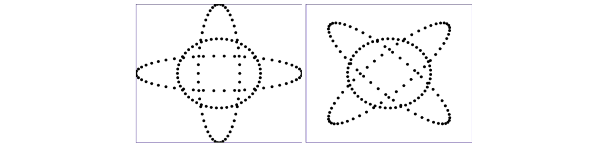
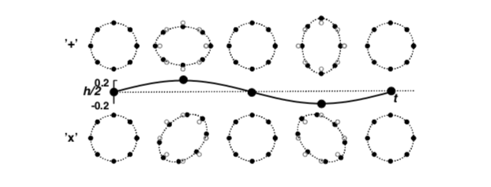
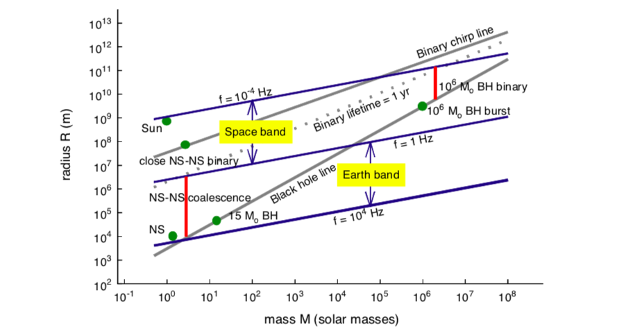
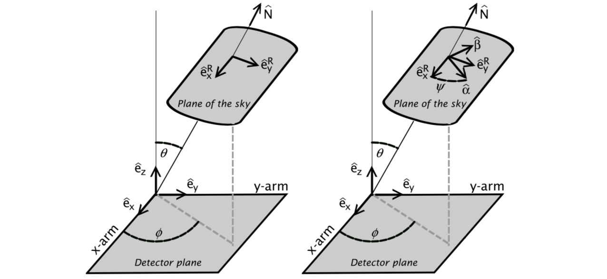

Physics, Astrophysics and Cosmology with Gravitational Waves (2009)

LIGO/GEO/VIRGO/TAMA 的 sensitivity levels 和 bandwidths: 10Hz - 10kHz

LISA (2020) 主要是低频范围 0.1mHz - 0.1Hz

---

From Fig.1 in [Physics, Astrophysics and Cosmology with Gravitational Waves](https://arxiv.org/abs/0903.0338) (2009) & [Gravitational Radiation](https://arxiv.org/abs/gr-qc/0003069) (2000)

- In Einstein’s theory, gravitational waves have **two** independent **polarizations**, denoted as **h+** and **h×**. The effect on proper separations of particles in a circular ring in the (x, y)-plane due to a plus-polarized wave traveling in the z-direction is shown in (a) and due to a cross-polarized wave is shown in (b). In contrast to electromagnetic waves, the angle between the two polarization states is **π/4** rather than π/2. The ring continuously gets deformed into one of the ellipses and back during the first half of a gravitational wave period and gets deformed into the other ellipse and back during the next half. 

---

From Fig.2 in [Physics, Astrophysics and Cosmology with Gravitational Waves](https://arxiv.org/abs/0903.0338) (2009) + [Gravitational Radiation](https://arxiv.org/abs/gr-qc/0003069) (2000)

**Mass-radius plot for gravitational wave sources.** The horizontal axis is the total mass of a radiating system, and the vertical axis is its size. Lines give order-of-magnitude constraints and relations. The black-hole and binary lines are described in the text.

- Characteristic (natural) frequencies for a self-gravitating body defined as $\omega_0=\sqrt{\pi G\bar{\rho}}$  or $f \sim (G\bar{\rho}/4\pi)^{1/2}$ (Newtonian formula + dimensional analysis $[G\cdot\rho]=[L]^3[M]^{-1}[T]^{-2}\cdot[M][L]^{-3}=[T]^{-2}$), taking the mean density $\bar{\rho} = 3M/4\pi R^3$ (size $R$ and mass $M$ of the source). Three lines (blue) of constant <u>natural frequency</u> are plotted: $f_0 = 10^4 Hz, f_0 = 1 Hz, \text{ and } f_0 = 10^{-4} Hz$. It's clear from the Figure that *gravitational waves between 1 and $10^4$ Hz are in principle accessible to ground-based detectors, while lower frequencies are observable only from space.*

- The "**Black hole line**" marking the black-hole boundary. This has the equation $R=2GM/c^2=2M$ (natural units). There are no objects below this line, because they would be smaller than the horizon size for their mass. This line cuts through the ground-based frequency band in such a way as tor estrict ground-based instruments to looking at stellar-mass objects. Nothing over a mass of about $10^4M_\odot$ can radiate above 1 Hz, i.e. *No system with a mass above about $10^4M_\odot$ can produce quadrupole radiation in the ground-based frequency band.*
- Typical values from **various sources** (green dots), i.e. a neutron star (NS), a pair of neutron stars that spiral together as they orbit (close NS-NS binary), some black holes (Sun, $15M_\odot$BH, $10^6M_\odot$BH brust) for ground-based and space-based detectors are shown. 
- The lower (dashed) "**Binary lifetime = 1 yr**" line is the 1-year coalescence line, where the orbital shrinking timescale in Eqn (19)[Gravitational Radiation](https://arxiv.org/abs/gr-qc/0003069) (2000) in is <u>less than one year</u>. The upper (solid) "**Binary chirp line**" is the 1-year <u>chirp</u> line: if a binary lies below this line then its orbit will shrink enough to make its orbital frequency increase by a measurable amount in one year. (In a one-year observation one can in principle measure changes in frequency of $1yr^{−1}$,or $3×10^{−8}$Hz.) It is clear from the Figure that *any binary system that is observed from the ground will coa- lesce within an observing time of one year.* 

---

---

https://arxiv.org/pdf/1811.08079.pdf

---

