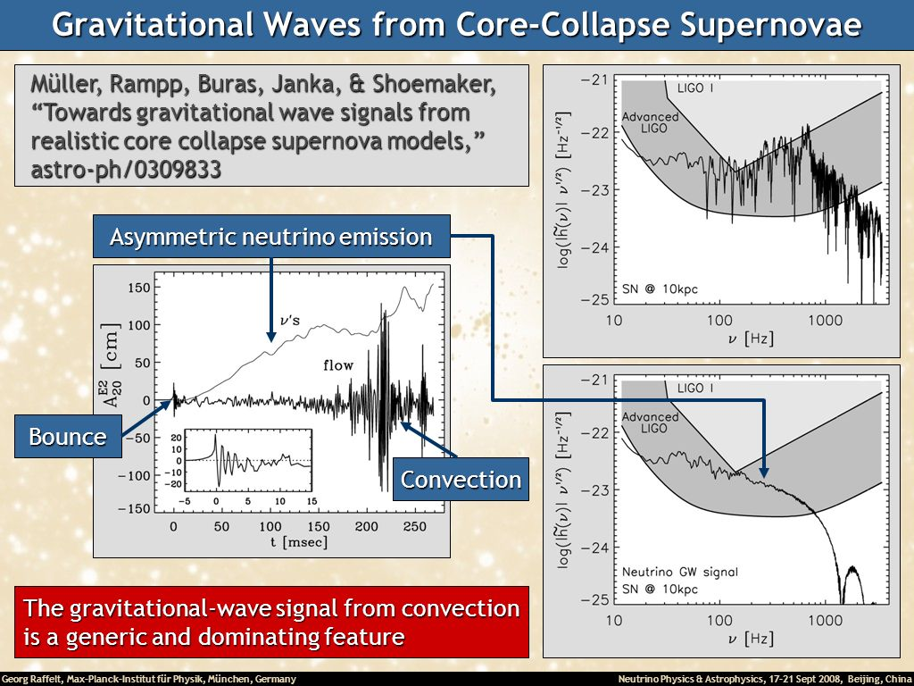

以下是正文，不要用一级标题。

**加粗**

*斜体*

<u>下划线</u>

~~删除线~~

<!--注释，这不会生成在html里-->

## 标题二


### 标题三

不过必须要说的是，利用卷积定理做快速卷积操作在信号处理中根本不是新鲜事。。。。

所以可以实现更快的卷积自然一点都不意外，其实真正值得挖掘的是，基于傅里叶变换的层操作是否可以提供更多的中间可视化层来为 CNN 的可解释性带了更多的素材，以及在此基础上的改进也很可能是要paper 可以水的。
接上文的段落行。

这是一个新的段落。

长分割线：`<hr>` or `---`

<hr>


## Blockquotes

> This is a blockquote with two paragraphs. This is first paragraph.
>
> This is second pragraph. Vestibulum enim wisi, viverra nec, fringilla in, laoreet vitae, risus.
> This is another blockquote with one paragraph. There is three empty line to seperate two blockquote.


## Lists

#### un-ordered list

*   Red
*   Green
*   Blue

#### ordered list

1.  Red
2. 	Green
3.	Blue

## Task List

Task lists are lists with items marked as either [ ] or [x] (incomplete or complete). For example:

- [ ] a task list item
- [ ] list syntax required
- [ ] normal **formatting**, @mentions, #1234 refs
- [ ] incomplete
- [x] completed

You can change the complete/incomplete state by clicking on the checkbox before the item.


## Tables

| asdf | asdf | asdf |
| ---- | :--: | ---: |
| 1234 | 1234 |  234 |
| 1234 | 1234 |  234 |
| 1234 | 1234 |  234 |


## Code Blocks

Inline codes: `import pandas as pd` # `dt-code` 理论上也可以对 inline code 进行渲染。

Code blocks: 

```javascript
var x = 25;
function(x){
  return x * x;
}
```


```python
import pandas as pd  # 注释
import numpy as np

with f in asd:
  yes
  break
  
for i in l:
  continue	
```


## Footnote & link

This is the first paragraph of the article.
Second line: This is the first paragraph of the article.

This is the footnote[^123].

Just wrap the text you would like to show up in a footnote in a `dt-fn` tag.
The number of the footnote will be automatically generated.[^eg]

[^eg]: This will become a hoverable footnote.
[^123]: contents footnote

This is [an example](http://example.com/ "anything") inline link.
[This link](http://example.net/) has no title attribute.

This is [an example][id] reference-style link.
Then, anywhere in the document, you define your link label on a line by itself like this:

[id]: http://example.com/  "Optional Title Here"


## Citations

我想引用一个东西时候就可以这样引用：!!gregor2015draw| !!

再引用一个最近的文章：!!Chatterjee:2019gqr| !!

也可以引用时带有自定义的名称：!!gregor2015draw|某人2015!!


## Equations

Inline math: $a^2=b^2+c^2$

Inline : $a^2$, My money : \$123 and \$321 ,

​    When $a \ne 0$, there are two solutions to $ax^2 + bx + c = 0$ and they are

equation block:
$$
x = {-b \pm \sqrt{b^2-4ac} \over 2a}.\label{eq}
$$

I can cite the equation (\ref{eq})


## Images

外链：


内链：




## Layout

The main text column is referred to as the body. It is the assumed layout of any direct descendents of the `dt-article`element.

```html
<div class="l-body"></div>
<!-- For images you want to display a little larger, try these: -->
<div class="l-middle"></div>
<div class="l-page"></div>
```

All of these have an `outset`variant if you want to poke out from the body text a little bit. For instance:

```html
<div class="l-body-outset"></div>
<div class="l-middle-outset"></div>
<div class="l-page-outset"></div>
```

Occasionally you’ll want to use the full browser width. For this, use `.l-screen`. You can also inset the element a little from the edge of the browser by using the inset variant.

```html
<div class="l-screen"></div>
<div class="l-screen-inset"></div>
```

Often you want to position smaller images so as not to completely interrupt the flow of your text. Or perhaps you want to put some text in the margin as an aside or to signal that it’s optional content. For these cases we’ll use the float-based layouts.

They are all floated to the right and anchored to the right-hand edge of the position you specify. By default, each will take up approximately half of the width of the standard layout position, but you can override the width with a more specific selector. 

```html
<div class="l-body side"></div>
<div class="l-middle side"></div>
<div class="l-page side"></div>
```

The final layout is for marginalia, asides, and footnotes. It does not interrupt the normal flow of `.l-body`sized text except on mobile screen sizes.

```html
<div class="l-gutter"></div>
```


<script type="text/bibliography">
  @article{gregor2015draw,
  title={DRAW: A recurrent neural network for image generation},
  author={Gregor, Karol and Danihelka, Ivo and Graves, Alex and Rezende, Danilo Jimenez and Wierstra, Daan},
  journal={arXivreprint arXiv:1502.04623},
  year={2015},
  url={https://arxiv.org/pdf/1502.04623.pdf} 
}
	@artical{Chatterjee:2019gqr,
	title={Title},
	author={Authors},
	journal={Journal},
	year={2019},
	url={https://example.com}
	}
</script>


---
If you have an appendix, a bibliography is automatically created and populated in it. If you have an appendix, a bibliography is automatically created and populated in it. If you have an appendix, a bibliography is automatically created and populated in it. If you have an appendix, a bibliography is automatically created and populated in it.

### Appendix Section Title

section content If you have an appendix, a bibliography is automatically created and populated in it. If you have an appendix, a bibliography is automatically created and populated in it. If you have an appendix, a bibliography is automatically created and populated in it. If you have an appendix, a bibliography is automatically created and populated in it.

---