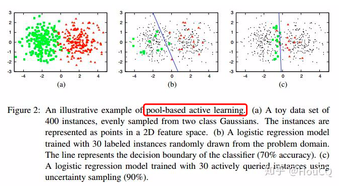
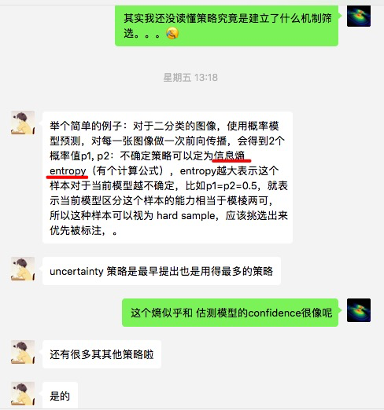
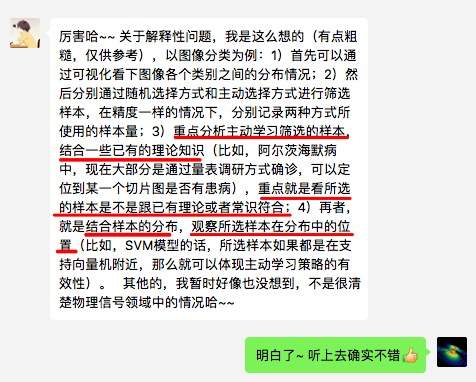

# Data Sampling and Training DNN in Parallel with Ray

[TOC]


- Pre-requirement
  - Python3.x
  - Numpy
  - Ray


## Method 1.

- Keywords:

```python
#! usr/bin/python
#coding=utf-8

from __future__ import absolute_import
from __future__ import division
from __future__ import print_function

# import sys, os
from tqdm import tqdm
import numpy as np
import ray, time
from multiprocessing import cpu_count
CPU_COUNT = cpu_count()
print('######################')
print('CPU_COUNT:', CPU_COUNT)
print('######################')

ray.init(num_cpus=CPU_COUNT,include_webui=False, ignore_reinit_error=True)

@ray.remote
class Data_precessing(object):
    def __init__(self, time_sampling):
        self.time_sampling = time_sampling

    def sampling(self,epoch):
        print('====================')
        print('Data sampling for {} ({}s)'.format(epoch, self.time_sampling))
        time.sleep(self.time_sampling)
        return epoch


class Solver(object):
    def __init__(self, time_sampling, time_training):
        self.num_epoch = 5
        self.time_sampling = time_sampling
        self.time_training = time_training

    @ray.remote
    def Parallel_cache(cls, epoch, temp):
        # @ray.remote can not describe a method with 'self' parameter.
        return cls.iteration(epoch)

    def train(self):
        Data = Data_precessing.remote(time_sampling = self.time_sampling)
        epochs = [Data.sampling.remote(i) for i in range(1,self.num_epoch +1)][::-1]

        while len(epochs)>1:
            epochs.append(self.Parallel_cache.remote(self, epochs[-1], epochs.pop(-1)))
            epochs = epochs[:-1]
        return ray.get(epochs)

    def iteration(self, epoch):
        print('Training with sample {} ({}s)'.format(epoch, self.time_training))
        time.sleep(self.time_training)
        return epoch + 1

solver = Solver(time_sampling = 5, time_training = 5)
# Sleep a little to improve the accuracy of the timing measurements below.
time.sleep(2); start_time = time.time()

_ = solver.train()

end_time = time.time(); 
print('The example took {} seconds.'.format(end_time - start_time))
```


## Method 2

```python
#! usr/bin/python
#coding=utf-8

from __future__ import absolute_import
from __future__ import division
from __future__ import print_function

import numpy as np
import ray, time
from multiprocessing import cpu_count
CPU_COUNT = cpu_count()
print('######################')
print('CPU_COUNT', CPU_COUNT)
print('######################')

ray.init(num_cpus=CPU_COUNT,include_webui=False, ignore_reinit_error=True)

class Solver(object):
    def __init__(self, time_sampling, time_training):
        self.num_epoch = 5
        self.time_sampling = time_sampling
        self.time_training = time_training
        self.data = 0

    @ray.remote
    def Parallel_cache(cls, epoch, temp):
        # @ray.remote can not describe a method with 'self' parameter.
        return cls.iteration(epoch)

    def sampling(self):
        self.data += 1
        print('====================')        
        print('Data sampling as {} ({}s)'.format(self.data, self.time_sampling))
        time.sleep(self.time_sampling)
        return 0

    def train(self):
        epochs = [ray.put(i) for i in range(self.num_epoch+1)][::-1]

        while len(epochs)>1:
            epochs.append(self.Parallel_cache.remote(self, epochs.pop(-1), self.sampling() ))
            epochs = epochs[:-1]
        return ray.get(epochs)

    def iteration(self, epoch):
        print('Training with sample {} ({}s)'.format(self.data, self.time_training))
        time.sleep(self.time_training)
        return epoch + 1

solver = Solver(time_sampling = 5, time_training = 5)
# Sleep a little to improve the accuracy of the timing measurements below.
time.sleep(2); start_time = time.time()

_ = solver.train()

end_time = time.time(); 
print('The example took {} seconds.'.format(end_time - start_time))
```


## Method 3

```python
#! usr/bin/python
#coding=utf-8

from __future__ import absolute_import
from __future__ import division
from __future__ import print_function

import numpy as np
import ray, time, sys
from multiprocessing import cpu_count
CPU_COUNT = cpu_count()
print('######################')
print('CPU_COUNT:', CPU_COUNT)
print('######################')

ray.init(num_cpus=CPU_COUNT,include_webui=False, ignore_reinit_error=True)

class GWave(object):
    def __init__(self, time_sampling):
        self.time_sampling = time_sampling
        self.data = 0

    def sampling(self):
        self.data += 1
        print('====================')        
        print('Data sampling as {} ({}s)'.format(self.data, self.time_sampling))
        time.sleep(self.time_sampling)
        return self.data

@ray.remote
class Solver(object):
    def __init__(self, time_training):
        self.time_training = time_training

    def Parallel_cache(self, epoch, data):
        # optional
        return self.iteration(epoch, data)        

    def iteration(self, epoch, data):
        print('Training with sample {} ({}s)'.format(data, self.time_training))
        time.sleep(self.time_training)
        return epoch + 1

solver = Solver.remote(time_training = 5)
gwave = GWave(time_sampling = 5)

# Sleep a little to improve the accuracy of the timing measurements below.
time.sleep(2); start_time = time.time()

epochs = [ray.put(i) for i in range(5 +1)][::-1]

while len(epochs)>1:
    epochs.append(solver.Parallel_cache.remote(epochs.pop(-1), gwave.sampling()))
    epochs = epochs[1:]
_ = ray.get(epochs)

end_time = time.time(); 
print('The example took {} seconds.'.format(end_time - start_time))
```


- All 5 epochs

- Sampling(CPU) = 5s | Training(GPU) = 5s


- Sampling(CPU) = 1s | Training(GPU) = 5s


- Sampling(CPU) = 5s | Training(GPU) = 1s


### Active Learning?

Ref: https://zhuanlan.zhihu.com/p/39367595

主动学习算法有个关键的假设：

> “*The key hypothesis is that if the learning algorithm is allowed to choose the data from which it learns—to be “curious,” if you will—it will perform better with less training”*。








